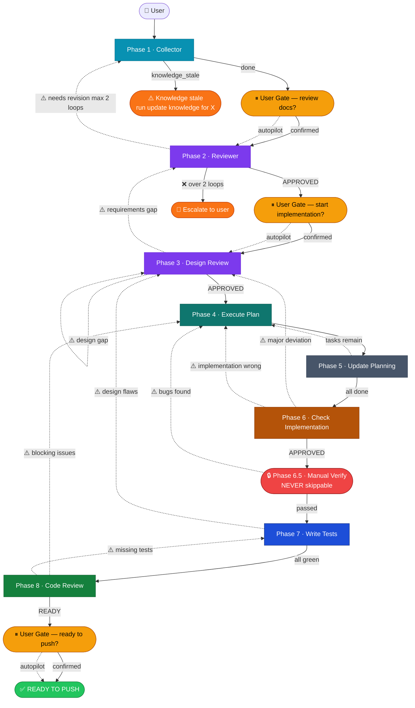

# Dev Lifecycle — Phase Summary

**Flow:** `1 → 2 → 3 → 4 → (5 after each task) → 6 → 6.5 (gate) → 7 → 8`

---

## When to Use This Doc

Load when:
- Orchestrator needs the full phase routing logic, flow overview, or state schema
- Starting or resuming a feature — selecting the right invocation pattern
- Checking magic keywords, Context Contracts, or analytics definitions
- Debugging a backward transition or escalation

> 📐 **Context budget:** ≤ 14 000 tokens. Load by section — do NOT pass the full doc unless needed.

Keywords: dev lifecycle, phase routing, orchestrator flow, state schema, magic keywords, autopilot, backward transitions, context contracts, HIR

---

## Multi-Agent Architecture (Phase Isolation)

> **Motivation:** Isolate context per phase to reduce hallucination. Each phase runs as a dedicated agent with a focused persona. Agents communicate through an **Orchestrator** (via `/fleet` on Copilot CLI).

### Architecture Overview

> See full routing diagram below in **Orchestrator Flow (Full Lifecycle)**.

---

### Orchestrator Flow (Full Lifecycle)



> **Màu:** 🩵 Cyan = Collect · 🟣 Violet = Review/Design · 🟢 Teal = Execute · ⬛ Slate = Track · 🟠 Amber = Check · 🔵 Blue = Test · 🟩 Green = Code Review · 🟡 Gate · 🔴 Hard Gate · 🟠 Escalate
> *(Mũi tên nét đứt `⚠️` = backward/retry. Nét đứt trơn = autopilot/skip. `❌` = escalate hard stop.)*

---

**Orchestrator responsibilities:**
- Receives user's feature prompt and extracts `feature-name`
- Spawns Phase-1 agent with initial context
- Receives Phase-1 output (doc paths + summary)
- Passes output to Phase-2 agent for review
- If Phase-2 returns gaps → loops back to Phase-1 with gap list
- If Phase-2 returns ✅ APPROVED → advances to Phase-3 agent
- Tracks iteration count (max 2 revision loops before escalating to user)

**Communication contract between agents (via Orchestrator):**

```json
// Phase-1 → Orchestrator
{
  "status": "done",
  "feature": "feature-name",
  "docs": {
    "requirements": "docs/ai/requirements/feature-name.md",
    "design": "docs/ai/design/feature-name.md",
    "planning": "docs/ai/planning/feature-name.md"
  },
  "summary": "Short plain-text summary of what was captured",
  "perf": {
    "duration_ms": 0,
    "tokens_total": 0,
    "tokens_input": 0,
    "context_fill_rate": 0,
    "context_budget_exceeded": false
  }
}

// Orchestrator → Phase-2
{
  "task": "review",
  "feature": "feature-name",
  "docs": { ... },         // same paths from Phase-1
  "context": "summary",     // Phase-1 summary for quick orientation
  "perf": {
    "duration_ms": 0,
    "tokens_total": 0,
    "tokens_input": 0,
    "context_fill_rate": 0,
    "context_budget_exceeded": false
  }
}

// Phase-2 → Orchestrator
{
  "verdict": "APPROVED" | "NEEDS_REVISION",
  "confidence_score": 0.92,            // must be ≥ 0.85; re-analyzes if below
  "gaps": ["gap 1", "gap 2"],
  "questions": ["Q1?", "Q2?"],
  "blocking": true | false,
  "perf": {
    "duration_ms": 0,
    "tokens_total": 0,
    "tokens_input": 0,
    "context_fill_rate": 0,
    "context_budget_exceeded": false
  }
}
```

---

### Phase-1 Agent — Collector

> 📄 **Full spec:** [phase-1-collector.md](./phase-1-collector.md)

| | |
|---|---|
| **Persona** | Curious, methodical, thorough. Assumes nothing. Asks until the picture is complete. |
| **Primary goal** | Extract enough information to produce solid `requirements`, `design`, and `planning` docs. |
| **Exit condition** | All 3 docs filled with no unresolved open questions → send output JSON to Orchestrator. |
| **Entry point** | `requirement-intake` (Hybrid Coordinator) — single agent called by Orchestrator |

---

### Phase-2 Agent — Reviewer

> 📄 **Full spec:** [phase-2-reviewer.md](./phase-2-reviewer.md) — same entry as Phase 2 section below.

---

### Orchestrator Agent

| Role | Agent | Status | Why |
|------|-------|--------|-----|
| **Primary orchestrator** | `gem-orchestrator` | ✅ Defined | Full routing — state file, magic keywords, wave execution, error recovery, 4 user gates |
| **Fallback / planning** | `Plan` | ✅ Installed | Basic task sequencing when `gem-orchestrator` is not available |

**Agent file:** `.github/agents/gem-orchestrator.agent.md`

**State file per feature:** `ai-workspace/temp/orchestrator-state-{feature}.json`

**State file schema (abbreviated):**

```jsonc
{
  "feature": "feature-name",
  "status": "pending|running|done|failed",
  "current_phase": 1,
  "keywords": [],
  "domain": {
    "has_frontend": true,
    "has_backend": true,
    "has_regraph": false   // true when plugin uses regraph — routes graph tasks to regraph-implementer
  },
  "escalations": [],
  "api_errors": [],              // { phase, code: 429|500|..., timestamp }
  "manual_interventions": [],    // { timestamp, phase, reason, type: "unexpected_fix|restart|override|correction" }
                                 // ← HIR source: any user action OUTSIDE expected gates
  "created_at": "ISO-8601",
  "completed_at": null,
  // ── Performance Metrics (written incrementally as each phase completes) ──
  "metrics": {
    "phase_1": null,   // { duration_ms, tokens_total, tokens_input, context_fill_rate, questions_asked, dor_result, spike_tasks_added }
    "phase_2": null,   // { duration_ms, tokens_total, tokens_input, context_fill_rate, revision_loops, confidence_score, gaps_found }
    "phase_3": null,   // { duration_ms, tokens_total, tokens_input, context_fill_rate, requirements_covered_pct, must_fix_count }
    "phase_4": [],     // per task: { task, duration_ms, tokens_total, tokens_input, context_fill_rate,
                       //             debug_retries, pass_at_1, reasoning_depth,
                       //             lines_added, lines_deleted, lines_rewritten, churn_ratio,
                       //             files_changed_count, tests_added_count }
    "phase_5": [],     // per trigger: { duration_ms, tokens_total, tasks_marked_done, deviations_recorded }
    "phase_6": null,   // { duration_ms, tokens_total, tokens_input, context_fill_rate, findings_raw, findings_after_filter, filter_ratio }
    "phase_7": null,   // { duration_ms, tokens_total, tokens_input, context_fill_rate, tests_added, coverage_pct, e2e_included }
    "phase_8": null,   // { duration_ms, tokens_total, tokens_input, context_fill_rate, findings_raw, findings_after_filter, must_fix_count }
    "backward_transitions": [],
    "totals": null     // { wall_clock_ms, tokens_grand_total, tokens_by_phase,
                       //   task_completion_velocity, api_error_rate,
                       //   token_inflation_index, context_fill_rate_max,
                       //   hir_per_100_tasks, avg_reasoning_depth, avg_churn_ratio }
  }
}
```

**User gates (hard stops):**
1. After Phase 1 — review docs before Phase 2 *(skippable: `autopilot`)*
2. After Phase 3 approved — confirm before Phase 4 *(skippable: `autopilot`)*
3. Phase 6.5 — manual verify ❌ **never skippable**
4. Phase 8 READY_TO_PUSH — confirm before push *(skippable: `autopilot`)*

**Magic keywords** (append to invocation):

| Keyword | Effect |
|---------|--------|
| `autopilot` | Skip all 3 skippable gates |
| `fast` | Drop adversarial agents in P2+P3; parallel cap → 4 |
| `skip-to N` | Jump to Phase N |
| `deep` | Lower confidence threshold to 0.75; extra review in P6 |
| `strict` | Pause after every agent |
| `no-tests` | Skip Phase 7 |
| `complex` | Enable pre-mortem (P3) + multi-plan + contract-first (P4) |
| `seq` | Force **all** parallel agent groups to run sequentially (cap = 1). Overrides `fast`. Applies: P2 critics, P4 wave tasks, P6 reviewers, P8 reviewers |

---

### Common Scenarios — Quick Reference

> Orchestrator auto-detects scenario type from prompt and recommends the flow below. User confirms before starting.

#### 🐛 Bug Fix

| Complexity | Khi nào | Invocation |
|---|---|---|
| **Simple** | 1–2 dòng, typo, config, nguyên nhân rõ | `start feature fix-X skip-to 4 fast autopilot no-tests` |
| **Medium** | Bug rõ, nguyên nhân chưa rõ | `start feature fix-X skip-to 4 fast autopilot` |
| **Complex** | Ảnh hưởng nhiều module, nghi design sai, security | `start feature fix-X skip-to 3 deep` |

#### ✨ New Feature

| Complexity | Khi nào | Invocation |
|---|---|---|
| **Simple** | Nhỏ, isolated, 1 component | `start feature X fast autopilot` |
| **Medium** | Feature bình thường | `start feature X` *(standard flow — no keywords)* |
| **Complex** | Nhiều module, cross-cutting, nhiều dependencies | `start feature X complex` |

#### 🔧 Improve / Refactor

| Complexity | Khi nào | Invocation |
|---|---|---|
| **Simple** | UI tweak, rename, cleanup, text change | `start feature improve-X skip-to 4 fast autopilot no-tests` |
| **Medium** | Refactor < 1 module, optimize | `start feature improve-X skip-to 4 fast` |
| **Complex** | Breaking change, architectural, migrate | `start feature improve-X skip-to 3 complex` |

> ⚠️ **Phase 6.5 never skippable** — anh luôn phải test tay, bất kể keyword nào.
> Không chắc complexity → chọn một level cao hơn (simple → medium, medium → complex).

---

### How Agent Routing Works

Each agent in a phase knows its job through **two layers**:

1. **System prompt (persona)** — baked into the agent's `.agent.md` file. Defines who the agent is, what tools it can use, what it refuses to do.
2. **Task message (invocation prompt)** — sent by the Orchestrator at runtime. Defines the specific work for *this* call: what to read, what to produce, what format to return.

The Orchestrator always sends a task message in this shape:

```
You are being invoked as [ROLE] for feature [FEATURE_NAME].

## Your Task
[WHAT TO DO — specific to this agent's role in this phase]

## Input
[WHAT TO READ — file paths, context, previous agent output]

## Output Required
[WHAT TO PRODUCE — format, file to write, JSON to return]

## Constraints
[ANY LIMITS — max scope, do not modify X, language rules]
```

This means: **you do NOT need to re-describe the agent's persona** in each phase — just write the task message. The agent's `.agent.md` handles persona; the Orchestrator handles tasking.

---

### Iteration Loop (Phase 1 ↔ Phase 2)

> Covered in **Orchestrator Flow (Full Lifecycle)** above and in [phase-2-reviewer.md](./phase-2-reviewer.md#iteration-loop).

---

---

## Phase 1 — New Requirement

**Goal:** Bootstrap a new feature from a Jira Epic or User Story.

> 📄 **Full spec (steps, DoR gate, INVEST, custom agent `requirement-intake`):** [phase-1-collector.md](./phase-1-collector.md)

| | |
|---|---|
| **Entry point** | `requirement-intake` agent (Hybrid Coordinator) |
| **Key gates** | Domain knowledge check → INVEST check → DoR gate |
| **Stale knowledge** | `knowledge-doc-auditor` detects stale → return `knowledge_stale` → orchestrator warns user + STOPS → user runs `update knowledge for X` → resumes |
| **Delegates to** | `knowledge-doc-auditor` → `bui-knowledge-builder` → `gem-researcher` → `gem-designer` → `gem-documentation-writer` |
| **Output** | 3 docs: `requirements`, `design`, `planning` + JSON contract to Orchestrator |

**Next:** Phase 2 → Phase 3

---


## Phase 2 — Review Requirements

> 📄 **Full spec:** [phase-2-reviewer.md](./phase-2-reviewer.md)

| | |
|---|---|
| **Persona** | Skeptical, precise, constructive critic. Never accepts vague wording. |
| **Primary goal** | Find every gap, contradiction, or ambiguity in Phase 1 docs → actionable gap report. |
| **Exit condition** | `APPROVED` or `NEEDS_REVISION` + gap list → Orchestrator. Max 2 revision loops. |
| **Key agents** | `knowledge-doc-auditor` → `knowledge-quality-evaluator` → `gem-critic` ∥ `devils-advocate` → `doublecheck` → `review-coordinator` |

**Next:** Phase 3. If fundamental gaps → back to Phase 1.

---

## Phase 3 — Review Design

> 📄 **Full spec:** [phase-3-design-review.md](./phase-3-design-review.md)

| | |
|---|---|
| **Primary goal** | Validate design coverage against requirements — every requirement must be traceable in the design doc. |
| **Exit condition** | All COVERED + no MUST-FIX → Phase 4. Missing coverage → Phase 2. |
| **Key agents** | `gem-researcher` → `gem-critic` → `research-technical-spike` *(conditional)* → `bui-knowledge-builder` *(seed catalog — conditional: `has_frontend`)* → `fe-backstage-reviewer` *(BUI annotation — conditional: `has_frontend`)* → `regraph-reviewer` *(ReGraph API design check — conditional: `has_regraph`)* → `gem-planner` *(pre-mortem — `complex` only)* → `knowledge-quality-evaluator` → `review-coordinator` |

**Next:** Phase 4. If requirements gaps → Phase 2. If design wrong → revise in place, re-run Phase 3.

---

## Phase 4 — Execute Plan

> 📄 **Full spec:** [phase-4-execute-plan.md](./phase-4-execute-plan.md)

| | |
|---|---|
| **Primary goal** | Implement tasks from planning doc using wave-based execution — parallel tasks within same wave, sequential across waves. |
| **Exit condition** | All tasks done → Phase 6. After each task → Phase 5 (auto-trigger). |
| **Key agents** | `gem-planner` → `gem-researcher` → `gem-implementer` *(BE stream)* + `gem-implementer + BUI skill` *(FE stream — conditional: `has_frontend`)* + `regraph-implementer` *(ReGraph stream — conditional: `has_regraph` OR task `tech_stack` contains `"regraph"`)* → `gem-debugger`* *(diagnose → retry max 2)* → `lifecycle-scribe` |
| **Wave execution** | Tasks grouped by `wave` field from plan.yaml. Same-wave tasks without `conflicts_with` run parallel (cap 2; 4 with `fast`; **1 with `seq`**). |
| **Error recovery** | On block: `gem-debugger` diagnoses → retry max 2 → `needs_replan` → escalate |

**Next:** After each task → Phase 5. When all done → Phase 6 → 6.5 → 7 → 8.


---

## Phase 5 — Update Planning *(auto-trigger after every Phase 4 task)*

> 📄 **Full spec:** [phase-5-update-planning.md](./phase-5-update-planning.md)

| | |
|---|---|
| **Trigger** | Auto — `lifecycle-scribe` called at end of every Phase 4 task |
| **Primary goal** | Reconcile planning doc with actual progress — mark done, record deviations, reorder if needed. |
| **Exit condition** | `tasks_remaining > 0` → Phase 4. `tasks_remaining = 0` → Phase 6. |
| **Key agents** | `lifecycle-scribe` → `gem-planner`* |

**Next:** If tasks remain → Phase 4. If all done → Phase 6.


---

## Phase 6 — Check Implementation

> 📄 **Full spec:** [phase-6-check-implementation.md](./phase-6-check-implementation.md)

| | |
|---|---|
| **Primary goal** | Verify all changed code matches design doc + requirements. Flag deviations, logic gaps, security issues. |
| **Exit condition** | APPROVED → Phase 6.5. Design wrong → Phase 3. Implementation wrong → Phase 4. |
| **Key agents** | `knowledge-doc-auditor` → `gem-reviewer` ∥ `se-security-reviewer` ∥ `fe-backstage-reviewer` *(BUI compliance — conditional: `has_frontend`)* ∥ `regraph-reviewer` *(ReGraph API correctness — conditional: `has_regraph`)* → `doublecheck` → `review-coordinator` · **`seq`: reviewers run sequentially** |

**Next:** Phase 6.5. If major deviations → Phase 3 (design wrong) or Phase 4 (implementation wrong).

---

## Phase 6.5 — Manual Verify *(gate — no doc)*

**Goal:** Human validation gate before writing automated tests.

- Run the app locally and test manually
- ⚠️ Do NOT start Phase 7 until explicitly confirmed as passed
- If bugs found → back to Phase 4 to fix, then re-verify before Phase 7

---

## Phase 7 — Write Tests

> 📄 **Full spec:** [phase-7-write-tests.md](./phase-7-write-tests.md)

| | |
|---|---|
| **Primary goal** | Achieve 100% test coverage — unit + integration + E2E (frontend). Testing doc updated with results. |
| **Entry condition** | Phase 6.5 manual verify confirmed passed. |
| **Exit condition** | All tests green, 100% coverage → Phase 8. Design flaw discovered → Phase 3. |
| **Key agents** | `polyglot-test-implementer` → `gem-browser-tester`* → `polyglot-test-tester` → `lifecycle-scribe` |

**Next:** Phase 8. If tests reveal design flaws → Phase 3.

---

## Phase 8 — Code Review

> 📄 **Full spec:** [phase-8-code-review.md](./phase-8-code-review.md)

| | |
|---|---|
| **Primary goal** | Final pre-push review — correctness, security, code quality, design alignment, docs completeness. |
| **Entry condition** | Phase 7 complete — all tests green, 100% coverage. |
| **Exit condition** | `READY_TO_PUSH` → push + PR. Blocking code issues → Phase 4. Missing tests → Phase 7. |
| **Key agents** | `gem-reviewer` ∥ `se-security-reviewer` ∥ `regraph-reviewer` *(conditional: `has_regraph`)* → `doublecheck` → `janitor` → `devils-advocate` → `knowledge-doc-auditor` → `review-coordinator` · **`seq`: gem-reviewer → se-security-reviewer (sequential)** |

**Done:** All checklist items pass → push and open PR.

---

## ⚡ Performance Metrics

Mỗi phase trả về `perf` block trong output JSON. Orchestrator ghi vào `state.metrics.<phase>` ngay khi nhận output.

> ⚠️ **CLI mode:** `tokens_total`, `tokens_input`, `context_fill_rate` are unavailable when running outside agent runtime. Use `"N/A (CLI)"`. `duration_ms` should be estimated from wall-clock if available, else `null`. Do **not** omit perf blocks — show `N/A` to remain spec-compliant.

### Operational Metrics

| Metric | Công thức / Lấy từ | Mục đích |
|--------|-------------------|---------|
| `duration_ms` | Mọi phase | Wall clock của toàn phase |
| `tokens_total` | Mọi phase | Tổng token ước tính (input + output) |
| **`context_fill_rate`** | `tokens_input / 200_000` | Đo mức độ "nhồi" context vào model. > 0.5 = nguy hiểm; > 0.8 = có thể bị truncation |
| `context_efficiency` | `tokens_output / tokens_input` | Proxy: bao nhiêu % input thực sự được dùng |
| **`task_completion_velocity`** | `total_tasks / sum(phase_4[].duration_ms)` × 3 600 000 | Tasks/hour — đo tốc độ thực tế của system |
| `api_errors[]` | State root | API-level failures: 429, 500, timeout |
| **`manual_interventions[]`** | State root | Mọi action của user ngoài expected gates — nguồn dữ liệu tính HIR |

### Reasoning Quality Metrics

| Metric | Công thức / Lấy từ | Mục đích |
|--------|-------------------|---------|
| **`reasoning_depth`** (per task) | `debug_retries + backward_transitions_from_this_task` | Composite: cảnh báo nếu agent bị "kẹt" trong vòng lặp suy luận |
| `pass_at_1` | Phase 4 (per task) | `true` nếu task done mà không cần debugger — tương đương **Pass@1** |
| `revision_loops` | Phase 2 | Số vòng lặp Phase 2 → Phase 1 |
| `confidence_score` | Phase 2 | Score cuối khi APPROVED (target ≥ 0.85) |
| `gaps_found` | Phase 2 | Số gaps được raise |
| `filter_ratio` | Phase 6 + 8 | `(findings_raw - filtered) / findings_raw` — hallucination rate |
| `questions_asked` | Phase 1 | Số câu hỏi clarifying trước khi viết doc |
| `dor_result` | Phase 1 | `pass\|fail` — DoR gate outcome |
| `spike_tasks_added` | Phase 1 | Số knowledge spike tasks được thêm vào plan |
| `requirements_covered_pct` | Phase 3 | % requirements được trace trong design |
| `must_fix_count` | Phase 3 + 8 | MUST_FIX issues tại phase đó |

### Code Quality Metrics

| Metric | Công thức / Lấy từ | Mục đích |
|--------|-------------------|---------|
| **`lines_added`** | Phase 4 (per task) | Từ `git diff --stat` sau khi task complete |
| **`lines_deleted`** | Phase 4 (per task) | Từ `git diff --stat` |
| **`lines_rewritten`** | Phase 4 (per task) | Lines sửa lại bởi `gem-debugger` trong task đó |
| **`churn_ratio`** | `lines_deleted / lines_added` | > 0.5 = agent không có plan rõ trước khi code — redesigning mid-stream |
| `files_changed_count` | Phase 4 (per task) | Files thực sự thay đổi |
| `tests_added_count` | Phase 4 + 7 | Tests được viết |
| `coverage_pct` | Phase 7 | Test coverage sau Phase 7 |

### Autonomy Metrics

| Metric | Công thức | Target |
|--------|-----------|--------|
| **HIR (Human Intervention Rate)** | `manual_interventions.length / total_tasks × 100` | → 0. Tính trên accumulated data |
| `backward_transitions` | State root | Mỗi lần pipeline đi backwards (array) |

> **Không track TTFT/TPS** — pipeline async batch. `duration_ms` per phase là proxy tốt hơn.

---

## 🔌 Context Management (Token Inflation Prevention)

> ⚠️ **Token Inflation risk:** Nếu orchestrator pass output đầy đủ của mỗi phase xuống phase tiếp theo, `tokens_input` tăng cộng dồn và chi phí tăng exponential. Một feature 8 phases không có slimming có thể consume 4–8× token so với cần thiết.

**Nguyên tắc:** Orchestrator **slim context** trước khi pass — mỗi phase chỉ nhận đúng fields cần cho công việc của nó.

### Context Contracts

| Phase | Receives | Explicitly NOT passed |
|-------|----------|-----------------------|
| **Phase 1** | Ticket info, domain knowledge path | — |
| **Phase 2** | Doc paths + Phase 1 `summary` (plain text) | Full Phase 1 JSON, intermediate sub-agent outputs |
| **Phase 3** | Requirements + Design doc paths + Phase 2 `gaps[]` | Phase 2 full output, Phase 1 data |
| **Phase 4 (per task)** | Task description + relevant design doc sections only + coding standards | Full planning doc, Phases 1–3 outputs, previous tasks' outputs |
| **Phase 5 (per trigger)** | Phase 4 task output (status + deviations) | Everything else |
| **Phase 6** | Changed file list + diffs + design doc (relevant sections) | Phase 4 full implementation notes, phases 1–3 |
| **Phase 7** | Changed file list + Phase 6 findings summary + design doc | Raw diffs, phase 4–5 data |
| **Phase 8** | Changed file list + diffs + Phase 7 coverage report | Phases 1–6 history |

### Input Budgets (soft limits — alert when exceeded)

| Phase | `tokens_input` budget | Action when exceeded |
|-------|-----------------------|---------------------|
| Phase 1 | ≤ 10 000 | Tickets too long → ask user to summarize AC |
| Phase 2 | ≤ 8 000 | Docs too large → pass summaries not full content |
| Phase 3 | ≤ 12 000 | Design too detailed → focus on traceability table only |
| Phase 4 (per task) | ≤ 10 000 | Task scope too broad → split into sub-tasks |
| Phase 6 | ≤ 14 000 | Large PR → batch by subsystem |
| Phase 8 | ≤ 12 000 | Compress findings to essential fields only |

> When a budget is exceeded: orchestrator sets `"context_budget_exceeded": true` in `state.metrics.phase_N`, compresses before retry. Phase 4 is most prone to inflation — each task should receive **only** the design doc section relevant to that task, not the full design.

---

## 📊 Orchestrator Analytics

Sau nhiều features, orchestrator tổng hợp từ `state.metrics` để đánh giá pipeline theo 4 chiều:

### Operational Performance

| Chỉ số | Công thức | Mục đích |
|--------|-----------|---------|
| **Task Completion Velocity** | `total_tasks / sum(phase_4[].duration_ms) × 3_600_000` | Tasks/hour — tốc độ thực tế. So sánh bug fix vs feature |
| **Context Fill Rate (max)** | `max(tokens_input / 200_000)` across phases | > 0.7 = nguy hiểm, risk truncation |
| **Token Inflation Index** | `max(tokens_input[N]) / tokens_input[phase_1]` | > 3× → cần áp dụng Context Contracts |
| Avg cost / feature | `mean(totals.tokens_grand_total)` | Baseline chi phí |

---

### Reasoning Quality

> 💡 **`doublecheck` = LLM-as-a-judge**: `filter_ratio` là bằng chứng định lượng chất lượng reasoning của reviewer agents.

| Chỉ số | Công thức | Signal |
|--------|-----------|--------|
| **Reasoning Depth** | `mean(debug_retries + backward_from_task)` per task | > 2 liên tục → agent bị kẹt vòng lặp suy luận |
| **Code Churn** | `mean(churn_ratio)` = `mean(lines_deleted / lines_added)` trong phase_4 | > 0.5 → agent không có plan rõ trước khi code |
| **Pass@1 rate** | `count(pass_at_1=true) / total_tasks` | < 0.6 → implementer thiếu context |
| **Noise ratio** (P6 + P8) | `mean(filter_ratio)` | > 0.35 → reviewers hallucinate |
| **Revision loops** (P2) | `mean(revision_loops)` | > 1 → Phase 1 output chất lượng thấp |
| **Confidence drift** (P2) | `confidence_score` trend | Giảm dần → reviewers kém calibrate |

> **Targets:** Reasoning depth ≤ 1.5, churn ratio < 0.40, Pass@1 ≥ 0.70, noise ratio < 0.30.

---

### P95 Latency

| Tracked value | Lấy từ | Mục đích |
|---|---|---|
| Feature wall clock (P50/P95) | `totals.wall_clock_ms` | End-to-end feature time |
| **Velocity** | `task_completion_velocity` (tasks/hour) | Tốc độ implementation thực tế |
| Bottleneck phase | `argmax(phase_N.duration_ms)` | Ưu tiên optimize chỗ nào |
| Phase 2 loop overhead | `revision_loops × phase_2.duration_ms` | Chi phí thực của revision |

> **Typical profile:** Phase 4 = 50–65% total time. Phase 7 = 15–25%.

---

### Autonomy — HIR (Human Intervention Rate)

> 🎯 **North-star metric cho autonomous pipeline.** HIR = 0 = system tự chạy hoàn toàn.

| Chỉ số | Công thức | Target |
|--------|-----------|--------|
| **HIR** | `manual_interventions.length / total_tasks × 100` | → 0 per 100 tasks |
| **Intervention by phase** | Histogram `manual_interventions[].phase` | Phase cao nhất = least stable |
| **Intervention by type** | `unexpected_fix \| restart \| override \| correction` | `restart` nhiều → agents crash; `unexpected_fix` → wrong output |
| **API error rate** | `api_errors[].code` histogram | 429 → back-off; 500 → instability |
| **Backward transition rate** | `backward_transitions.length / phases_run` | > 0.3 → design/req chất lượng thấp |
| **Phase 8 NEEDS_FIX rate** | `verdict = "NEEDS_FIX"` / features | Cao → implementer skip quality |

**HIR tracking rule:** Expected gates (1, 2, 3, 4) **KHÔNG** tính. Chỉ tính:
- User sửa output agent trực tiếp → `unexpected_fix`
- User restart agent ngoài dự kiến → `restart`
- User override orchestrator decision → `override`
- User manually fix code → `correction`

> **Action triggers:**  
> - HIR > 10 / 100 tasks → pipeline chưa ổn, không dùng `autopilot`
> - `context_fill_rate` > 0.7 → slim context ngay (Context Contracts)
> - `token_inflation_index` > 3 → áp dụng Context Contracts
> - `reasoning_depth` > 2 over 5 consecutive tasks → escalate, plan quá thô
> - `api_errors[].code = 429` > 5× / feature → add exponential back-off

---

## Backward Transitions

| From | Condition | Go back to |
|------|-----------|-----------|
| Phase 2 | Fundamental gaps unresolvable | Phase 1 |
| Phase 3 | Requirements gaps found | Phase 2 |
| Phase 3 | Design fundamentally wrong | Revise design in place |
| Phase 6 | Major design deviation | Phase 3 |
| Phase 6 | Implementation wrong | Phase 4 |
| Phase 6.5 | Bugs found during manual verify | Phase 4 → re-verify |
| Phase 7 | Tests reveal design flaws | Phase 3 |
| Phase 8 | Blocking issues in code | Phase 4 |
| Phase 8 | Missing tests | Phase 7 |

---

## Doc Locations

```
docs/ai/requirements/feature-{name}.md
docs/ai/design/feature-{name}.md
docs/ai/planning/feature-{name}.md
docs/ai/implementation/feature-{name}.md
docs/ai/testing/feature-{name}.md
```

> ⚠️ All doc content must be written in **English only**.

---

## Final Feature Summary (Phase 8 → READY_TO_PUSH)

When Phase 8 returns `READY_TO_PUSH`, Orchestrator surfaces the following before the push gate. Always include — even if some metrics are estimated.

| Section | Content |
|---|---|
| Phase Verdicts | P1–P8 checkmarks in one line |
| **⚡ Pipeline Stats** | Total duration · tasks completed · task velocity · total tokens · token inflation index · backward transitions · HIR |

Stats sourced from `state.metrics.totals`. Orchestrator writes `totals` after Phase 8 completes.

