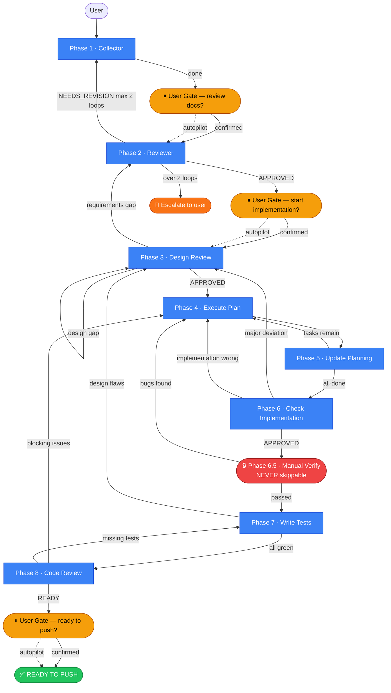

# Dev Lifecycle — Phase Summary

**Flow:** `1 → 2 → 3 → 4 → (5 after each task) → 6 → 6.5 (gate) → 7 → 8`

---

## Multi-Agent Architecture (Phase Isolation)

> **Motivation:** Isolate context per phase to reduce hallucination. Each phase runs as a dedicated agent with a focused persona. Agents communicate through an **Orchestrator** (via `/fleet` on Copilot CLI).

### Architecture Overview

> See full routing diagram below in **Orchestrator Flow (Full Lifecycle)**.

---

### Orchestrator Flow (Full Lifecycle)



> **Màu:** 🔵 Phase thông thường · 🟡 User gate *(skippable bằng `autopilot`)* · 🔴 Phase 6.5 *(never skippable)* · 🟠 Escalate · 🟢 Done
> *(Đường nét đứt `-.->` = path khi `autopilot` active)*

---

**Orchestrator responsibilities:**
- Receives user's feature prompt and extracts `feature-name`
- Spawns Phase-1 agent with initial context
- Receives Phase-1 output (doc paths + summary)
- Passes output to Phase-2 agent for review
- If Phase-2 returns gaps → loops back to Phase-1 with gap list
- If Phase-2 returns ✅ APPROVED → advances to Phase-3 agent
- Tracks iteration count (max 2 revision loops before escalating to user)

**Communication contract between agents (via Orchestrator):**

```json
// Phase-1 → Orchestrator
{
  "status": "done",
  "feature": "feature-name",
  "docs": {
    "requirements": "docs/ai/requirements/feature-name.md",
    "design": "docs/ai/design/feature-name.md",
    "planning": "docs/ai/planning/feature-name.md"
  },
  "summary": "Short plain-text summary of what was captured"
}

// Orchestrator → Phase-2
{
  "task": "review",
  "feature": "feature-name",
  "docs": { ... },         // same paths from Phase-1
  "context": "summary"     // Phase-1 summary for quick orientation
}

// Phase-2 → Orchestrator
{
  "verdict": "APPROVED" | "NEEDS_REVISION",
  "confidence_score": 0.92,            // must be ≥ 0.85; re-analyzes if below
  "gaps": ["gap 1", "gap 2"],
  "questions": ["Q1?", "Q2?"],
  "blocking": true | false
}
```

---

### Phase-1 Agent — Collector

> 📄 **Full spec:** [phase-1-collector.md](./phase-1-collector.md)

| | |
|---|---|
| **Persona** | Curious, methodical, thorough. Assumes nothing. Asks until the picture is complete. |
| **Primary goal** | Extract enough information to produce solid `requirements`, `design`, and `planning` docs. |
| **Exit condition** | All 3 docs filled with no unresolved open questions → send output JSON to Orchestrator. |
| **Entry point** | `requirement-intake` (Hybrid Coordinator) — single agent called by Orchestrator |

---

### Phase-2 Agent — Reviewer

> 📄 **Full spec:** [phase-2-reviewer.md](./phase-2-reviewer.md) — same entry as Phase 2 section below.

---

### Orchestrator Agent

| Role | Agent | Status | Why |
|------|-------|--------|-----|
| **Primary orchestrator** | `gem-orchestrator` | ✅ Defined | Full routing — state file, magic keywords, wave execution, error recovery, 4 user gates |
| **Fallback / planning** | `Plan` | ✅ Installed | Basic task sequencing when `gem-orchestrator` is not available |

**Agent file:** `.github/agents/gem-orchestrator.agent.md`

**State file per feature:** `ai-workspace/temp/orchestrator-state-{feature}.json`

**User gates (hard stops):**
1. After Phase 1 — review docs before Phase 2 *(skippable: `autopilot`)*
2. After Phase 3 approved — confirm before Phase 4 *(skippable: `autopilot`)*
3. Phase 6.5 — manual verify ❌ **never skippable**
4. Phase 8 READY_TO_PUSH — confirm before push *(skippable: `autopilot`)*

**Magic keywords** (append to invocation):

| Keyword | Effect |
|---------|--------|
| `autopilot` | Skip all 3 skippable gates |
| `fast` | Drop adversarial agents in P2+P3; parallel cap → 4 |
| `skip-to N` | Jump to Phase N |
| `deep` | Lower confidence threshold to 0.75; extra review in P6 |
| `strict` | Pause after every agent |
| `no-tests` | Skip Phase 7 |
| `complex` | Enable pre-mortem (P3) + multi-plan + contract-first (P4) |

---

### Common Scenarios — Quick Reference

> Orchestrator auto-detects scenario type from prompt and recommends the flow below. User confirms before starting.

#### 🐛 Bug Fix

| Complexity | Khi nào | Invocation |
|---|---|---|
| **Simple** | 1–2 dòng, typo, config, nguyên nhân rõ | `start feature fix-X skip-to 4 fast autopilot no-tests` |
| **Medium** | Bug rõ, nguyên nhân chưa rõ | `start feature fix-X skip-to 4 fast autopilot` |
| **Complex** | Ảnh hưởng nhiều module, nghi design sai, security | `start feature fix-X skip-to 3 deep` |

#### ✨ New Feature

| Complexity | Khi nào | Invocation |
|---|---|---|
| **Simple** | Nhỏ, isolated, 1 component | `start feature X fast autopilot` |
| **Medium** | Feature bình thường | `start feature X` *(standard flow — no keywords)* |
| **Complex** | Nhiều module, cross-cutting, nhiều dependencies | `start feature X complex` |

#### 🔧 Improve / Refactor

| Complexity | Khi nào | Invocation |
|---|---|---|
| **Simple** | UI tweak, rename, cleanup, text change | `start feature improve-X skip-to 4 fast autopilot no-tests` |
| **Medium** | Refactor < 1 module, optimize | `start feature improve-X skip-to 4 fast` |
| **Complex** | Breaking change, architectural, migrate | `start feature improve-X skip-to 3 complex` |

> ⚠️ **Phase 6.5 never skippable** — anh luôn phải test tay, bất kể keyword nào.
> Không chắc complexity → chọn một level cao hơn (simple → medium, medium → complex).

---

### How Agent Routing Works

Each agent in a phase knows its job through **two layers**:

1. **System prompt (persona)** — baked into the agent's `.agent.md` file. Defines who the agent is, what tools it can use, what it refuses to do.
2. **Task message (invocation prompt)** — sent by the Orchestrator at runtime. Defines the specific work for *this* call: what to read, what to produce, what format to return.

The Orchestrator always sends a task message in this shape:

```
You are being invoked as [ROLE] for feature [FEATURE_NAME].

## Your Task
[WHAT TO DO — specific to this agent's role in this phase]

## Input
[WHAT TO READ — file paths, context, previous agent output]

## Output Required
[WHAT TO PRODUCE — format, file to write, JSON to return]

## Constraints
[ANY LIMITS — max scope, do not modify X, language rules]
```

This means: **you do NOT need to re-describe the agent's persona** in each phase — just write the task message. The agent's `.agent.md` handles persona; the Orchestrator handles tasking.

---

### Iteration Loop (Phase 1 ↔ Phase 2)

> Covered in **Orchestrator Flow (Full Lifecycle)** above and in [phase-2-reviewer.md](./phase-2-reviewer.md#iteration-loop).

---

---

## Phase 1 — New Requirement

**Goal:** Bootstrap a new feature from a Jira Epic or User Story.

> 📄 **Full spec (steps, DoR gate, INVEST, custom agent `requirement-intake`):** [phase-1-collector.md](./phase-1-collector.md)

| | |
|---|---|
| **Entry point** | `requirement-intake` agent (Hybrid Coordinator) |
| **Key gates** | INVEST check → DoR gate → domain knowledge check |
| **Delegates to** | `gem-researcher` → `gem-designer` → `gem-documentation-writer` |
| **Output** | 3 docs: `requirements`, `design`, `planning` + JSON contract to Orchestrator |

**Next:** Phase 2 → Phase 3

---


## Phase 2 — Review Requirements

> 📄 **Full spec:** [phase-2-reviewer.md](./phase-2-reviewer.md)

| | |
|---|---|
| **Persona** | Skeptical, precise, constructive critic. Never accepts vague wording. |
| **Primary goal** | Find every gap, contradiction, or ambiguity in Phase 1 docs → actionable gap report. |
| **Exit condition** | `APPROVED` or `NEEDS_REVISION` + gap list → Orchestrator. Max 2 revision loops. |
| **Key agents** | `knowledge-doc-auditor` → `knowledge-quality-evaluator` → `gem-critic` ∥ `devils-advocate` → `doublecheck` → `review-coordinator` |

**Next:** Phase 3. If fundamental gaps → back to Phase 1.

---

## Phase 3 — Review Design

> 📄 **Full spec:** [phase-3-design-review.md](./phase-3-design-review.md)

| | |
|---|---|
| **Primary goal** | Validate design coverage against requirements — every requirement must be traceable in the design doc. |
| **Exit condition** | All COVERED + no MUST-FIX → Phase 4. Missing coverage → Phase 2. |
| **Key agents** | `gem-researcher` → `gem-critic` → `research-technical-spike` *(conditional)* → `gem-planner` *(pre-mortem — `complex` only)* → `knowledge-quality-evaluator` → `review-coordinator` |

**Next:** Phase 4. If requirements gaps → Phase 2. If design wrong → revise in place, re-run Phase 3.

---

## Phase 4 — Execute Plan

> 📄 **Full spec:** [phase-4-execute-plan.md](./phase-4-execute-plan.md)

| | |
|---|---|
| **Primary goal** | Implement tasks from planning doc using wave-based execution — parallel tasks within same wave, sequential across waves. |
| **Exit condition** | All tasks done → Phase 6. After each task → Phase 5 (auto-trigger). |
| **Key agents** | `gem-planner` → `gem-researcher` → `gem-implementer` → `gem-debugger`* *(diagnose → retry max 2)* → `lifecycle-scribe` |
| **Wave execution** | Tasks grouped by `wave` field from plan.yaml. Same-wave tasks without `conflicts_with` run parallel (cap 2, or 4 with `fast`). |
| **Error recovery** | On block: `gem-debugger` diagnoses → retry max 2 → `needs_replan` → escalate |

**Next:** After each task → Phase 5. When all done → Phase 6 → 6.5 → 7 → 8.


---

## Phase 5 — Update Planning *(auto-trigger after every Phase 4 task)*

> 📄 **Full spec:** [phase-5-update-planning.md](./phase-5-update-planning.md)

| | |
|---|---|
| **Trigger** | Auto — `lifecycle-scribe` called at end of every Phase 4 task |
| **Primary goal** | Reconcile planning doc with actual progress — mark done, record deviations, reorder if needed. |
| **Exit condition** | `tasks_remaining > 0` → Phase 4. `tasks_remaining = 0` → Phase 6. |
| **Key agents** | `lifecycle-scribe` → `gem-planner`* |

**Next:** If tasks remain → Phase 4. If all done → Phase 6.


---

## Phase 6 — Check Implementation

> 📄 **Full spec:** [phase-6-check-implementation.md](./phase-6-check-implementation.md)

| | |
|---|---|
| **Primary goal** | Verify all changed code matches design doc + requirements. Flag deviations, logic gaps, security issues. |
| **Exit condition** | APPROVED → Phase 6.5. Design wrong → Phase 3. Implementation wrong → Phase 4. |
| **Key agents** | `knowledge-doc-auditor` → `gem-reviewer` ∥ `se-security-reviewer` → `doublecheck` → `review-coordinator` |

**Next:** Phase 6.5. If major deviations → Phase 3 (design wrong) or Phase 4 (implementation wrong).

---

## Phase 6.5 — Manual Verify *(gate — no doc)*

**Goal:** Human validation gate before writing automated tests.

- Run the app locally and test manually
- ⚠️ Do NOT start Phase 7 until explicitly confirmed as passed
- If bugs found → back to Phase 4 to fix, then re-verify before Phase 7

---

## Phase 7 — Write Tests

> 📄 **Full spec:** [phase-7-write-tests.md](./phase-7-write-tests.md)

| | |
|---|---|
| **Primary goal** | Achieve 100% test coverage — unit + integration + E2E (frontend). Testing doc updated with results. |
| **Entry condition** | Phase 6.5 manual verify confirmed passed. |
| **Exit condition** | All tests green, 100% coverage → Phase 8. Design flaw discovered → Phase 3. |
| **Key agents** | `polyglot-test-implementer` → `gem-browser-tester`* → `polyglot-test-tester` → `lifecycle-scribe` |

**Next:** Phase 8. If tests reveal design flaws → Phase 3.

---

## Phase 8 — Code Review

> 📄 **Full spec:** [phase-8-code-review.md](./phase-8-code-review.md)

| | |
|---|---|
| **Primary goal** | Final pre-push review — correctness, security, code quality, design alignment, docs completeness. |
| **Entry condition** | Phase 7 complete — all tests green, 100% coverage. |
| **Exit condition** | `READY_TO_PUSH` → push + PR. Blocking code issues → Phase 4. Missing tests → Phase 7. |
| **Key agents** | `gem-reviewer` ∥ `se-security-reviewer` → `doublecheck` → `janitor` → `devils-advocate` → `knowledge-doc-auditor` → `review-coordinator` |

**Done:** All checklist items pass → push and open PR.

---

## Backward Transitions

| From | Condition | Go back to |
|------|-----------|-----------|
| Phase 2 | Fundamental gaps unresolvable | Phase 1 |
| Phase 3 | Requirements gaps found | Phase 2 |
| Phase 3 | Design fundamentally wrong | Revise design in place |
| Phase 6 | Major design deviation | Phase 3 |
| Phase 6 | Implementation wrong | Phase 4 |
| Phase 6.5 | Bugs found during manual verify | Phase 4 → re-verify |
| Phase 7 | Tests reveal design flaws | Phase 3 |
| Phase 8 | Blocking issues in code | Phase 4 |
| Phase 8 | Missing tests | Phase 7 |

---

## Doc Locations

```
docs/ai/requirements/feature-{name}.md
docs/ai/design/feature-{name}.md
docs/ai/planning/feature-{name}.md
docs/ai/implementation/feature-{name}.md
docs/ai/testing/feature-{name}.md
```

> ⚠️ All doc content must be written in **English only**.

