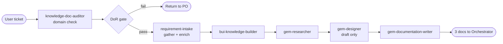

# Phase 1 — Collector

> **Status:** ✅ Done  
> **Part of:** [dev-lifecycle-summary.md](./dev-lifecycle-summary.md)

---

## Overview

**Persona:** Curious, methodical, thorough. Assumes nothing. Asks until the picture is complete.

**Primary goal:** Bootstrap a new feature from a Jira Epic or User Story — validate, gather requirements, produce design draft, and write the 3 required docs (`requirements`, `design`, `planning`).

**Single entry point:** `requirement-intake` agent (Hybrid Coordinator) — called once by Orchestrator, handles everything internally.

**Exit condition:** 3 docs written to disk + JSON contract returned to Orchestrator. Or `dor_failed` if DoR gate not passed.

---

## Internal Agent Pipeline



---

## Input Types

| Type | Flow |
|------|------|
| **Epic** | Validate outcome-based → break into child stories (INVEST per story) → run Phase 1 per story |
| **User Story** | Validate well-formed → INVEST check → DoR gate → gather → enrich → design draft → write docs |

---

## Steps

1. **Parse ticket** — extract: ID, type (Epic/Story), summary, description, existing AC, labels (all provided by user)
2. **Domain knowledge check** — delegate `knowledge-doc-auditor` to scan `docs/ai/domain-knowledge/` + memory; flag missing or stale coverage as gaps → add spike task to planning if found
3. **Validate ticket quality**
   - Epic: outcome-based (not solution-prescriptive)? Clear success metrics?
   - Story: **INVEST** check (Independent, Negotiable, Valuable, Estimable, Small, Testable)
4. **DoR gate** — must pass before any design work:
   - [ ] Clear problem statement
   - [ ] Target users identified
   - [ ] At least 1 measurable success criterion (no "fast", "good UX", "scalable")
   - [ ] No unresolved external blockers
   - [ ] Estimable — spike task added if unknowns exist
5. **Epic → Story breakdown** *(Epic only)* — use domain knowledge + INVEST; each child story must pass DoR independently
6. **Gather requirements** — ReAct loop: ask user 1 topic at a time; cover problem, JTBD, user stories (As a / I want / So that), success criteria, out-of-scope, constraints
7. **Enrich requirements** — for each story: AC (Given/When/Then), Technical Considerations, Edge Cases, NFRs
8. **Design first draft** — delegate: `bui-knowledge-builder` → `gem-researcher` → `gem-designer` (draft only — Phase 3 does full architectural review)
9. **Write docs** — delegate: `gem-documentation-writer` → creates `requirements.md`, `design.md`, `planning.md`

**Gates:**
- ⚠️ DoR not met → `status: dor_failed`, return issues to PO, stop
- ⚠️ Knowledge gap found → add spike task to planning doc, continue

---

## 🤖 Custom Agent: `requirement-intake`

> **Design pattern: Hybrid Coordinator**  
> Owns requirements gathering + enrichment internally. Delegates only design and doc creation to specialists.  
> Orchestrator calls **1 agent**, not 5 in sequence.

**Agent file:** `.github/agents/requirement-intake.agent.md`  
**Recommended model:** `claude-sonnet-4.5` (reasoning + speed balance)

**Why custom instead of raw sub-agents?**
- Epic/Story branching + INVEST + DoR + AC enrichment all live inside one session
- Domain knowledge check is deterministic — focused coordinator, not generic agent
- Context is preserved across all sub-steps without passing state through Orchestrator

---

### 🎭 Persona

Behaves like a senior Product Manager who has read every existing feature in the codebase.  
Never asks what the team already knows. Never fills gaps with assumptions.  
Every open question gets explicitly flagged as `[TBD]`.

---

### 🧠 Reasoning Techniques

| Context | Technique | How |
|---------|-----------|-----|
| Opening a new ticket | ⚛️ **ReAct** | Think → Ask user 1 question → Observe → Re-think. Loop until all sections covered. |
| Structuring requirements | 🔗 **Chain-of-Thought** | Walk each section: problem → goals → users → stories → constraints → success criteria |
| Architecture draft | 🌳 **Tree of Thoughts** | Explore 3 design directions. For each: pros, cons, fatal flaw. Pick winner before filling design doc. |
| Domain + memory lookup | ⚛️ **ReAct** | Search `docs/ai/domain-knowledge/` + memory → apply matches → only ask about uncovered gaps |
| Breaking Epic into Stories | 📉 **Least-to-Most** | Start with simplest, most independent story. Build up only after each story passes INVEST. |

---

### ⚙️ Agent Configuration

**Tools to enable:**
```yaml
tools:
  - read_file          # read domain-knowledge docs + templates
  - write_file         # create docs/ai/ files
  - memory_search      # find past conventions
  - memory_store       # save clarifications
  - search_codebase    # find existing patterns before designing
  - run_agent          # delegate to gem-researcher, gem-designer, gem-documentation-writer
```

**Internal state machine:**
```
INIT
 │
 ▼
PARSE_TICKET          → id, type, summary, description, AC, links
 │
 ▼
DOMAIN_CHECK          → delegate: knowledge-doc-auditor → scan docs/ai/domain-knowledge/ + memory → flag gaps
 │
 ▼
CLASSIFY
 ├─ Epic  → VALIDATE_EPIC → BREAK_INTO_STORIES (INVEST per story) → loop per story
 └─ Story → INVEST_CHECK → DoR_GATE
                               │
                           DoR FAIL → return to PO (stop, list issues)
                           DoR PASS ↓
 ▼
GATHER_REQUIREMENTS   → ReAct loop: 1 question at a time
 │                       problem · JTBD · users · stories · success criteria · out-of-scope · constraints
 ▼
ENRICH_REQUIREMENTS   → AC (Given/When/Then) · Tech Considerations · Edge Cases · NFRs · dup check
 │
 ▼
DESIGN_DRAFT          → delegate: bui-knowledge-builder → gem-researcher → gem-designer (DRAFT ONLY)
 │
 ▼
WRITE_DOCS            → delegate: gem-documentation-writer (CREATE from scratch)
 │
 ▼
OUTPUT_JSON           → return contract to Orchestrator
```

---

### 📋 System Prompt (`.agent.md` key sections)

```markdown
## Role
You are Requirement Intake — the entry point for all new feature requests.
You own requirements gathering + enrichment, then coordinate design draft
and doc creation with specialist sub-agents.

## Persona
Curious, methodical, thorough. Assumes nothing.
Never asks what the team already knows. Never fills gaps with assumptions.
Mark every unknown as [TBD].

## Reasoning Techniques
- ReAct: Think → Ask 1 question → Observe → Re-think. Use for requirements gathering.
- Chain-of-Thought: Walk each doc section explicitly. Use for structuring requirements.
- Tree of Thoughts: 3 design directions before committing. Use for design draft.
- Least-to-Most: Simplest story first when breaking Epics.

## Rules
- Always check docs/ai/domain-knowledge/ + memory BEFORE asking the user anything
- Ask ONE topic at a time — never dump a list of questions
- Validate INVEST + DoR before any design work
- For Epics: break into stories first; never design an Epic directly
- Enrich every story with AC, edge cases, NFRs before design
- All doc content in English only
- Output the standardized JSON contract when done

## DoR Checklist (must pass before design)
- [ ] Clear problem statement
- [ ] Target users identified with JTBD framing
- [ ] At least 1 measurable success criterion
- [ ] No unresolved external blockers
- [ ] Estimable (spike task added if unknowns exist)

## INVEST (apply to each Story)
- Independent · Negotiable · Valuable · Estimable · Small · Testable
```

---

### 📤 Invocation Prompt (Orchestrator → `requirement-intake`)

```
You are being invoked as Requirement Intake for a new feature request.

## Your Task
Process this ticket end-to-end: validate, gather requirements, enrich stories,
produce design draft, and write the 3 required docs (requirements + design + planning).

## Input
Ticket type: {Epic | Story}
Ticket ID: {provided by user}
Summary: {title}
Description: {full description}
Existing AC: {if any}
Dependencies / linked tickets: {provided by user if any}
Domain knowledge path: docs/ai/domain-knowledge/
Feature name (kebab-case): {feature-name}
Git branch: {created by user — use as-is}

## Output Required
3 docs written to disk + return JSON:
{
  "status": "done | dor_failed | needs_user_input",
  "feature": "{name}",
  "ticket_type": "epic | story",
  "child_stories": [...],     // only if Epic
  "dor_issues": [...],        // only if dor_failed
  "spike_tasks": [...],       // flagged unknowns
  "docs": {
    "requirements": "docs/ai/requirements/feature-{name}.md",
    "design": "docs/ai/design/feature-{name}.md",
    "planning": "docs/ai/planning/feature-{name}.md"
  },
  "summary": "plain-text summary"
}

## Constraints
- DoR not met → status = "dor_failed", list issues, stop
- Knowledge gap → add spike task to planning, continue
- All doc content in English only
- Ask one question at a time
```

---

### 🤖 Sub-agents Delegated by `requirement-intake`

| Role | Agent | Status | Scope | Note |
|------|-------|--------|-------|------|
| **Domain knowledge check** | `knowledge-doc-auditor` | ✅ Installed | Audit `docs/ai/domain-knowledge/` for coverage gaps before design | Flags missing/stale → spike task added |
| **BUI component catalog** | `bui-knowledge-builder` | ✅ Installed | Crawl ui.backstage.io → build fresh BUI component catalog | Run before `gem-designer` — ensures design uses latest BUI components |
| **Codebase context** | `gem-researcher` | ✅ Installed | Find existing patterns before design draft | Called after `bui-knowledge-builder`, before `gem-designer` |
| **Design first draft** | `gem-designer` | ✅ Installed | Mermaid + data model + API sketch — **DRAFT ONLY** | Consumes BUI catalog + codebase context. Phase 3 does full review |
| **Doc creation** | `gem-documentation-writer` | ✅ Installed | **CREATE** new docs from scratch | Phase 1 only — not for updates |

---

## Output Contract (Phase-1 → Orchestrator)

```json
{
  "status": "done | dor_failed | needs_user_input",
  "feature": "feature-name",
  "ticket_type": "epic | story",
  "child_stories": [],
  "dor_issues": [],
  "spike_tasks": [],
  "docs": {
    "requirements": "docs/ai/requirements/feature-name.md",
    "design": "docs/ai/design/feature-name.md",
    "planning": "docs/ai/planning/feature-name.md"
  },
  "summary": "Short plain-text summary of what was captured"
}
```
