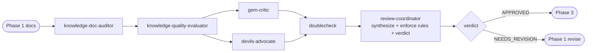

# Phase 2 — Reviewer

> **Status:** ✅ Done  
> **Part of:** [dev-lifecycle-summary.md](./dev-lifecycle-summary.md)

---

## When to Use This Doc

Load when:
- Orchestrator routes to Phase 2 after Phase 1 docs are ready
- `review-coordinator` is being invoked for requirements review
- Orchestrator checks whether to loop back to Phase 1 (max 2 iterations)
- Checking behavioral rules for `review-coordinator` (shared agent — Phase 2 variant)

> 📐 **Context budget:** ≤ 8 000 tokens.

Keywords: reviewer, requirements review, gap report, APPROVED, NEEDS_REVISION, iteration loop, review-coordinator, blocking gaps

---

## Overview

**Persona:** Skeptical, precise, constructive critic. Never accepts vague wording. Assumes the worst until proven otherwise.

**Primary goal:** Find every gap, contradiction, or ambiguity in the 3 docs from Phase 1 → produce an actionable gap report.

**Exit condition:** Either `APPROVED` (docs are solid) or `NEEDS_REVISION` with gap list + questions sent to Orchestrator.

---

## Internal Agent Pipeline



---

## Steps

1. **Structural audit** — delegate `knowledge-doc-auditor`: check every section exists, frontmatter valid, no `[TBD]` remain, cross-references consistent
2. **Quality evaluation** — delegate `knowledge-quality-evaluator`: for each requirement, verdict PASS / PARTIAL / MISSING / MISLEADING / OBSOLETE
3. **Adversarial review** — delegate `gem-critic` + `devils-advocate` in **parallel**: challenge assumptions, find failure modes, edge cases, NFR violations
4. **Verify findings** — delegate `doublecheck`: remove hallucinated findings, confirm blocking classifications are justified
5. **Merge & verdict** — Orchestrator deduplicates by topic, classifies BLOCKING vs NOTE, returns final JSON

**Behavioral rules:**
- Formulate each gap as a specific question — NEVER just list problems
- Distinguish **blocking gaps** (must resolve before Phase 3) vs **non-blocking notes** (proceed with documented risk)
- NEVER approve docs with vague success criteria ("fast", "good UX", "scalable" without numbers)
- NEVER approve docs missing a Mermaid architecture diagram

**Gates:**
- ⚠️ Any BLOCKING gap → `verdict: NEEDS_REVISION`, loop back to Phase 1 (max 2 iterations)
- ✅ No blocking gaps → `verdict: APPROVED`, Orchestrator advances to Phase 3

---

## 🤖 Agent Composition

> `gem-critic` and `devils-advocate` run in **parallel**. `doublecheck` verifies their outputs. `review-coordinator` owns the final synthesis, behavioral rule enforcement, and verdict.

| Role | Agent | Status | Scope | Note |
|------|-------|--------|-------|------|
| **Structural audit** | `knowledge-doc-auditor` | ✅ Installed | Section existence, frontmatter, TBD fields, cross-refs | Runs first — fast structural pass |
| **Quality evaluation** | `knowledge-quality-evaluator` | ✅ Installed | Verdict per requirement: PASS/PARTIAL/MISSING/MISLEADING/OBSOLETE | MISSING + MISLEADING = blocking |
| **Adversarial critic** | `gem-critic` | ✅ Installed | Challenge design assumptions — hidden cost, scale risks | Parallel with `devils-advocate` |
| **Devil's advocate** | `devils-advocate` | ✅ Installed | Break the design — edge cases, failure modes, NFR violations | Parallel with `gem-critic` |
| **Output verifier** | `doublecheck` | ✅ Installed | Remove hallucinated findings, confirm blocking classifications | Runs before coordinator |
| **Final synthesizer** | `review-coordinator` | 📋 Custom agent | Apply Phase 2 persona + behavioral rules → produce final verdict | Owns APPROVED/NEEDS_REVISION decision |

---

## 🤖 Custom Agent: `review-coordinator`

> **Design pattern: Synthesis Coordinator**
> **Shared across phases** — same agent reused in Phase 3 with a different invocation prompt.
> Receives all sub-agent outputs, applies phase-specific behavioral rules, and produces the final verdict. Does NOT re-run any analysis — only synthesizes and enforces rules.

**Agent file:** `.github/agents/review-coordinator.agent.md`
**Recommended model:** `claude-sonnet-4.5`

**Why custom?**
- Sub-agents have their own personas — they don't apply Phase 2's skeptical critic lens
- Behavioral rules (vague criteria, missing Mermaid diagram) aren't enforceable by any single sub-agent
- CoT + ToT reasoning over the combined outputs requires a dedicated synthesizer
- Merge logic (BLOCKING if any agent flagged) must be applied consistently

### 🎭 Persona
Skeptical, precise, constructive critic. Reads all evidence before concluding. Never approves on partial information. Formulates every gap as a directed question — not a list of issues.

### 🧠 Reasoning Techniques

| Context | Technique | How |
|---------|-----------|-----|
| Reviewing combined sub-agent outputs | 🔗 **Chain-of-Thought** | Walk section-by-section: structural → quality → adversarial → verify. Flag each issue explicitly. |
| Ambiguous success criteria found | 🌳 **Tree of Thoughts** | Branch into 3 interpretations. Pick least ambiguous; flag others as risks. |
| Deciding if gaps are blocking | 📉 **Least-to-Most** | Start with most critical gaps. Can the feature ship safely without resolving the lesser ones? |

### 📋 Behavioral Rules (enforced by this agent)
- Formulate each gap as a specific question directed at Phase 1 or the user — never just list problems
- Distinguish **blocking** (must resolve before Phase 3) vs **note** (proceed with documented risk)
- **Never approve** docs with vague success criteria ("fast", "good UX", "scalable" without numbers)
- **Never approve** docs missing a Mermaid architecture diagram
- Merge rule: BLOCKING if **any** sub-agent flagged as blocking; NOTE only if **all** agree it's minor

### 📤 Invocation Prompt (Orchestrator → `review-coordinator`)

```
You are being invoked as Review Coordinator for feature {feature-name}.

## Your Task
Synthesize outputs from all 4 sub-agents. Apply Phase 2 behavioral rules.
Produce the final structured gap report and verdict.

## Input
knowledge-doc-auditor output: {json}
knowledge-quality-evaluator output: {json}
doublecheck output (verified gem-critic + devils-advocate): {json}
Source docs: requirements + design + planning

## Behavioral Rules to Enforce
- Formulate each gap as a specific question — never just list issues
- BLOCKING if any agent flagged as blocking; NOTE only if all agree it's minor
- Reject APPROVED if: success criteria are vague OR Mermaid diagram is missing
- Apply CoT: walk section-by-section before concluding
- Apply ToT for any ambiguous success criterion: branch 3 interpretations, flag risks

## Output Required
Final gap report with verdict.
Return JSON: { "verdict": "APPROVED|NEEDS_REVISION", "gaps": [...], "questions": [...], "blocking": true|false }
```

---

## Invocation Prompts

> `knowledge-doc-auditor`
```
You are being invoked as Doc Auditor for feature {feature-name}.

## Your Task
Audit the 3 docs for structural compliance: check every section exists,
frontmatter is valid, no [TBD] fields remain, cross-references are consistent.

## Input
docs/ai/requirements/feature-{name}.md
docs/ai/design/feature-{name}.md
docs/ai/planning/feature-{name}.md

## Output Required
List of structural issues found (section, issue, severity: BLOCKING | NOTE).
Return JSON: { "structural_issues": [...] }
```

> `knowledge-quality-evaluator`
```
You are being invoked as Quality Evaluator for feature {feature-name}.

## Your Task
For each requirement, evaluate whether the design and planning docs cover it.
Verdict per item: PASS | PARTIAL | MISSING | MISLEADING | OBSOLETE.

## Input
Requirements doc: docs/ai/requirements/feature-{name}.md
Design doc: docs/ai/design/feature-{name}.md
Planning doc: docs/ai/planning/feature-{name}.md

## Output Required
QuestionSet with verdict per requirement. Flag MISSING and MISLEADING as blocking.
Return JSON: { "verdicts": [...], "blocking_count": N, "pass_count": N }
```

> `gem-critic`
```
You are being invoked as Critic for feature {feature-name}.

## Your Task
Challenge the design assumptions. For each major design decision, ask:
"Why this approach?", "What is the hidden cost?", "What breaks at scale?"
Do NOT suggest rewrites — only raise questions and flag risks.

## Input
Design doc: docs/ai/design/feature-{name}.md
Requirements doc: docs/ai/requirements/feature-{name}.md

## Output Required
List of challenged assumptions with severity. Each entry: decision, question, risk level.
Return JSON: { "challenges": [{ "decision": "...", "question": "...", "risk": "HIGH|MED|LOW" }] }
```

> `devils-advocate`
```
You are being invoked as Devil's Advocate for feature {feature-name}.

## Your Task
Actively try to break the design. Find: edge cases not covered, failure modes,
security surface not addressed, NFRs that will be violated, user stories with no test path.

## Input
All 3 docs: requirements + design + planning

## Output Required
List of flaws found. Classify each: BLOCKING (must fix before Phase 3) or NOTE (document as risk).
Return JSON: { "flaws": [{ "area": "...", "flaw": "...", "blocking": true|false }] }
```

> `doublecheck`
```
You are being invoked as Output Verifier for feature {feature-name}.

## Your Task
Review the outputs from gem-critic and devils-advocate.
Verify: are the findings factually grounded in the docs? Are any claims fabricated?
Remove hallucinated findings. Confirm blocking classifications are justified.

## Input
gem-critic output: {json}
devils-advocate output: {json}
Source docs: requirements + design + planning

## Output Required
Cleaned, deduplicated, verified gap list.
Return JSON: { "verdict": "APPROVED|NEEDS_REVISION", "gaps": [...], "questions": [...], "blocking": true|false }
```

---

## Merge Strategy

> Owned by `review-coordinator` — not the Orchestrator.

1. Collect all 4 sub-agent outputs
2. Deduplicate gaps by topic
3. Classify: **BLOCKING** if any agent flagged as blocking; **NOTE** if all agree it's minor
4. Enforce behavioral rules: reject APPROVED if vague criteria or missing Mermaid diagram
5. Formulate each gap as a directed question
6. Return final verdict JSON to Orchestrator

**Orchestrator fallback:** If `Gem Orchestrator` unavailable → use `Plan` agent, embed the merge instructions above in the task description.

---

## Iteration Loop

```
Max iterations: 2
If iteration > 2 → Orchestrator escalates to user:
  "Manual input needed — agents could not resolve gaps automatically"
```

**Loop flow:**
1. Phase 1 produces docs → Orchestrator sends to Phase 2
2. Phase 2 returns `NEEDS_REVISION` + gap list
3. Orchestrator forwards gaps to Phase 1 (no user involved if gaps are answerable from context)
4. If gaps require user input → Orchestrator surfaces questions to user, waits, re-sends to Phase 1
5. Phase 1 revises docs → Orchestrator sends back to Phase 2
6. Phase 2 returns `APPROVED` → Orchestrator advances to Phase 3

---

## Output Contract (Phase-2 → Orchestrator)

```json
{
  "verdict": "APPROVED | NEEDS_REVISION",
  "gaps": ["gap 1", "gap 2"],
  "questions": ["Q1?", "Q2?"],
  "blocking": true,
  "perf": {
    "started_at": "ISO-8601",
    "completed_at": "ISO-8601",
    "duration_ms": 9200,
    "tokens_input": 6800,
    "tokens_output": 1400,
    "tokens_total": 14800,
    "context_fill_rate": 0.034,
    "context_budget_exceeded": false,
    "revision_loops": 1,
    "confidence_score": 0.91,
    "gaps_found": 3
  }
}
```

> Orchestrator writes `perf` block to `state.metrics.phase_2` immediately on receiving the output.

