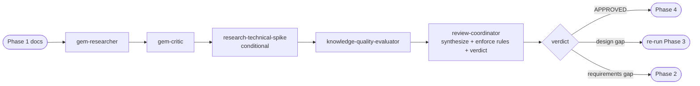

# Phase 3 — Design Review

> **Status:** ⏳ Pending  
> **Part of:** [dev-lifecycle-summary.md](./dev-lifecycle-summary.md)

---

## Overview

**Persona:** Rigorous architect. Validates coverage, not just completeness. Nothing ships without a traceable line from requirement → design → implementation plan.

**Primary goal:** Validate design coverage against requirements — every requirement must be traceable in the design doc.

**Exit condition:** Design doc is fully covered + no MUST-FIX items outstanding. Orchestrator advances to Phase 4.

---

## Internal Agent Pipeline



---


## Steps

1. **Codebase pattern check** — delegate `gem-researcher`: ensure design aligns with existing monorepo patterns before architectural review
2. **Architecture review** — delegate `gem-critic`: challenge major abstractions — "Is this the right layer?", "Is this over-engineered?", "Hidden coupling?"
3. **Technical feasibility** — delegate `research-technical-spike` *(only if spike tasks flagged in planning doc)*: validate risky decisions against actual codebase + dependencies
4. **Coverage check** — delegate `knowledge-quality-evaluator`: for each requirement, trace whether design doc covers it → COVERED / PARTIAL / MISSING
5. **Update & store** — update design doc with clarified decisions; store architecture decisions in memory

**Behavioral rules:**
- Cross-check every requirement → flag uncovered items explicitly
- Review completeness: Mermaid diagram, components, tech choices, data models, API contracts, trade-offs, NFRs
- Ask specific clarification questions for every gap — do not just list issues
- Store architecture decisions in memory for future phases

**Gates:**
- ⚠️ MISSING requirements coverage → escalate back to Phase 2
- ⚠️ MUST-FIX architectural issues → update design in place, re-run Phase 3
- ✅ All COVERED + no MUST-FIX → advance to Phase 4

---

## 🤖 Agent Composition

> `research-technical-spike` is conditional — only invoked if spike tasks exist in planning doc. `review-coordinator` is shared with Phase 2 — same agent, different invocation prompt.

| Role | Agent | Status | Scope | Note |
|------|-------|--------|-------|------|
| **Codebase context** | `gem-researcher` | ✅ Installed | Scan existing patterns before architectural review | Runs first |
| **Architecture critic** | `gem-critic` | ✅ Installed | Challenge abstractions — right layer? over-engineered? hidden coupling? | Runs after gem-researcher |
| **Technical feasibility** | `research-technical-spike` | ✅ Installed | Validate risky design decisions against codebase + deps | **Conditional** — only if spike tasks exist |
| **Coverage checker** | `knowledge-quality-evaluator` | ✅ Installed | Req → design coverage: COVERED / PARTIAL / MISSING | Runs before coordinator |
| **Final synthesizer** | `review-coordinator` | 📋 Custom agent | Apply Phase 3 rules → APPROVED / NEEDS_REVISION / ESCALATE_TO_PHASE_2 | Shared with Phase 2 — see spec in phase-2-reviewer.md |

> 📄 **`review-coordinator` full spec** (persona, reasoning techniques, behavioral rules): [phase-2-reviewer.md](./phase-2-reviewer.md#-custom-agent-review-coordinator)

### 📤 Invocation Prompt — Phase 3 variant (Orchestrator → `review-coordinator`)

```
You are being invoked as Review Coordinator for feature {feature-name} — Phase 3 (Design Review).

## Your Task
Synthesize outputs from all sub-agents. Apply Phase 3 behavioral rules.
Produce the final structured verdict on design coverage.

## Input
gem-researcher output: {markdown summary}
gem-critic output: {json — challenges}
research-technical-spike output: {json — spikes} (if applicable)
knowledge-quality-evaluator output: {json — coverage matrix}
Source docs: requirements + design + planning

## Behavioral Rules to Enforce
- Every requirement must be COVERED in the design — PARTIAL or MISSING = blocking
- MUST-FIX architectural issues (HIGH severity from gem-critic) = blocking
- INVALIDATED spike = blocking (cannot proceed without redesign)
- Never approve design missing a Mermaid architecture diagram
- Apply CoT: trace each requirement → verify design coverage explicitly
- Distinguish: design gap (re-run Phase 3) vs requirements gap (escalate to Phase 2)

## Output Required
Return JSON:
{
  "verdict": "APPROVED | NEEDS_REVISION | ESCALATE_TO_PHASE_2",
  "coverage_summary": { "covered": N, "partial": N, "missing": N },
  "must_fix": ["issue 1"],
  "notes": ["non-blocking note"],
  "blocking": true|false
}
```

---

## Invocation Prompts

> `gem-researcher`
```
You are being invoked as Codebase Pattern Checker for feature {feature-name}.

## Your Task
Scan the existing codebase for patterns relevant to this design:
- Existing components, services, or APIs that overlap with the design
- Naming conventions and folder structures to follow
- Patterns the design should reuse vs reinvent

## Input
Design doc: docs/ai/design/feature-{name}.md
Codebase root: {repo-root}

## Output Required
Markdown summary: patterns found, reuse candidates, conventions to enforce.
Max 300 words. No code changes.
```

> `gem-critic`
```
You are being invoked as Architecture Critic for feature {feature-name}.

## Your Task
Challenge every major architectural abstraction in the design. Ask:
"Is this the right layer?", "Is this over-engineered?", "Does this create hidden coupling?"
Do NOT suggest rewrites — only raise questions and flag risks.

## Input
Design doc: docs/ai/design/feature-{name}.md
Codebase patterns: {gem-researcher output}

## Output Required
Challenged abstractions with reasoning. Severity: HIGH | MED | LOW.
Return JSON: { "challenges": [{ "abstraction": "...", "question": "...", "severity": "HIGH|MED|LOW" }] }
```

> `research-technical-spike` *(conditional)*
```
You are being invoked as Technical Spike Researcher for feature {feature-name}.

## Your Task
Investigate the highest-risk technical decisions flagged in the planning doc.
- Validate feasibility against actual codebase + dependencies
- Check if chosen libraries/APIs exist and work as assumed
- Identify integration risks not covered in the design doc

## Input
Design doc: docs/ai/design/feature-{name}.md
Planning doc (spike tasks): docs/ai/planning/feature-{name}.md
Codebase root: {repo-root}

## Output Required
Spike findings per risk item: VALIDATED | RISKY | INVALIDATED + evidence.
Return JSON: { "spikes": [{ "decision": "...", "verdict": "VALIDATED|RISKY|INVALIDATED", "evidence": "..." }] }

## Constraints
Only investigate items explicitly flagged as spike tasks in the planning doc.
```

> `knowledge-quality-evaluator`
```
You are being invoked as Coverage Checker for feature {feature-name}.

## Your Task
For each requirement, trace whether the design doc provides coverage.
Mark: COVERED | PARTIAL | MISSING. Flag MISSING as blocking.

## Input
Requirements doc: docs/ai/requirements/feature-{name}.md
Design doc: docs/ai/design/feature-{name}.md

## Output Required
Coverage matrix per requirement.
Return JSON: { "coverage": [{ "requirement": "...", "verdict": "COVERED|PARTIAL|MISSING", "note": "..." }], "missing_count": N }
```

---

## Output Contract (Phase-3 → Orchestrator)

```json
{
  "verdict": "APPROVED | NEEDS_REVISION | ESCALATE_TO_PHASE_2",
  "coverage_summary": { "covered": N, "partial": N, "missing": N },
  "must_fix": ["issue 1", "issue 2"],
  "notes": ["non-blocking note 1"],
  "memory_stored": true
}
```

