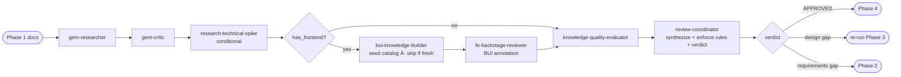

# Phase 3 — Design Review

> **Status:** ⏳ Pending  
> **Part of:** [dev-lifecycle-guide.md](./dev-lifecycle-guide.md)

---

## When to Use This Doc

Load when:
- Orchestrator routes to Phase 3 after Phase 2 APPROVED
- Design review is starting — coverage check + architecture critique
- `state.domain.has_frontend = true` → BUI knowledge seed + BUI annotation needed
- `research-technical-spike` is conditionally invoked for spike tasks

> 📐 **Context budget:** ≤ 10 000 tokens.

Keywords: design review, architecture critique, BUI annotation, coverage check, technical spike, research-technical-spike, bui-knowledge-builder, fe-backstage-reviewer

---

## Overview

**Persona:** Rigorous architect. Validates coverage, not just completeness. Nothing ships without a traceable line from requirement → design → implementation plan.

**Primary goal:** Validate design coverage against requirements — every requirement must be traceable in the design doc.

**Exit condition:** Design doc is fully covered + no MUST-FIX items outstanding. Orchestrator advances to Phase 4.

---

## Internal Agent Pipeline



---


## Steps

1. **Codebase pattern check** — delegate `gem-researcher`: ensure design aligns with existing monorepo patterns before architectural review
2. **Architecture review** — delegate `gem-critic`: challenge major abstractions — "Is this the right layer?", "Is this over-engineered?", "Hidden coupling?"
3. **Technical feasibility** — delegate `research-technical-spike` *(only if spike tasks flagged in planning doc)*: validate risky decisions against actual codebase + dependencies
4. **BUI Knowledge Seed** *(conditional — only if `has_frontend: true`)* — delegate `bui-knowledge-builder`:
   - Check if `docs/ai/domain-knowledge/bui-components.md` exists and version matches `@backstage/ui` in `packages/app/package.json`
   - If **missing or stale** → crawl `ui.backstage.io`, build full catalog, write to `docs/ai/domain-knowledge/bui-components.md`
   - If **already fresh** → skip crawl, return `status: skipped` immediately (no overhead)
   - Output feeds directly into step 5 as the BUI reference source
5. **BUI Design Annotation** *(conditional — only if `has_frontend: true`)* — delegate `fe-backstage-reviewer` as annotator:
   - Read design doc + `docs/ai/domain-knowledge/bui-components.md` (from step 4) + `AGENTS.md` coding standards
   - For each UI component described in the design, annotate the correct BUI equivalent and constraints
   - Append a `## BUI Design Constraints` block to the design doc (do NOT rewrite other sections)
   - Example annotation output:
     ```markdown
     ## BUI Design Constraints
     | Component Need | BUI/Backstage Component | Notes |
     |---|---|---|
     | UserList | `<Table>` from `@backstage/core-components` | Do NOT use MUI DataGrid |
     | Action buttons | `<Button>` from `@backstage/core-components` | |
     | Layout wrapper | `<Box>` + CSS Modules | Not `makeStyles` |
     | StatusChip | `<Chip>` MUI v7 | Wrap in `<MuiV7ThemeProvider>` |
     ```
   - `gem-implementer` in Phase 4 FE stream MUST consume this block
6. **Coverage check** — delegate `knowledge-quality-evaluator`: for each requirement, trace whether design doc covers it → COVERED / PARTIAL / MISSING
7. **Update & store** — update design doc with clarified decisions; store architecture decisions in memory

**Behavioral rules:**
- Cross-check every requirement → flag uncovered items explicitly
- Review completeness: Mermaid diagram, components, tech choices, data models, API contracts, trade-offs, NFRs
- Ask specific clarification questions for every gap — do not just list issues
- Store architecture decisions in memory for future phases

**Gates:**
- ⚠️ MISSING requirements coverage → escalate back to Phase 2
- ⚠️ MUST-FIX architectural issues → update design in place, re-run Phase 3
- ✅ All COVERED + no MUST-FIX → advance to Phase 4

---

## 🤖 Agent Composition

> `research-technical-spike` is conditional — only invoked if spike tasks exist in planning doc. `bui-knowledge-builder` + `fe-backstage-reviewer` are conditional — only invoked if `has_frontend: true`. `review-coordinator` is shared with Phase 2 — same agent, different invocation prompt.

| Role | Agent | Status | Scope | Note |
|------|-------|--------|-------|------|
| **Codebase context** | `gem-researcher` | ✅ Installed | Scan existing patterns before architectural review | Runs first |
| **Architecture critic** | `gem-critic` | ✅ Installed | Challenge abstractions — right layer? over-engineered? hidden coupling? | Runs after gem-researcher |
| **Technical feasibility** | `research-technical-spike` | ✅ Installed | Validate risky design decisions against codebase + deps | **Conditional** — only if spike tasks exist |
| **BUI knowledge seed** | `bui-knowledge-builder` | ✅ Installed | Ensure `docs/ai/domain-knowledge/bui-components.md` is fresh | **Conditional** — `has_frontend: true` only. Self-skips if version already matches. Runs before annotator. |
| **BUI annotator** | `fe-backstage-reviewer` | ✅ Installed | Annotate design doc with BUI component constraints — reads from `bui-components.md` | **Conditional** — `has_frontend: true` only. Read-only + appends annotation block |
| **Coverage checker** | `knowledge-quality-evaluator` | ✅ Installed | Req → design coverage: COVERED / PARTIAL / MISSING | Runs before coordinator |
| **Final synthesizer** | `review-coordinator` | 📋 Custom agent | Apply Phase 3 rules → APPROVED / NEEDS_REVISION / ESCALATE_TO_PHASE_2 | Shared with Phase 2 — see spec in phase-2-reviewer.md |

> 📄 **`review-coordinator` full spec** (persona, reasoning techniques, behavioral rules): [phase-2-reviewer.md](./phase-2-reviewer.md#-custom-agent-review-coordinator)

### 📤 Invocation Prompt — Phase 3 variant (Orchestrator → `review-coordinator`)

```
You are being invoked as Review Coordinator for feature {feature-name} — Phase 3 (Design Review).

## Your Task
Synthesize outputs from all sub-agents. Apply Phase 3 behavioral rules.
Produce the final structured verdict on design coverage.

## Input
gem-researcher output: {markdown summary}
gem-critic output: {json — challenges}
research-technical-spike output: {json — spikes} (if applicable)
knowledge-quality-evaluator output: {json — coverage matrix}
Source docs: requirements + design + planning

## Behavioral Rules to Enforce
- Every requirement must be COVERED in the design — PARTIAL or MISSING = blocking
- MUST-FIX architectural issues (HIGH severity from gem-critic) = blocking
- INVALIDATED spike = blocking (cannot proceed without redesign)
- Never approve design missing a Mermaid architecture diagram
- Apply CoT: trace each requirement → verify design coverage explicitly
- Distinguish: design gap (re-run Phase 3) vs requirements gap (escalate to Phase 2)

## Output Required
Return JSON:
{
  "verdict": "APPROVED | NEEDS_REVISION | ESCALATE_TO_PHASE_2",
  "coverage_summary": { "covered": N, "partial": N, "missing": N },
  "must_fix": ["issue 1"],
  "notes": ["non-blocking note"],
  "blocking": true|false
}
```

---

## Invocation Prompts

> `gem-researcher`
```
You are being invoked as Codebase Pattern Checker for feature {feature-name}.

## Your Task
Scan the existing codebase for patterns relevant to this design:
- Existing components, services, or APIs that overlap with the design
- Naming conventions and folder structures to follow
- Patterns the design should reuse vs reinvent

## Input
Design doc: docs/ai/design/feature-{name}.md
Codebase root: {repo-root}

## Output Required
Markdown summary: patterns found, reuse candidates, conventions to enforce.
Max 300 words. No code changes.
```

> `gem-critic`
```
You are being invoked as Architecture Critic for feature {feature-name}.

## Your Task
Challenge every major architectural abstraction in the design. Ask:
"Is this the right layer?", "Is this over-engineered?", "Does this create hidden coupling?"
Do NOT suggest rewrites — only raise questions and flag risks.

## Input
Design doc: docs/ai/design/feature-{name}.md
Codebase patterns: {gem-researcher output}

## Output Required
Challenged abstractions with reasoning. Severity: HIGH | MED | LOW.
Return JSON: { "challenges": [{ "abstraction": "...", "question": "...", "severity": "HIGH|MED|LOW" }] }
```

> `research-technical-spike` *(conditional)*
```
You are being invoked as Technical Spike Researcher for feature {feature-name}.

## Your Task
Investigate the highest-risk technical decisions flagged in the planning doc.
- Validate feasibility against actual codebase + dependencies
- Check if chosen libraries/APIs exist and work as assumed
- Identify integration risks not covered in the design doc

## Input
Design doc: docs/ai/design/feature-{name}.md
Planning doc (spike tasks): docs/ai/planning/feature-{name}.md
Codebase root: {repo-root}

## Output Required
Spike findings per risk item: VALIDATED | RISKY | INVALIDATED + evidence.
Return JSON: { "spikes": [{ "decision": "...", "verdict": "VALIDATED|RISKY|INVALIDATED", "evidence": "..." }] }

## Constraints
Only investigate items explicitly flagged as spike tasks in the planning doc.
```

> `knowledge-quality-evaluator`
```
You are being invoked as Coverage Checker for feature {feature-name}.

## Your Task
For each requirement, trace whether the design doc provides coverage.
Mark: COVERED | PARTIAL | MISSING. Flag MISSING as blocking.

## Input
Requirements doc: docs/ai/requirements/feature-{name}.md
Design doc: docs/ai/design/feature-{name}.md

## Output Required
Coverage matrix per requirement.
Return JSON: { "coverage": [{ "requirement": "...", "verdict": "COVERED|PARTIAL|MISSING", "note": "..." }], "missing_count": N }
```

> `bui-knowledge-builder` — BUI Knowledge Seed *(conditional — only if `has_frontend: true`)*
```
You are being invoked as BUI Knowledge Seeder for feature {feature-name}.

## Your Task
Ensure the BUI component catalog is fresh before annotation begins.
Check the current @backstage/ui version and compare against catalog version header.
If catalog is missing or stale → crawl ui.backstage.io and rebuild.
If already fresh → skip immediately.

## Input
packages/app/package.json  ← read @backstage/ui version
docs/ai/domain-knowledge/bui-components.md  ← existing catalog (may not exist)

## Output Required
Return JSON: { "status": "completed|skipped", "bui_version": "x.y.z", "output_path": "docs/ai/domain-knowledge/bui-components.md" }
```

> `fe-backstage-reviewer` — BUI Annotator *(conditional — only if `has_frontend: true`)*
```
You are being invoked as BUI Design Annotator for feature {feature-name}.

## Your Task
Read the design doc and identify every UI component or layout decision described.
For each, annotate the correct Backstage UI (BUI) component to use, and any constraints.
Do NOT rewrite the design doc — only APPEND a new section: "## BUI Design Constraints".

## Input
Design doc: docs/ai/design/feature-{name}.md
BUI component catalog: docs/ai/domain-knowledge/bui-components.md  ← USE THIS as primary reference
Coding standards: AGENTS.md (BUI first, no MUI makeStyles, CSS Modules, MuiV7ThemeProvider rules)

## Annotation Rules
- BUI-first: consult bui-components.md before anything else
- If BUI equivalent exists in catalog → use it. If only MUI exists → flag it and note MuiV7ThemeProvider requirement
- No `import React` — project uses react-jsx transform
- No JSDoc in code files
- CSS Modules over makeStyles
- Remix Icons (`@remixicon/react`) over `@material-ui/icons`

## Output Required
Append this block verbatim to the design doc:
---
## BUI Design Constraints
_(auto-annotated by fe-backstage-reviewer — Phase 3)_
| Component Need | BUI/Backstage Component | Notes |
|---|---|---|
| {need} | `{component}` | {constraint or MuiV7ThemeProvider note} |
---
Return JSON: { "annotations_count": N, "muiv7_wrappers_required": ["..."], "appended_to": "docs/ai/design/feature-{name}.md" }
```

---

## Output Contract (Phase-3 → Orchestrator)

```json
{
  "verdict": "APPROVED | NEEDS_REVISION | ESCALATE_TO_PHASE_2",
  "coverage_summary": { "covered": N, "partial": N, "missing": N },
  "must_fix": ["issue 1", "issue 2"],
  "notes": ["non-blocking note 1"],
  "memory_stored": true,
  "perf": {
    "started_at": "ISO-8601",
    "completed_at": "ISO-8601",
    "duration_ms": 11600,
    "tokens_input": 9800,
    "tokens_output": 1600,
    "tokens_total": 18200,
    "context_fill_rate": 0.049,
    "context_budget_exceeded": false,
    "requirements_covered_pct": 92,
    "must_fix_count": 2
  }
}
```

> Orchestrator writes `perf` block to `state.metrics.phase_3` immediately on receiving the output.

