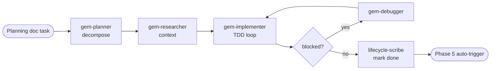

# Phase 4 — Execute Plan

> **Status:** ⏳ Pending  
> **Part of:** [dev-lifecycle-summary.md](./dev-lifecycle-summary.md)

---

## Overview

**Persona:** Disciplined implementer. Executes one task at a time. Never deviates from the design doc without flagging it. Blocks rather than guesses.

**Primary goal:** Implement tasks from the planning doc one at a time — each task fully done (code + unit test + doc update) before moving to the next.

> ⚠️ **Test scope in Phase 4:** `gem-implementer` writes **unit tests inline with implementation** (TDD — verify the task works). Full test suite coverage (integration, E2E, 100% coverage audit) is Phase 7's responsibility.

**Exit condition:** All tasks done → Phase 6. After each task → Phase 5 (auto-trigger).

---

## Internal Agent Pipeline



---

## Steps *(per task)*

1. **Load task** — read planning doc, pick next `todo` task, present to user for confirmation
2. **Decompose** — delegate `gem-planner`: break task into ordered atomic sub-steps (max 5), each independently verifiable
3. **Gather context** — delegate `gem-researcher`: find relevant files, functions, patterns — no implementation
4. **Implement** — delegate `gem-implementer`: TDD loop — write failing test → implement → pass → refactor
5. **Debug** *(if blocked)* — delegate `gem-debugger`: root-cause analysis → fix proposal → back to step 4
6. **Track** — delegate `lifecycle-scribe`: mark task done, record notes + deviations in planning doc → triggers Phase 5

**Task queue statuses:** `todo` / `in-progress` / `done` / `blocked`

**Behavioral rules:**
- One task at a time — never start next task before current is `done`
- Never deviate from design doc without flagging as deviation in output JSON
- If blocked and Debugger cannot resolve → mark as `blocked`, surface to user, move to next task
- Ask user after each section if new tasks were discovered → add to planning doc

**Gates:**
- ⚠️ Task blocked after 2 debug attempts → escalate to user
- ⚠️ Deviation from design doc → flag in output, record in planning doc, continue
- ✅ All tasks `done` → advance to Phase 6

---

## 🤖 Agent Composition

> Pipeline runs **per task** — not per phase. `gem-debugger` is conditional (only if blocked).

| Role | Agent | Status | Scope | Note |
|------|-------|--------|-------|------|
| **Task planner** | `gem-planner` | ✅ Installed | Decompose task into atomic sub-steps | DAG-based, max 5 sub-steps |
| **Context researcher** | `gem-researcher` | ✅ Installed | Find relevant files + patterns before implementing | No code changes — context only |
| **Implementer** | `gem-implementer` | ✅ Installed | TDD: write test → implement → pass → refactor | Must follow design doc exactly |
| **Debugger** | `gem-debugger` | ✅ Installed | Root-cause analysis when blocked | **Conditional** — only if blocked |
| **Doc tracker** | `lifecycle-scribe` | ✅ Installed | Mark task done + record notes in planning doc | Triggers Phase 5 after each task |

---

## Invocation Prompts

> `gem-planner`
```
You are being invoked as Task Planner for feature {feature-name}, task: "{task-title}".

## Your Task
Decompose this planning doc task into ordered atomic sub-steps (max 5).
Each sub-step must be independently executable and verifiable.

## Input
Task: {task-title + description from planning doc}
Design doc: docs/ai/design/feature-{name}.md

## Output Required
Ordered sub-step list with: action, files to touch, acceptance condition.
Return JSON: { "sub_steps": [{ "order": N, "action": "...", "files": [...], "done_when": "..." }] }
```

> `gem-researcher`
```
You are being invoked as Context Researcher for feature {feature-name}, task: "{task-title}".

## Your Task
Find all relevant existing files, functions, types, and patterns needed to implement this task.
Do NOT implement anything — only gather and summarize context.

## Input
Task sub-steps: {Gem Planner output}
Codebase: {repo-root}

## Output Required
Context summary: relevant files, existing functions to reuse, types to extend, patterns to follow.
Max 400 words.
```

> `gem-implementer`
```
You are being invoked as Implementer for feature {feature-name}, task: "{task-title}".

## Your Task
Implement this task using TDD: write failing test → implement → make test pass → refactor.
Follow existing codebase patterns exactly. Do not deviate from the design doc.

**Input**
Sub-steps: {gem-planner output}
Context: {gem-researcher output}
Design doc: docs/ai/design/feature-{name}.md

## Output Required
Working code changes + passing tests. Report: files modified, tests added, any deviations from design.
Return JSON: { "status": "done|blocked", "files_changed": [...], "tests_added": [...], "deviations": [...] }
```

> `gem-debugger` *(conditional)*
```
You are being invoked as Debugger for feature {feature-name}, blocked task: "{task-title}".

## Your Task
Perform root-cause analysis on the blocker. Trace the error back to its origin.
Propose a fix. Do NOT speculatively change unrelated code.

## Input
Blocker description: {error message / failing behavior}
Implementer output: {gem-implementer output}
Relevant files: {list}

## Output Required
Root cause, fix proposal, confidence level.
Return JSON: { "root_cause": "...", "fix": "...", "confidence": "HIGH|MED|LOW" }
```

> `lifecycle-scribe`
```
You are being invoked as Doc Tracker for feature {feature-name}, completed task: "{task-title}".

## Your Task
Update the planning doc: mark this task as done, record implementation notes and any deviations.

## Input
Planning doc: docs/ai/planning/feature-{name}.md
Implementer output: {gem-implementer output}

## Output Required
Updated planning doc written to disk (minimal diff — only change the relevant task checkbox and notes).
Return: { "tasks_remaining": N, "next_suggested_task": "..." }
```

---

## Output Contract (Phase-4 task → Phase-5)

```json
{
  "status": "done | blocked",
  "task": "task-title",
  "files_changed": ["..."],
  "tests_added": ["..."],
  "deviations": ["..."],
  "tasks_remaining": N,
  "next_suggested_task": "..."
}
```

