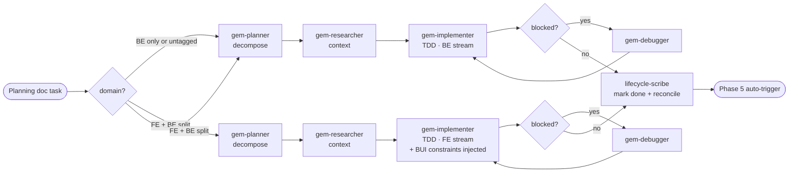

# Phase 4 — Execute Plan

> **Status:** ⏳ Pending  
> **Part of:** [dev-lifecycle-summary.md](./dev-lifecycle-summary.md)

---

## When to Use This Doc

Load when:
- Orchestrator routes to Phase 4 to implement a task from the planning doc
- Determining FE vs BE stream routing (`[fe]` tag + `has_frontend`)
- `gem-implementer` is being invoked — need BUI constraints injection rules
- `gem-debugger` is conditionally triggered for a blocked task

> 📐 **Context budget:** ≤ 8 000 tokens per task. Pass only the section relevant to current stream.

Keywords: execute plan, implementation, TDD, wave execution, FE stream, BE stream, gem-implementer, gem-debugger, BUI constraints injection

---

## Overview

**Persona:** Disciplined implementer. Executes one task at a time. Never deviates from the design doc without flagging it. Blocks rather than guesses.

**Primary goal:** Implement tasks from the planning doc one at a time — each task fully done (code + unit test + doc update) before moving to the next.

> ⚠️ **Test scope in Phase 4:** `gem-implementer` writes **unit tests inline with implementation** (TDD — verify the task works). Full test suite coverage (integration, E2E, 100% coverage audit) is Phase 7's responsibility.

**Exit condition:** All tasks done → Phase 6. After each task → Phase 5 (auto-trigger).

---

## Internal Agent Pipeline



---

## Steps *(per task)*

1. **Load task** — read planning doc, pick next `todo` task, present to user for confirmation
2. **Domain route** — check task tag:
   - `[fe]` tag AND `state.domain.has_frontend = true` → **FE stream** (BUI-aware)
   - `[be]` tag or no tag → **BE stream** (standard)
   - Both streams can run in parallel if they have no `conflicts_with` overlap
3. **Decompose** — delegate `gem-planner`: break task into ordered atomic sub-steps (max 5), each independently verifiable
4. **Gather context** — delegate `gem-researcher`: find relevant files, functions, patterns — no implementation
5. **Implement** — delegate `gem-implementer`:
   - **BE stream:** standard TDD — write failing test → implement → pass → refactor
   - **FE stream:** TDD + inject BUI constraints:
     - Mandatory additional input: `## BUI Design Constraints` block from design doc
     - Mandatory additional input: `.github/coding-standards.md` BUI rules
     - Must not use `import React`, must not use `makeStyles`, must not use `@material-ui/icons`
6. **Debug** *(if blocked)* — delegate `gem-debugger`: root-cause analysis → fix proposal → back to step 5
7. **Track** — delegate `lifecycle-scribe`: mark task done, record notes + deviations in planning doc → triggers Phase 5

**Task queue statuses:** `todo` / `in-progress` / `done` / `blocked`

**Behavioral rules:**
- MUST execute one task at a time — NEVER start next task before current is `done`
- NEVER deviate from design doc without flagging as deviation in output JSON
- If blocked and Debugger cannot resolve → mark as `blocked`, surface to user, move to next task
- Ask user after each section if new tasks were discovered → add to planning doc

**Gates:**
- ⚠️ Task blocked after 2 debug attempts → escalate to user
- ⚠️ Deviation from design doc → flag in output, record in planning doc, continue
- ✅ All tasks `done` → advance to Phase 6

---

## 🤖 Agent Composition

> Pipeline runs **per task** — not per phase. `gem-debugger` is conditional (only if blocked). FE stream adds BUI skill injection to `gem-implementer`.

| Role | Agent | Status | Scope | Note |
|------|-------|--------|-------|------|
| **Task planner** | `gem-planner` | ✅ Installed | Decompose task into atomic sub-steps | DAG-based, max 5 sub-steps |
| **Context researcher** | `gem-researcher` | ✅ Installed | Find relevant files + patterns before implementing | No code changes — context only |
| **Implementer (BE stream)** | `gem-implementer` | ✅ Installed | TDD: write test → implement → pass → refactor | Standard invocation |
| **Implementer (FE stream)** | `gem-implementer` | ✅ Installed | TDD + BUI constraints injected from design annotation | `[fe]` tasks only — extra context: BUI Design Constraints + coding-standards |
| **Debugger** | `gem-debugger` | ✅ Installed | Root-cause analysis when blocked | **Conditional** — only if blocked |
| **Doc tracker** | `lifecycle-scribe` | ✅ Installed | Mark task done + record notes in planning doc | Triggers Phase 5 after each task |

---

## Invocation Prompts

> `gem-planner`
```
You are being invoked as Task Planner for feature {feature-name}, task: "{task-title}".

## Your Task
Decompose this planning doc task into ordered atomic sub-steps (max 5).
Each sub-step must be independently executable and verifiable.

## Input
Task: {task-title + description from planning doc}
Design doc: docs/ai/design/feature-{name}.md

## Output Required
Ordered sub-step list with: action, files to touch, acceptance condition.
Return JSON: { "sub_steps": [{ "order": N, "action": "...", "files": [...], "done_when": "..." }] }
```

> `gem-researcher`
```
You are being invoked as Context Researcher for feature {feature-name}, task: "{task-title}".

## Your Task
Find all relevant existing files, functions, types, and patterns needed to implement this task.
Do NOT implement anything — only gather and summarize context.

## Input
Task sub-steps: {Gem Planner output}
Codebase: {repo-root}

## Output Required
Context summary: relevant files, existing functions to reuse, types to extend, patterns to follow.
Max 400 words.
```

> `gem-implementer` — BE stream
```
You are being invoked as Implementer for feature {feature-name}, task: "{task-title}".

## Your Task
Implement this task using TDD: write failing test → implement → make test pass → refactor.
Follow existing codebase patterns exactly. Do not deviate from the design doc.

**Input**
Sub-steps: {gem-planner output}
Context: {gem-researcher output}
Design doc: docs/ai/design/feature-{name}.md

## Output Required
Working code changes + passing tests. Report: files modified, tests added, any deviations from design.
Return JSON: { "status": "done|blocked", "files_changed": [...], "tests_added": [...], "deviations": [...] }
```

> `gem-implementer` — FE stream *(only for `[fe]`-tagged tasks when `has_frontend: true`)*
```
You are being invoked as FE Implementer for feature {feature-name}, task: "{task-title}".

## Your Task
Implement this frontend task using TDD.
You MUST follow the BUI Design Constraints annotated in the design doc — no exceptions.

**Input**
Sub-steps: {gem-planner output}
Context: {gem-researcher output}
Design doc: docs/ai/design/feature-{name}.md
BUI Design Constraints: {## BUI Design Constraints block from design doc}
Coding standards: .github/coding-standards.md

## BUI Rules (non-negotiable)
- BUI-first: prefer `@backstage/core-components` and `@backstage/ui` over MUI
- No `import React` — project uses react-jsx transform
- No JSDoc in code files — document in README only
- Use direct imports, not barrel imports
- CSS Modules over makeStyles
- Remix Icons (`@remixicon/react`) — not `@material-ui/icons`
- MUI v7 components (Button, Chip, Card, Alert, Divider, IconButton) → wrap in `<MuiV7ThemeProvider>` from `@internal/plugin-dop-common`
- Backstage components (InfoCard, LinkButton, Progress, Link) → no wrapper needed

## Output Required
Working code changes + passing tests.
Return JSON: { "status": "done|blocked", "files_changed": [...], "tests_added": [...], "deviations": [...], "bui_violations": [] }
```

> `gem-debugger` *(conditional)*
```
You are being invoked as Debugger for feature {feature-name}, blocked task: "{task-title}".

## Your Task
Perform root-cause analysis on the blocker. Trace the error back to its origin.
Propose a fix. Do NOT speculatively change unrelated code.

## Input
Blocker description: {error message / failing behavior}
Implementer output: {gem-implementer output}
Relevant files: {list}

## Output Required
Root cause, fix proposal, confidence level.
Return JSON: { "root_cause": "...", "fix": "...", "confidence": "HIGH|MED|LOW" }
```

> `lifecycle-scribe`
```
You are being invoked as Doc Tracker for feature {feature-name}, completed task: "{task-title}".

## Your Task
Update the planning doc: mark this task as done, record implementation notes and any deviations.

## Input
Planning doc: docs/ai/planning/feature-{name}.md
Implementer output: {gem-implementer output}

## Output Required
Updated planning doc written to disk (minimal diff — only change the relevant task checkbox and notes).
Return: { "tasks_remaining": N, "next_suggested_task": "..." }
```

---

## Output Contract (Phase-4 task → Phase-5)

```json
{
  "status": "done | blocked",
  "task": "task-title",
  "stream": "be | fe",
  "files_changed": ["..."],
  "tests_added": ["..."],
  "deviations": ["..."],
  "bui_violations": [],
  "tasks_remaining": N,
  "next_suggested_task": "...",
  "perf": {
    "context_budget_exceeded": 0,
    "started_at": "ISO-8601",
    "completed_at": "ISO-8601",
    "duration_ms": 14200,
    "tokens_total": 21000,
    "tokens_input": 8400,
    "context_fill_rate": 0.042,
    "debug_retries": 0,
    "pass_at_1": true,
    "reasoning_depth": 0,
    "lines_added": 84,
    "lines_deleted": 12,
    "lines_rewritten": 0,
    "churn_ratio": 0.14,
    "files_changed_count": 4,
    "tests_added_count": 3
  }
}
```

> Orchestrator **appends** each task's `perf` block to `state.metrics.phase_4[]` — Phase 4 is an array since it runs once per task.

