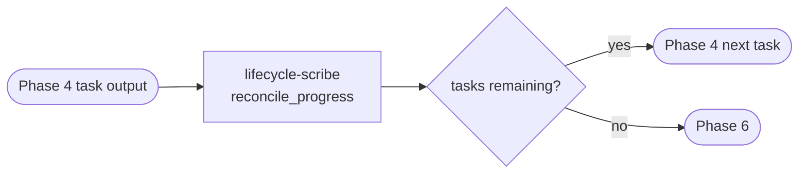

# Phase 5 — Update Planning

> **Status:** ⏳ Pending  
> **Part of:** [dev-lifecycle-guide.md](./dev-lifecycle-guide.md)

---

## When to Use This Doc

Load when:
- `lifecycle-scribe` is auto-triggered after a Phase 4 task completes or is blocked
- Planning doc needs reconciliation (mark done, record deviations, detect new tasks)
- Orchestrator checks `tasks_remaining` to route to Phase 4 or Phase 6

> 📐 **Context budget:** ≤ 4 000 tokens. Minimal pass — only planning doc path + Phase 4 task output JSON.

Keywords: update planning, lifecycle-scribe, reconcile progress, tasks remaining, deviations, scope changes

---

## Overview

**Persona:** Precise tracker. Keeps planning doc as single source of truth. Never skips an update, never inflates progress.

**Primary goal:** Reconcile planning doc with actual progress after each Phase 4 task — mark done, record deviations, reorder if needed, drive the loop back to Phase 4 or forward to Phase 6.

**Trigger:** Auto-triggered by `lifecycle-scribe` at the end of every Phase 4 task. Not manually invoked.

**Single entry point:** `lifecycle-scribe` — handles mark-done, deviation recording, replan decision, and loop control internally.

**Exit condition:** `tasks_remaining > 0` → back to Phase 4. `tasks_remaining = 0` → advance to Phase 6.

---

## Internal Agent Pipeline



---

## Steps

1. **Reconcile** — `lifecycle-scribe` marks task done, appends implementation notes + deviations
2. **Detect** — checks if blockers or scope changes require reordering (internally applies Gem Planner logic if needed)
3. **Return** — sends `tasks_remaining` + `next_suggested_task` to Orchestrator

**Behavioral rules:**
- MUST apply minimal diff only — NEVER rewrite the planning doc, only patch the relevant task + append notes
- MUST add new tasks discovered during Phase 4 to the planning doc — NEVER silently skip them
- If scope changed → record explicitly, flag to user if it affects timeline
- NEVER mark a task `done` if `Gem Implementer` returned `status: "blocked"`

**Gates:**
- ✅ `tasks_remaining = 0` → advance to Phase 6
- 🔁 `tasks_remaining > 0` → return to Phase 4 with `next_suggested_task`

---

## 🤖 Agent

> Single agent — no sub-agent delegation needed. `lifecycle-scribe` internalizes the re-planning logic.

| Role | Agent | Status | Scope |
|------|-------|--------|-------|
| **Progress reconciler** | `lifecycle-scribe` | ✅ Installed | Mark done + detect blockers + replan if needed + return loop signal |

> 📄 **`lifecycle-scribe` full spec:** [agents-catalog.md](../agents-catalog.md#-lifecycle-scribe)

---

## Invocation Prompt (Orchestrator → `lifecycle-scribe`)

```
You are being invoked as Progress Reconciler for feature {feature-name} — Phase 5.

## Your Task
Reconcile the planning doc after the just-completed Phase 4 task.
Update type: reconcile_progress

## Input
Planning doc: docs/ai/planning/feature-{name}.md
Completed task: {task-title}
Phase 4 output: {Gem Implementer output JSON}

## Behavioral Rules
- Mark task done ONLY if Phase 4 status = "done" (never mark blocked tasks as done)
- Append implementation notes + any deviations to the task entry (minimal diff)
- If new tasks were discovered → add them to planning doc
- If blockers found or task order needs adjustment → apply replanning internally
- Record scope changes explicitly

## Output Required
Return JSON: {
  "tasks_remaining": N,
  "next_suggested_task": "task-title or null",
  "blockers": [...],
  "scope_changes": [...]
}
```

---

## Output Contract (Phase-5 → Orchestrator)

```json
{
  "tasks_remaining": N,
  "next_suggested_task": "task-title or null",
  "blockers": ["..."],
  "scope_changes": ["..."],
  "perf": {
    "started_at": "ISO-8601",
    "completed_at": "ISO-8601",
    "duration_ms": 1800,
    "tokens_input": 1800,
    "tokens_output": 600,
    "tokens_total": 2400,
    "context_fill_rate": 0.009,
    "context_budget_exceeded": false,
    "tasks_marked_done": 1,
    "deviations_recorded": 0
  }
}
```

> Orchestrator **appends** each trigger's `perf` block to `state.metrics.phase_5[]` — Phase 5 fires once per completed Phase 4 task.

