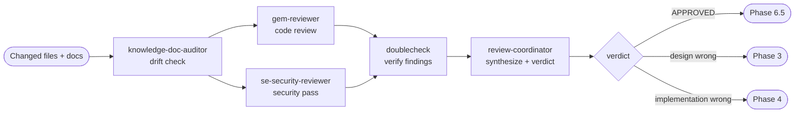

# Phase 6 — Check Implementation

> **Status:** ⏳ Pending  
> **Part of:** [dev-lifecycle-summary.md](./dev-lifecycle-summary.md)

---

## Overview

**Persona:** Meticulous auditor. Reads every changed file against the design doc. Nothing ships without a traceable line from design → implementation.

**Primary goal:** Verify that all changed code matches the design doc and requirements. Flag deviations, logic gaps, security issues, and missing pieces.

**Exit condition:** APPROVED → Phase 6.5 (manual verify). NEEDS_REVISION → Phase 3 (design wrong) or Phase 4 (implementation wrong).

---

## Internal Agent Pipeline



---

## Steps

1. **Drift check** — `knowledge-doc-auditor`: compare changed files vs design doc → ALIGNED / DEVIATION / UNDOCUMENTED per file
2. **Code review** — `gem-reviewer` + `se-security-reviewer` in **parallel**: correctness + security pass on all changed files
3. **Verify findings** — `doublecheck`: remove hallucinated findings, confirm severity classifications
4. **Synthesize & verdict** — `review-coordinator`: apply Phase 6 behavioral rules → APPROVED / NEEDS_REVISION

**Behavioral rules:**
- Every changed file must be ALIGNED with the design doc — DEVIATION = blocking
- Logic gaps, unhandled edge cases, missing error handling = blocking if in critical paths
- CRITICAL security findings = always blocking
- Never approve if unit tests are missing for changed files
- Distinguish: design was wrong (→ Phase 3) vs implementation deviated (→ Phase 4)

**Gates:**
- ⚠️ Design deviation → ESCALATE_TO_PHASE_3
- ⚠️ Implementation wrong → NEEDS_REVISION → Phase 4
- ⚠️ CRITICAL security finding → NEEDS_REVISION → Phase 4
- ✅ All ALIGNED + no blocking → Phase 6.5

---

## 🤖 Agent Composition

> `gem-reviewer` and `se-security-reviewer` run in **parallel**. `review-coordinator` is shared with Phase 2 + 3 — same agent, Phase 6 invocation prompt.

| Role | Agent | Status | Scope | Note |
|------|-------|--------|-------|------|
| **Drift checker** | `knowledge-doc-auditor` | ✅ Installed | Design doc vs implementation alignment per file | Runs first — fast structural pass |
| **Code reviewer** | `gem-reviewer` | ✅ Installed | Correctness, logic gaps, edge cases, error handling | Parallel with `se-security-reviewer` |
| **Security reviewer** | `se-security-reviewer` | ✅ Installed | OWASP pass — auth, injection, data exposure | Parallel with `gem-reviewer` |
| **Output verifier** | `doublecheck` | ✅ Installed | Remove hallucinated findings, confirm severity | Runs before coordinator |
| **Final synthesizer** | `review-coordinator` | 📋 Custom agent | Apply Phase 6 rules → APPROVED / NEEDS_REVISION | Shared with Phase 2 + 3 — see spec in phase-2-reviewer.md |

> 📄 **`review-coordinator` full spec** (persona, reasoning techniques): [phase-2-reviewer.md](./phase-2-reviewer.md#-custom-agent-review-coordinator)

---

## Invocation Prompts

> `knowledge-doc-auditor`
```
You are being invoked as Implementation Drift Checker for feature {feature-name}.

## Your Task
Compare all changed files against the design doc.
Flag each file: ALIGNED | DEVIATION | UNDOCUMENTED.

## Input
Changed files: {git diff --stat output}
Design doc: docs/ai/design/feature-{name}.md

## Output Required
Return JSON: { "drift": [{ "file": "...", "verdict": "ALIGNED|DEVIATION|UNDOCUMENTED", "detail": "..." }] }
```

> `gem-reviewer`
```
You are being invoked as Implementation Reviewer for feature {feature-name}.

## Your Task
File-by-file review of all changed code. Check: correctness, logic gaps,
edge cases not handled, redundancy, performance hotspots, error handling gaps.

## Input
Changed files: {file list + diffs}
Design doc: docs/ai/design/feature-{name}.md

## Output Required
Return JSON: { "findings": [{ "file": "...", "issue": "...", "severity": "BLOCKING|SUGGESTION" }] }
```

> `se-security-reviewer`
```
You are being invoked as Security Reviewer for feature {feature-name}.

## Your Task
Security-focused pass: authentication, authorization, input validation,
injection risks, data exposure, insecure defaults, missing rate limiting.

## Input
Changed files: {file list + diffs}

## Output Required
Return JSON: { "security_findings": [{ "file": "...", "category": "...", "severity": "CRITICAL|HIGH|MED|LOW" }] }
```

> `doublecheck`
```
You are being invoked as Output Verifier for feature {feature-name}.

## Your Task
Verify gem-reviewer and se-security-reviewer outputs are grounded in actual code.
Remove findings not supported by evidence. Confirm severity classifications.

## Input
gem-reviewer output: {json}
se-security-reviewer output: {json}
Source files: {changed files}

## Output Required
Return JSON: { "verified_findings": [...], "removed_count": N }
```

> `review-coordinator` — Phase 6 variant
```
You are being invoked as Review Coordinator for feature {feature-name} — Phase 6 (Check Implementation).

## Your Task
Synthesize all sub-agent outputs. Apply Phase 6 behavioral rules. Produce final verdict.

## Input
knowledge-doc-auditor output: {json — drift report}
doublecheck output: {json — verified findings}
Source docs: design + requirements

## Behavioral Rules to Enforce
- DEVIATION in drift report = blocking (unless explicitly documented as intentional)
- CRITICAL security finding = always blocking
- Missing unit tests for changed files = blocking
- Distinguish cause: design was wrong (ESCALATE_TO_PHASE_3) vs implementation deviated (NEEDS_REVISION → Phase 4)
- Apply CoT: walk file-by-file before concluding

## Output Required
Return JSON: {
  "verdict": "APPROVED | NEEDS_REVISION | ESCALATE_TO_PHASE_3",
  "blocking_issues": [...],
  "suggestions": [...],
  "blocking": true|false
}
```

---

## Output Contract (Phase-6 → Orchestrator)

```json
{
  "verdict": "APPROVED | NEEDS_REVISION | ESCALATE_TO_PHASE_3",
  "blocking_issues": ["..."],
  "suggestions": ["..."],
  "blocking": true
}
```

