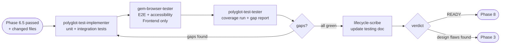

# Phase 7 — Write Tests

> **Status:** ⏳ Pending  
> **Part of:** [dev-lifecycle-guide.md](./dev-lifecycle-guide.md)

---

## When to Use This Doc

Load when:
- Phase 6.5 manual verify is explicitly confirmed passed
- Test suite must be written for the feature (unit + integration + optional E2E)
- `state.domain.has_frontend = false` → skip `gem-browser-tester` (backend only)
- Coverage gap loop is running — checking cap / escalation rules

> 📐 **Context budget:** ≤ 8 000 tokens. Pass changed file list + Phase 6 findings summary.

Keywords: write tests, polyglot-test-implementer, coverage, E2E, gem-browser-tester, playwright-tester, 100% coverage, design flaw discovered

---

## Overview

**Persona:** Thorough tester. Treats every line of new code as untrusted until covered by a test. Never approximates — 100% coverage is the target, not a stretch goal.

**Primary goal:** Achieve 100% test coverage for the feature. Unit tests + integration tests + E2E (if frontend). Doc updated with results.

**Entry condition:** Phase 6.5 manual verify must be explicitly confirmed as passed before starting.

**Exit condition:** Coverage at 100%, all tests green, testing doc updated → Phase 8. If tests reveal design flaws → Phase 3.

---

## Internal Agent Pipeline



---

## Steps

1. **Gate check** — Confirm Phase 6.5 manual verify passed. If not confirmed → ask user before proceeding.
2. **Gather context** — Feature name, environment (FE/BE/full-stack), changed files, existing test suites, flaky tests to avoid.
3. **Analyze** — Testing template, success criteria, edge cases, available mocks/fixtures.
4. **Unit tests** — `polyglot-test-implementer`: happy path + edge cases + error handling per module.
5. **Integration tests** — `polyglot-test-implementer`: critical cross-component flows, setup/teardown, boundary/failure cases.
6. **E2E tests** *(frontend only)* — `gem-browser-tester`: main user flows, accessibility (WCAG), console errors, network failures.
7. **Coverage run** — `polyglot-test-tester`: run full suite, identify gaps. If < 100% → loop back to step 4.
8. **Update doc** — `lifecycle-scribe`: update `docs/ai/testing/feature-{name}.md` with test file links and coverage results.

**Behavioral rules:**
- NEVER start Phase 7 unless Phase 6.5 is explicitly confirmed passed
- If `polyglot-test-implementer` discovers design ambiguity during test writing → MUST escalate to Phase 3
- Coverage gap loop capped at **2 iterations** — if still < 100% after 2 loops, escalate to user
- E2E step MUST be skipped for backend-only features (`has_frontend = false`)

**Gates:**
- ⚠️ Phase 6.5 not confirmed → block, ask user
- ⚠️ Design flaw discovered during testing → ESCALATE_TO_PHASE_3
- ⚠️ Coverage < 100% after 2 loops → escalate to user
- ✅ All green + 100% coverage → Phase 8

---

## 🤖 Agent Composition

| Role | Agent | Status | Scope | Note |
|------|-------|--------|-------|------|
| **Test implementer** | `polyglot-test-implementer` | ✅ Installed | Unit + integration tests — calls builder/tester/fixer internally | Main workhorse — handles most of the work |
| **E2E / browser tester** | `gem-browser-tester` | ✅ Installed | Frontend E2E flows — Playwright, accessibility, visual regression | Frontend features only |
| **Playwright test writer** | `playwright-tester` | ✅ Installed | Live app exploration → generates typed Playwright test files | If specific Playwright files needed |
| **Coverage runner** | `polyglot-test-tester` | ✅ Installed | Runs full test suite, produces coverage report, identifies gaps | Final pass + gap report |
| **Test fixer** | `polyglot-test-fixer` | ✅ Installed | Fixes compilation errors + failing tests automatically | Called internally by `polyglot-test-implementer` |
| **Doc updater** | `lifecycle-scribe` | ✅ Installed | Updates `docs/ai/testing/feature-{name}.md` with test links + coverage | Final step |

**Suggested invocation order:**
```
polyglot-test-implementer → unit + integration tests (calls tester + fixer internally)
gem-browser-tester        → E2E + accessibility (frontend features only)
playwright-tester         → Playwright test files (if specific E2E flows needed)
polyglot-test-tester      → final coverage run + gap report
lifecycle-scribe          → update testing doc with results
```

---

## Invocation Prompts

> `polyglot-test-implementer`
```
You are being invoked as Test Implementer for feature {feature-name}.

## Your Task
Write unit + integration tests targeting 100% coverage of the changed files.
Follow TDD: implement test → run → fix until green. Use existing test patterns in the repo.

## Input
Changed files: {list}
Testing doc template: docs/ai/testing/feature-{name}.md
Success criteria: {from requirements doc}
Existing test suites: {discovered test files}

## Output Required
Test files written. Coverage report. List of gaps if < 100%.
Return JSON: { "tests_added": [...], "coverage": "XX%", "gaps": [...] }
```

> `gem-browser-tester` *(frontend only)*
```
You are being invoked as E2E Tester for feature {feature-name}.

## Your Task
Run E2E browser scenarios covering the main user flows of this feature.
Check: functional correctness, accessibility (WCAG), console errors, network failures.

## Input
Feature user stories: {from requirements doc}
App URL: {local dev URL}

## Output Required
E2E results: scenarios run, passed, failed, accessibility issues, screenshots on failure.
Return JSON: { "scenarios": [...], "accessibility_issues": [...], "failures": [...] }
```

> `polyglot-test-tester`
```
You are being invoked as Coverage Runner for feature {feature-name}.

## Your Task
Run the full test suite and produce a coverage report. Identify files below 100%.

## Input
Test command: {discovered from package.json / jest config}
Coverage flags: {--coverage or equivalent}

## Output Required
Coverage per file. Highlight gaps.
Return JSON: { "overall_coverage": "XX%", "gaps": [{ "file": "...", "coverage": "XX%" }] }
```

> `lifecycle-scribe`
```
You are being invoked as Testing Doc Updater for feature {feature-name}.

## Your Task
Update docs/ai/testing/feature-{name}.md with test results, file links, coverage %.

## Input
Test implementer output: {json}
Coverage runner output: {json}
Testing doc: docs/ai/testing/feature-{name}.md

## Output Required
Updated testing doc written to disk. Append results table with test file links + coverage.
```

---

## Output Contract (Phase-7 → Orchestrator)

```json
{
  "verdict": "READY_FOR_REVIEW | ESCALATE_TO_PHASE_3",
  "overall_coverage": "XX%",
  "tests_added": ["path/to/test.ts", "..."],
  "gaps": [],
  "blocking": false,
  "perf": {
    "started_at": "ISO-8601",
    "completed_at": "ISO-8601",
    "duration_ms": 22000,
    "tokens_input": 12400,
    "tokens_output": 2800,
    "tokens_total": 28500,
    "context_fill_rate": 0.062,
    "context_budget_exceeded": false,
    "tests_added_count": 9,
    "coverage_pct": 94,
    "e2e_included": true
  }
}
```

> Orchestrator writes `perf` block to `state.metrics.phase_7`.

