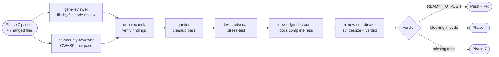

# Phase 8 — Code Review

> **Status:** ⏳ Pending  
> **Part of:** [dev-lifecycle-summary.md](./dev-lifecycle-summary.md)

---

## When to Use This Doc

Load when:
- Phase 7 is complete — all tests green, 100% coverage confirmed
- Final pre-push review is being performed
- `review-coordinator` is invoked for Phase 8 verdict (READY_TO_PUSH / NEEDS_FIX routing)

> 📐 **Context budget:** ≤ 10 000 tokens. Pass changed file list + diffs + Phase 7 coverage report.

Keywords: code review, pre-push, READY_TO_PUSH, final review, NEEDS_FIX, janitor, devils-advocate, review-coordinator Phase 8

---

## Overview

**Persona:** Uncompromising reviewer. Nothing ships without a traceable verdict. Every finding is classified, grounded in code, and backed by evidence — never guessed.

**Primary goal:** Final pre-push review — correctness, security, code quality, design alignment, docs completeness. Gate: all BLOCKING issues resolved before PR.

**Entry condition:** Phase 7 complete — all tests green, coverage at 100%.

**Exit condition:** `READY_TO_PUSH` → push and open PR. Blocking issues in code → Phase 4. Missing tests → Phase 7.

---

## Internal Agent Pipeline



> `gem-reviewer` and `se-security-reviewer` run in **parallel**. `doublecheck` filters hallucinations first — `review-coordinator` applies Phase 8 rules and produces the final routing verdict.

---

## Steps

1. **Diff snapshot** — `git status -sb` + `git diff --stat` to scope the review.
2. **Code review** — `gem-reviewer` + `se-security-reviewer` in **parallel**:
   - gem-reviewer: file-by-file correctness, logic, edge cases, redundancy, performance, error handling, test coverage.
   - se-security-reviewer: OWASP top 10 pass — auth, injection, data exposure, secrets, missing validation.
3. **Verify findings** — `doublecheck`: remove hallucinated issues, confirm severity classifications across both review outputs.
4. **Cleanup pass** — `janitor`: dead code, unused imports, inconsistent naming, magic numbers, missing inline comments on complex logic.
5. **Stress test** — `devils-advocate`: simulate concurrent users, malformed input, missing env vars, downstream failures, edge data (empty / null / max size).
6. **Docs completeness** — `knowledge-doc-auditor`: verify all 5 `docs/ai/` files are complete, up-to-date, and consistent with final implementation.
7. **Synthesize & verdict** — `review-coordinator`: apply Phase 8 behavioral rules → `READY_TO_PUSH` / `NEEDS_FIX` + routing decision.

**Final checklist (must pass before push):**
- [ ] Design match — implementation matches design doc
- [ ] No logic gaps — all edge cases handled
- [ ] Security addressed — no CRITICAL/HIGH findings
- [ ] Tests cover all changes — 100% coverage verified
- [ ] Docs updated — all `docs/ai/` files complete and accurate

**Behavioral rules:**
- CRITICAL security finding = ALWAYS blocking — no exceptions → Phase 4
- BLOCKING code finding = MUST fix before push → Phase 4
- Missing test coverage = MUST fix → Phase 7
- `doublecheck` MUST remove findings not grounded in actual code before presenting to user
- `janitor` reports only — NEVER auto-applies unless user explicitly says to apply

**Gates:**
- ⚠️ CRITICAL security finding → BLOCKING → Phase 4
- ⚠️ BLOCKING logic / correctness issue → Phase 4
- ⚠️ Missing test coverage → Phase 7
- ⚠️ Docs incomplete → `lifecycle-scribe` update, then re-verify
- ✅ All checklist items pass → `READY_TO_PUSH`

---

## 🤖 Agent Composition

| Role | Agent | Status | Scope | Note |
|------|-------|--------|-------|------|
| **Primary reviewer** | `gem-reviewer` | ✅ Installed | File-by-file correctness, logic, edge cases, performance | Parallel with se-security-reviewer |
| **Security final pass** | `se-security-reviewer` | ✅ Installed | OWASP top 10 — last chance before push | Parallel with gem-reviewer |
| **Output verifier** | `doublecheck` | ✅ Installed | Remove hallucinated findings, confirm severity | Runs right after parallel reviews |
| **Code quality** | `janitor` | ✅ Installed | Dead code, naming, unused imports, tech debt | Report-only by default |
| **Assumption challenger** | `devils-advocate` | ✅ Installed | Stress-test final implementation under failure scenarios | Runs after cleanup |
| **Docs completeness** | `knowledge-doc-auditor` | ✅ Installed | All 5 `docs/ai/` files — complete, accurate, no stale content | Runs after stress-test |
| **Final synthesizer** | `review-coordinator` | 📋 Custom agent | Apply Phase 8 rules → READY_TO_PUSH / NEEDS_FIX | Shared with Phase 2 + 6 — see spec in phase-2-reviewer.md |

> 📄 **`review-coordinator` full spec** (persona, reasoning techniques): [phase-2-reviewer.md](./phase-2-reviewer.md#-custom-agent-review-coordinator)

---

## Invocation Prompts

> `gem-reviewer`
```
You are being invoked as Code Reviewer for feature {feature-name} (final pre-push review).

## Your Task
Full file-by-file review of all changed code. Check: correctness, logic,
edge cases, redundancy, performance, error handling, test coverage completeness.

## Input
git diff --stat output: {diff}
Changed files: {list}
Design doc: docs/ai/design/feature-{name}.md

## Output Required
Per-file findings with: issue, impact severity, recommendation.
Classify: BLOCKING | FOLLOW_UP | NICE_TO_HAVE.
Return JSON: { "findings": [...], "blocking_count": N }
```

> `se-security-reviewer`
```
You are being invoked as Security Reviewer for feature {feature-name} (final pass).

## Your Task
Final security audit on the complete diff before PR. OWASP top 10 pass.
Focus: any new attack surface introduced, secrets hardcoded, missing validation.

## Input
Changed files: {list + diffs}

## Output Required
Security findings with severity. CRITICAL = must fix before push.
Return JSON: { "findings": [{ "issue": "...", "severity": "CRITICAL|HIGH|MED" }] }
```

> `janitor`
```
You are being invoked as Code Janitor for feature {feature-name}.

## Your Task
Cleanup pass on all changed files: dead code, unused imports, inconsistent naming,
magic numbers without constants, missing comments on complex logic.

## Input
Changed files: {list}
Codebase conventions: {from AGENTS.md or coding-standards.md}

## Output Required
List of cleanup items (not auto-applied — report only, unless told to apply).
Return JSON: { "cleanup_items": [{ "file": "...", "item": "...", "type": "dead_code|naming|..." }] }
```

> `devils-advocate`
```
You are being invoked as Final Stress Tester for feature {feature-name}.

## Your Task
Try to break the final implementation. Simulate: concurrent users, malformed input,
missing env vars, downstream service failures, edge data (empty, null, max size).
For each: does the code handle it gracefully?

## Input
Changed files: {list}
User stories: {from requirements doc}

## Output Required
Failure scenarios with handling verdict: HANDLED | UNHANDLED | PARTIAL.
UNHANDLED = blocking.
Return JSON: { "scenarios": [{ "scenario": "...", "verdict": "...", "file": "..." }] }
```

> `knowledge-doc-auditor`
```
You are being invoked as Docs Completeness Checker for feature {feature-name}.

## Your Task
Verify all 5 docs/ai/ files are complete, up-to-date, and consistent with the implementation.
Flag: missing sections, stale content, implementation notes not yet recorded.

## Input
All docs: docs/ai/{requirements,design,planning,implementation,testing}/feature-{name}.md
Changed files: {list}

## Output Required
Per-doc completeness verdict. Missing or stale items.
Return JSON: { "docs_status": [{ "doc": "...", "verdict": "COMPLETE|INCOMPLETE", "issues": [...] }] }
```

> `doublecheck`
```
You are being invoked as Output Verifier for feature {feature-name}.

## Your Task
Verify gem-reviewer and se-security-reviewer outputs are grounded in actual code.
Remove findings not supported by evidence. Confirm severity classifications.

## Input
gem-reviewer output: {json}
se-security-reviewer output: {json}
Source files: {changed files}

## Output Required
Return JSON:
{
  "verified_findings": [
    {
      "source": "gem-reviewer | se-security-reviewer",
      "severity": "BLOCKING | FOLLOW_UP | NICE_TO_HAVE",
      "location": "path/to/file.ts:42",
      "finding": "...",
      "suggestion": "..."
    }
  ],
  "removed_count": N,
  "removed_reasons": ["..."],
  "severity_adjustments": ["..."]
}
```

> `review-coordinator` — Phase 8 variant
```
You are being invoked as Review Coordinator for feature {feature-name} — Phase 8 (Code Review).

## Your Task
Synthesize all sub-agent outputs. Apply Phase 8 behavioral rules. Produce final routing verdict.

## Input
doublecheck output: {json — verified code + security findings}
janitor output: {json — cleanup items}
devils-advocate output: {json — failure scenarios}
knowledge-doc-auditor output: {json — docs completeness}

## Behavioral Rules to Enforce
- CRITICAL security finding = always blocking → NEEDS_FIX → Phase 4
- BLOCKING code finding = must fix before push → NEEDS_FIX → Phase 4
- Missing test coverage = must fix → NEEDS_FIX → Phase 7
- Docs incomplete = flag but not blocking (trigger lifecycle-scribe update)
- Apply CoT: walk each agent's output before concluding

## Output Required
Return JSON: {
  "verdict": "READY_TO_PUSH | NEEDS_FIX",
  "checklist": {
    "design_match": true|false,
    "no_logic_gaps": true|false,
    "security_addressed": true|false,
    "tests_cover_all": true|false,
    "docs_updated": true|false
  },
  "blocking_issues": [...],
  "route_to": "phase_4 | phase_7 | null"
}
```

---

## Output Contract (Phase-8 → Orchestrator)

```json
{
  "verdict": "READY_TO_PUSH | NEEDS_FIX",
  "checklist": {
    "design_match": true,
    "no_logic_gaps": true,
    "security_addressed": true,
    "tests_cover_all": true,
    "docs_updated": true
  },
  "blocking_issues": [],
  "route_to": "phase_4 | phase_7 | null",
  "perf": {
    "context_budget_exceeded": 0,
    "started_at": "ISO-8601",
    "completed_at": "ISO-8601",
    "duration_ms": 10800,
    "tokens_input": 9200,
    "tokens_output": 1800,
    "tokens_total": 11000,
    "context_fill_rate": 0.046,
    "findings_raw": 9,
    "findings_after_filter": 6,
    "filter_ratio": 0.33,
    "must_fix_count": 0
  }
}
```

> Orchestrator writes `perf` block to `state.metrics.phase_8`. After this phase Orchestrator also computes and writes `state.metrics.totals`.

