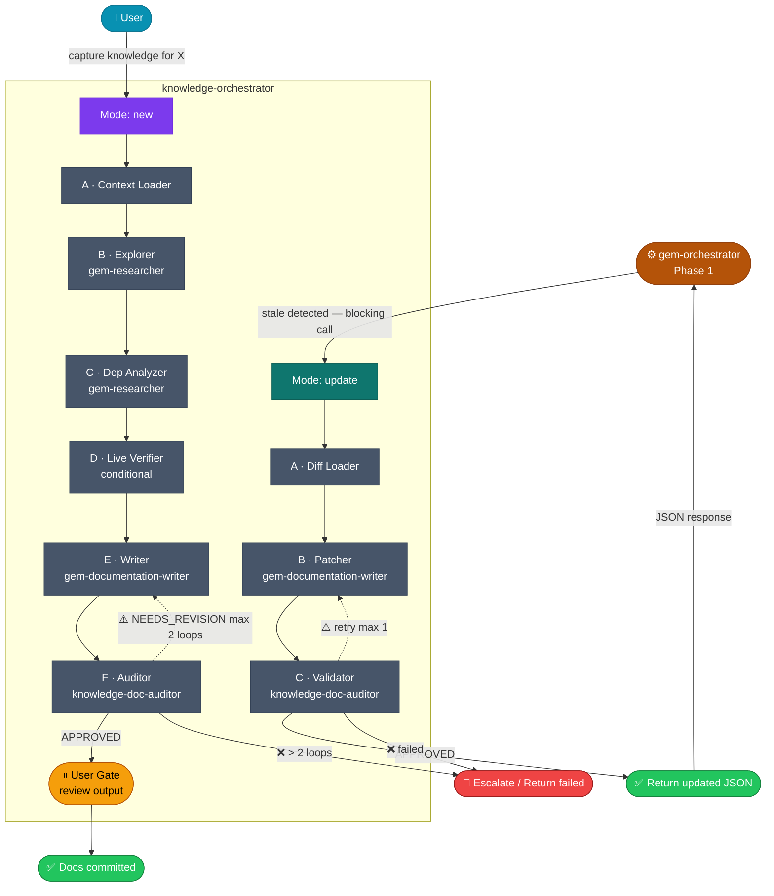

# Knowledge Lifecycle — Orchestrator Guide

**Modes:** `new` (full capture) · `update` (stale patch)

---

## When to Use This Doc

Load when:
- `knowledge-orchestrator` needs pipeline routing logic, mode decision table, or context contracts
- `gem-orchestrator` needs to understand how to call knowledge-orchestrator for stale doc updates
- Debugging a failed capture, stale patch, or inter-orchestrator handoff

> 📐 **Context budget:** ≤ 8 000 tokens. Load by section — do NOT pass the full doc unless needed.

Keywords: knowledge capture, update stale, knowledge orchestrator, inter-orchestrator, domain knowledge, doc lifecycle

---

## Architecture Overview



> *(Mũi tên nét đứt `⚠️` = retry. `❌` = hard failure → escalate or return `status: "failed"`)*

---

## Mode Decision Table

| Trigger | Mode | Gates | Pipeline |
|---------|------|-------|----------|
| `capture knowledge for X` (user) | `new` | 1 user gate (end) | A→B→C→D*→E→F→gate |
| `update knowledge for X` (user) | `update` | None (fully auto) | A→B→C |
| Called by `gem-orchestrator` (JSON) | `update` | None (fully auto) | A→B→C |

> *D = conditional — skipped if no external system signal detected or `fast` keyword active.

---

## Mode: new — Pipeline Steps

| Step | Agent | Input | Output | Skip condition |
|------|-------|-------|--------|----------------|
| **A** Context Loader | *(orchestrator reads directly)* | Knowledge index + domain dev/ compact files | `existing_facts[]`, `gaps_found[]` | `force` keyword |
| **B** Explorer | `gem-researcher` | Entry point + A output | Purpose, exports, source refs | — |
| **C** Dep Analyzer | `gem-researcher` | B output | Dependency graph depth 3 (5 if `deep`) | `fast` keyword |
| **D** Live Verifier | *(conditional — see table below)* | B+C output + detected signals | `verified_facts[]`, `discrepancies[]` | No signal detected · `fast` keyword |
| **E** Writer | `gem-documentation-writer` | B+C+D output + A facts | 3 docs: business/ + dev/ + detail/ | — |
| **F** Auditor | `knowledge-doc-auditor` | Doc paths from E | `APPROVED` or `NEEDS_REVISION` + issues | — |

**Revision loop:** F → E max **2 loops** before escalating.

**`deep` extra step:** `gem-critic` architecture pass inserted between C and D.

### Step D — Live Verifier: Source Detection & Agent Routing

Step D runs only when the entry point touches external systems. Orchestrator auto-detects signals from B+C output:

| Signal detected | Live source queried | Agent | Tool |
|----------------|--------------------|----|------|
| Imports `@cambridge-intelligence/regraph` or `react-regraph` | ReGraph MCP — `search_definitions`, `search_documentation` | `regraph-reviewer` | MCP |
| Writes/reads Elasticsearch (`client.index`, `client.search`, collator pattern) | ES live index mapping `GET /{index}/_mapping` | `gem-researcher` | `run_terminal` |
| Runs SPARQL queries (GraphDB client, `sparqlQuery`, `SELECT ?`) | GraphDB live SPARQL test query against endpoint | `gem-researcher` | `run_terminal` |
| FE plugin + `deep` keyword | FE app running locally — screenshot + snapshot | `gem-browser-tester` | browser MCP |

**D output:**
```jsonc
{
  "verified_facts": [
    "ReGraph Chart v3.4 — prop `nodes` type confirmed as NodeData[]",
    "ES index dop-ai-inventory-* mapping has field ai_labels (keyword)"
  ],
  "discrepancies": [
    "Source uses Chart prop `selection` but MCP shows it was renamed to `selectedIds` in v3.3"
  ],
  "sources_checked": ["regraph-mcp", "elasticsearch"],
  "skipped_sources": [],
  "perf": { "duration_ms": 0, "tokens_input": 0, "context_fill_rate": 0 }
}
```

> **Writer (Step E) MUST** include `discrepancies[]` in the `dev/` compact file under a **⚠️ Known Discrepancies** section if non-empty. This makes stale patterns visible to future agents.

**Mode `new` — final output (before user gate):**

Orchestrator surfaces the following before the user gate. Always include even if metrics are estimated:

```
## 📦 Capture Summary — {domain}/{name}

### Docs Created
- business/{name}.md          ({N} lines)
- dev/{name}.md               ({N} lines — must be ≤ 250)
- dev/{name}-detail.md        ({N} lines)

### Step D Live Verification
- Sources checked: {regraph-mcp | elasticsearch | graphdb | fe-app | none}
- verified_facts: {N}
- discrepancies: {N} (see ⚠️ section in dev/{name}.md)

### Step F Audit
- Verdict: APPROVED | APPROVED (post-patch)
- Findings: {N} issues found, {N} patched
- filter_ratio: {0.xx}

### ⚡ Pipeline Stats
| Step | duration_ms | tokens_input | context_fill_rate |
|------|------------|--------------|-------------------|
| B Explorer      | ... | ... | ... |
| C Dep Analyzer  | ... | ... | ... |
| D Live Verifier | ... | ... | ... |
| E Writer        | ... | ... | ... |
| F Auditor       | ... | ... | ... |
| **Total**       | ... | ... | **max: ...** |

revision_loops: {N} | context_budget_exceeded: false
```

---

## Mode: update — Pipeline Steps

| Step | Agent | Input | Output | Notes |
|------|-------|-------|--------|-------|
| **A** Diff Loader | *(orchestrator)* | `target_doc` + `changed_files[]` | `stale_sections[]` | Returns `no_changes_needed` if nothing stale |
| **B** Patcher | `gem-documentation-writer` | Existing doc + stale sections | `sections_patched[]` | Patch ONLY stale sections |
| **C** Validator | `knowledge-doc-auditor` | Updated doc | `APPROVED` or `NEEDS_REVISION` | Max **1** retry |

**Return to caller:** `{ status, doc_path, sections_patched, summary, perf }`

---

## Inter-Orchestrator Communication

### gem-orchestrator → knowledge-orchestrator (call)

```jsonc
{
  "mode": "update",
  "caller": "gem-orchestrator/phase-1",
  "target_doc": "docs/ai/domain-knowledge/{domain}/knowledge-{name}.md",
  "changed_files": ["plugins/.../src/..."],
  "feature": "feature-name"
}
```

### knowledge-orchestrator → gem-orchestrator (response)

```jsonc
{
  "status": "updated|failed|no_changes_needed",
  "doc_path": "...",
  "sections_patched": ["Dependencies table"],
  "summary": "Updated X — Y unchanged",
  "perf": {
    "duration_ms": 3800,
    "tokens_input": 0,
    "context_fill_rate": 0,        // tokens_input / 200_000
    "filter_ratio": 0.1,           // (findings_raw - accepted) / findings_raw — from Validator
    "retry_count": 0,
    "context_budget_exceeded": false
  }
}
```

### gem-orchestrator behavior on response

| Response `status` | gem-orchestrator action |
|---|---|
| `updated` | Resume Phase 1 with fresh knowledge ✅ |
| `no_changes_needed` | Resume Phase 1 immediately ✅ |
| `failed` | Mark doc `[STALE — not updated]` in context → warn user → continue Phase 1 |
| Timeout (>60s) | Treat as `failed` |

### Multiple stale docs

`gem-orchestrator` spawns **parallel** update calls — one per stale doc. Each gets its own state file. Blocks Phase 1 until **all** resolve.

---

## State File

**Location:** `ai-workspace/temp/knowledge-state-{slug}.json`

```jsonc
{
  "slug": "catalog-graph",
  "mode": "new|update",
  "caller": "user|gem-orchestrator/phase-1",
  "status": "pending|running|done|failed",
  "keywords": [],
  "target": {
    "entry_point": "...",
    "domain": "catalog-graph",
    "business_doc": "docs/ai/domain-knowledge/catalog-graph/business/catalog-graph.md",
    "dev_doc":      "docs/ai/domain-knowledge/catalog-graph/dev/catalog-graph.md",
    "detail_doc":   "docs/ai/domain-knowledge/catalog-graph/dev/catalog-graph-detail.md"
  },
  "pipeline": {
    "context_loader":  null,   // { status, existing_facts_count, gaps_found_count }
    "explorer":        null,   // { status, perf: { duration_ms, tokens_input, context_fill_rate } }
    "dep_analyzer":    null,   // { status, perf: { ... } }
    "live_verifier":   null,   // { status, skipped, sources_checked[], verified_facts_count, discrepancies_count, perf: { ... } }
    "writer":          null,   // { status, perf: { ... } }
    "auditor":         null    // { status, findings_raw, findings_accepted, filter_ratio, perf: { ... } }
  },
  "revision_loops": 0,
  "stale_sections": [],
  "sections_patched": [],
  "escalations": [],
  "created_at": "ISO-8601",
  "completed_at": null,
  // ── Performance Metrics ───────────────────────────────────────────────────
  "metrics": {
    "duration_ms": null,
    "tokens_total": null,
    "context_fill_rate_max": null,   // max(tokens_input / 200_000) across all steps
    "context_budget_exceeded": false,
    // mode: new only
    "revision_loops": 0,
    "filter_ratio": null,            // from Auditor (Step F)
    "discrepancies_found": 0,        // from Live Verifier (Step D)
    "sources_checked": [],           // from Live Verifier (Step D)
    // mode: update only
    "retry_count": 0,
    "filter_ratio_update": null      // from Validator (Step C)
  }
}
```

---

## Magic Keywords

| Keyword | Effect | Mode |
|---------|--------|------|
| `deep` | Dep graph depth 5 + `gem-critic` pass before writer + FE app verification in Step D | `new` |
| `fast` | Skip Dep Analyzer (Step C) + Skip Live Verifier (Step D) | `new` |
| `force` | Skip Context Loader (Step A) — full re-capture | `new` |

---

## Context Contracts

| Step | Receives | NOT passed |
|------|----------|-----------|
| A (Context Loader) | Knowledge index path + domain | Source files |
| B (Explorer) | Entry point path + A.existing_facts | Full knowledge docs |
| C (Dep Analyzer) | B output + entry point path | A facts, full source |
| D (Live Verifier) | B+C output (signals only) + external system endpoints | Full source, A facts |
| E (Writer) | B+C+D output + A gaps + capture skill rules | Full source files |
| F/C (Auditor/Validator) | Doc paths only | Pipeline history |

---

## Doc Locations

```
docs/ai/domain-knowledge/
├── README.md                              # Index — always updated after new capture
├── common/                                # Shared technical references (no audience split)
│   └── knowledge-{name}.md
└── {domain}/
    ├── business/
    │   └── {name}.md                      # PO/BA layer — plain language, no code, no limit
    └── dev/
        ├── {name}.md                      # AI compact ≤ 250 lines (business summary + technical overview)
        └── {name}-detail.md               # Full walkthrough — code refs, patterns, no limit
```

**Audience rules:**
- `business/` — PO / BA / non-tech: flow, terminology, business rules. No source file refs.
- `dev/{name}.md` — AI agents load this first: business context (~30 lines) + technical overview (~100 lines) + key patterns (~50 lines) + cross-refs.
- `dev/{name}-detail.md` — load on demand for implementation specifics.
- `common/` — technical references shared across 2+ domains. No `business/dev/` split.

---

## ⚡ Performance Metrics

Each step returns a `perf` block. Orchestrator writes it to `state.pipeline.<step>` immediately on receipt.

| Metric | Source | Purpose |
|--------|--------|---------|
| `duration_ms` | All steps | Wall clock per step |
| `tokens_input` | All steps | Estimated token input |
| `context_fill_rate` | `tokens_input / 200_000` | > 0.5 = warning; > 0.8 = truncation risk |
| `context_budget_exceeded` | All steps | `true` when input budget exceeded |
| `revision_loops` | Mode `new` — Step F | F→E loops before APPROVED |
| `filter_ratio` | Step F (Auditor) + Step C (Validator) | `(findings_raw - accepted) / findings_raw` — hallucination rate |
| `retry_count` | Mode `update` — Step C | Validator retry count |
| `discrepancies_found` | Step D (Live Verifier) | Count of source-vs-live mismatches |
| `sources_checked` | Step D (Live Verifier) | Which external systems were queried |

### Input Budgets (soft limits)

| Step | Budget | Action when exceeded |
|------|--------|---------------------|
| B (Explorer) | ≤ 8 000 tokens | Split entry point scope — ask user |
| C (Dep Analyzer) | ≤ 6 000 tokens | Reduce depth to 2, alert |
| D (Live Verifier) | ≤ 4 000 tokens | Query fewer sources — prioritize ReGraph MCP > ES > GraphDB > FE |
| E (Writer) | ≤ 10 000 tokens | Pass summaries not full source output |
| F/C (Auditor/Validator) | ≤ 4 000 tokens | Pass doc paths only — already enforced by Context Contracts |

> **`filter_ratio` target:** < 0.30 — if Auditor consistently > 0.35, Writer output quality is low.

---

## Failure Handling

| Failure point | Mode | Action |
|---|---|---|
| Explorer blocked | `new` | Escalate to user |
| Live Verifier — external system unreachable | `new` | Skip that source, log in `skipped_sources[]`, continue |
| Live Verifier — all sources fail | `new` | Log warning, continue without verified_facts (doc still created) |
| Writer > 2 revision loops | `new` | Escalate to user |
| Validator fail after 1 retry | `update` | Return `status: "failed"` to caller |
| Diff Loader — doc not found | `update` | Return `status: "failed", reason: "doc not found"` |
| Timeout > 60s | `update` | Caller treats as `failed` |

