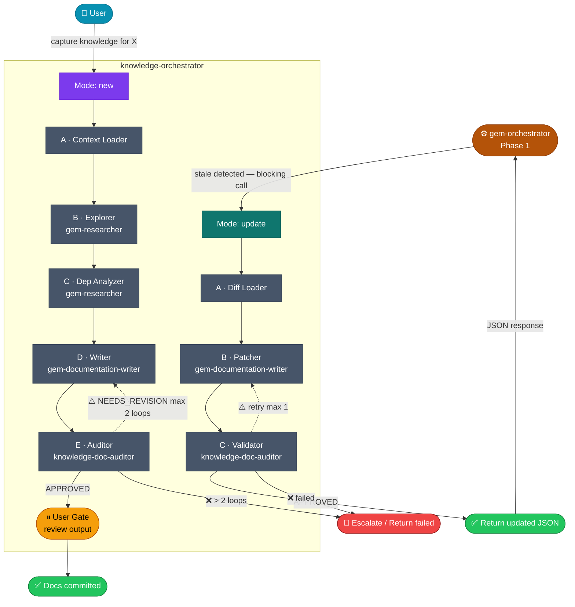

# Knowledge Lifecycle — Orchestrator Guide

**Modes:** `new` (full capture) · `update` (stale patch)

---

## When to Use This Doc

Load when:
- `knowledge-orchestrator` needs pipeline routing logic, mode decision table, or context contracts
- `gem-orchestrator` needs to understand how to call knowledge-orchestrator for stale doc updates
- Debugging a failed capture, stale patch, or inter-orchestrator handoff

> 📐 **Context budget:** ≤ 8 000 tokens. Load by section — do NOT pass the full doc unless needed.

Keywords: knowledge capture, update stale, knowledge orchestrator, inter-orchestrator, domain knowledge, doc lifecycle

---

## Architecture Overview



> *(Mũi tên nét đứt `⚠️` = retry. `❌` = hard failure → escalate or return `status: "failed"`)*

---

## Mode Decision Table

| Trigger | Mode | Gates | Pipeline |
|---------|------|-------|----------|
| `capture knowledge for X` (user) | `new` | 1 user gate (end) | A→B→C→D→E→gate |
| `update knowledge for X` (user) | `update` | None (fully auto) | A→B→C |
| Called by `gem-orchestrator` (JSON) | `update` | None (fully auto) | A→B→C |

---

## Mode: new — Pipeline Steps

| Step | Agent | Input | Output | Skip condition |
|------|-------|-------|--------|----------------|
| **A** Context Loader | *(orchestrator reads directly)* | Knowledge index + domain summaries | `existing_facts[]`, `gaps_found[]` | `force` keyword |
| **B** Explorer | `gem-researcher` | Entry point + A output | Purpose, exports, source refs | — |
| **C** Dep Analyzer | `gem-researcher` | B output | Dependency graph depth 3 (5 if `deep`) | `fast` keyword |
| **D** Writer | `gem-documentation-writer` | B+C output + A facts | Summary ≤150 lines + detail file | — |
| **E** Auditor | `knowledge-doc-auditor` | Doc paths from D | `APPROVED` or `NEEDS_REVISION` + issues | — |

**Revision loop:** E → D max **2 loops** before escalating.

**`deep` extra step:** `gem-critic` architecture pass inserted between C and D.

---

## Mode: update — Pipeline Steps

| Step | Agent | Input | Output | Notes |
|------|-------|-------|--------|-------|
| **A** Diff Loader | *(orchestrator)* | `target_doc` + `changed_files[]` | `stale_sections[]` | Returns `no_changes_needed` if nothing stale |
| **B** Patcher | `gem-documentation-writer` | Existing doc + stale sections | `sections_patched[]` | Patch ONLY stale sections |
| **C** Validator | `knowledge-doc-auditor` | Updated doc | `APPROVED` or `NEEDS_REVISION` | Max **1** retry |

**Return to caller:** `{ status, doc_path, sections_patched, summary, duration_ms }`

---

## Inter-Orchestrator Communication

### gem-orchestrator → knowledge-orchestrator (call)

```jsonc
{
  "mode": "update",
  "caller": "gem-orchestrator/phase-1",
  "target_doc": "docs/ai/domain-knowledge/{domain}/knowledge-{name}.md",
  "changed_files": ["plugins/.../src/..."],
  "feature": "feature-name"
}
```

### knowledge-orchestrator → gem-orchestrator (response)

```jsonc
{
  "status": "updated|failed|no_changes_needed",
  "doc_path": "...",
  "sections_patched": ["Dependencies table"],
  "summary": "Updated X — Y unchanged",
  "duration_ms": 3800
}
```

### gem-orchestrator behavior on response

| Response `status` | gem-orchestrator action |
|---|---|
| `updated` | Resume Phase 1 with fresh knowledge ✅ |
| `no_changes_needed` | Resume Phase 1 immediately ✅ |
| `failed` | Mark doc `[STALE — not updated]` in context → warn user → continue Phase 1 |
| Timeout (>60s) | Treat as `failed` |

### Multiple stale docs

`gem-orchestrator` spawns **parallel** update calls — one per stale doc. Each gets its own state file. Blocks Phase 1 until **all** resolve.

---

## State File

**Location:** `ai-workspace/temp/knowledge-state-{slug}.json`

```jsonc
{
  "slug": "catalog-graph",
  "mode": "new|update",
  "caller": "user|gem-orchestrator/phase-1",
  "status": "pending|running|done|failed",
  "keywords": [],
  "target": {
    "entry_point": "...",
    "domain": "catalog-graph",
    "doc_path": "docs/ai/domain-knowledge/catalog-graph/knowledge-catalog-graph.md",
    "detail_path": "..."
  },
  "pipeline": {
    "context_loader": null,
    "explorer":       null,
    "dep_analyzer":   null,
    "writer":         null,
    "auditor":        null
  },
  "revision_loops": 0,
  "stale_sections": [],
  "sections_patched": [],
  "escalations": [],
  "created_at": "ISO-8601",
  "completed_at": null,
  "metrics": {
    "duration_ms": null,
    "tokens_total": null,
    "tokens_input": null,
    "context_fill_rate": null
  }
}
```

---

## Magic Keywords

| Keyword | Effect | Mode |
|---------|--------|------|
| `deep` | Dep graph depth 5 + `gem-critic` pass before writer | `new` |
| `fast` | Skip Dep Analyzer (Step C) | `new` |
| `force` | Skip Context Loader (Step A) — full re-capture | `new` |

---

## Context Contracts

| Step | Receives | NOT passed |
|------|----------|-----------|
| A (Context Loader) | Knowledge index path + domain | Source files |
| B (Explorer) | Entry point path + A.existing_facts | Full knowledge docs |
| C (Dep Analyzer) | B output + entry point path | A facts, full source |
| D (Writer) | B+C output + A gaps + capture skill rules | Full source files |
| E/C (Auditor/Validator) | Doc paths only | Pipeline history |

---

## Doc Locations

```
docs/ai/domain-knowledge/
├── README.md                              # Index — always updated after new capture
└── {domain}/
    ├── knowledge-{name}.md                # Summary ≤ 150 lines
    ├── knowledge-{name}-detail.md         # Full implementation details
    └── knowledge-{name}-{topic}.md        # Optional standalone reference
```

---

## Failure Handling

| Failure point | Mode | Action |
|---|---|---|
| Explorer blocked | `new` | Escalate to user |
| Writer > 2 revision loops | `new` | Escalate to user |
| Validator fail after 1 retry | `update` | Return `status: "failed"` to caller |
| Diff Loader — doc not found | `update` | Return `status: "failed", reason: "doc not found"` |
| Timeout > 60s | `update` | Caller treats as `failed` |

