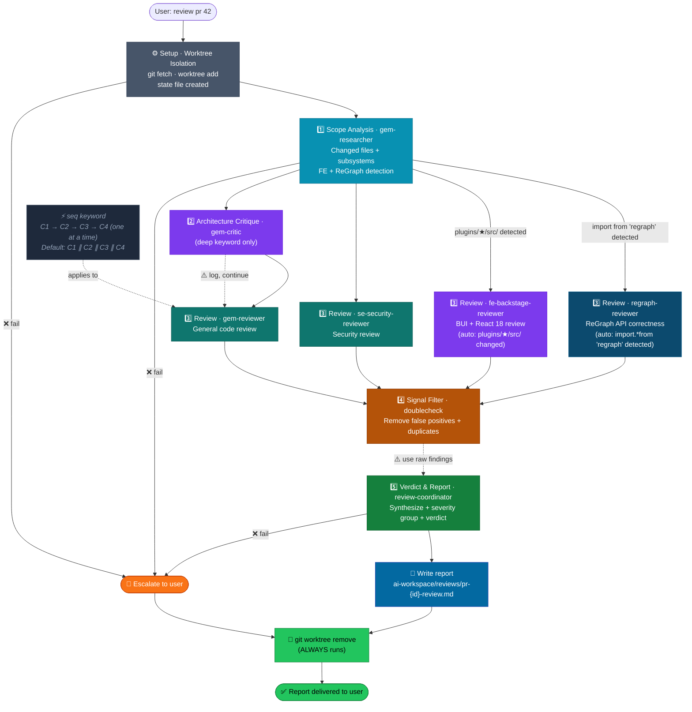

# Review Lifecycle — Summary

**Pipeline:** `Setup → 1·Scope → 2·Architect* → 3·Review (parallel) → 4·Filter → 5·Verdict → Report → Cleanup`

> `*` = conditional step

---

## When to Use This Doc

Load when:
- `review-orchestrator` is starting or has been invoked for a PR/MR review
- Checking pipeline flow, state file schema, magic keywords, or partial failure policy
- Orchestrator needs Context Contracts or analytics definitions for the review pipeline

> 📐 **Context budget:** ≤ 8 000 tokens. Load by section when possible.

Keywords: review pipeline, PR review, review-orchestrator, worktree, state schema, verdict logic, context contracts, partial failure, HIR

---

## Purpose

AI-powered PR/MR code review that runs **fully isolated** in a git worktree — parallel with the user's own work. Produces a structured, severity-grouped report and guarantees cleanup on every exit path.

---

## Relationship to `gem-orchestrator`

| | `gem-orchestrator` | `review-orchestrator` |
|---|---|---|
| **Purpose** | Feature dev lifecycle (P1→P8) | PR/MR code review |
| **Trigger** | `start feature X` | `review pr 42` |
| **Code changes** | ✅ Yes (implements) | ❌ No (read-only) |
| **Worktree** | ❌ Manual | ✅ Auto-managed |
| **User gates** | 4 explicit gates | None — fully automatic |
| **Multiple parallel** | 1 feature at a time | ✅ Multiple PRs in parallel |
| **State file** | `orchestrator-state-{feature}.json` | `review-state-pr-{id}.json` |
| **Output** | Feature docs + code changes | Review report MD |

---

## Pipeline Flow



> **Cleanup runs on every exit path** — success, failure, or escalation.
> *(Mũi tên `❌ fail` = ESCALATE. Mũi tên nét đứt `⚠️` = log + tiếp tục không dừng.)*
> **Màu:** ⬛ Slate = Setup · 🩵 Cyan = Scope · 🟣 Violet = Arch/FE · 🟢 Teal = Review · 🔵 Dark-blue = ReGraph · 🟠 Amber = Filter · 🟩 Green = Verdict/Cleanup · 🔵 Blue = Report · 🟠 Escalate

---

## Step Index

| Step | Doc | Agent(s) | Trigger |
|------|-----|----------|---------|
| **Setup · Worktree Isolation** | [step-0-setup.md](./step-0-setup.md) | *(orchestrator)* | Always |
| **Step 1 · Scope Analysis** | [step-A-researcher.md](./step-A-researcher.md) | `gem-researcher` | Always |
| **Step 2 · Architecture Critique** | [step-B-architecture.md](./step-B-architecture.md) | `gem-critic` | `deep` keyword only |
| **Step 3 · Code + Security Review** | [step-C-code-review.md](./step-C-code-review.md) | `gem-reviewer` ∥ `se-security-reviewer` ∥ `fe-backstage-reviewer`* ∥ `regraph-reviewer`* | Always (FE + ReGraph reviewers conditional) · **`seq`: sequential** |
| **Step 4 · Signal Filter** | [step-D-doublecheck.md](./step-D-doublecheck.md) | `doublecheck` | Always |
| **Step 5 · Verdict & Report** | [step-E-coordinator.md](./step-E-coordinator.md) | `review-coordinator` | Always |

---

## Invocation Patterns

```bash
review pr 42                       # standard review
review branch feature/member-xyz   # by branch name
review pr 42 for member-name       # tag author in report
review pr 42 deep                  # + Step 2 Architecture Critique
review pr 42 security              # double pass on Step 3b Security
review pr 42 fast                  # skip Step 2, higher parallelism
review pr 42 summary-only          # no line-by-line, overview only
review pr 42 seq                   # Step 3 reviewers run one at a time (rate-limit / debug)

status review pr 42                # check pipeline progress
cancel review pr 42                # stop + force cleanup
```

---

## Magic Keywords

| Keyword | Effect |
|---------|--------|
| `deep` | Add Step 2 · Architecture Critique (`gem-critic`) + lower confidence threshold to 0.80 |
| `security` | Step 3b · `se-security-reviewer` runs 2 passes: general + OWASP Top 10 checklist |
| `fast` | Skip Step 2; parallel cap → 4 |
| `summary-only` | Skip line-by-line findings; high-level summary only |
| `seq` | Step 3 reviewers run **sequentially** (cap = 1). Overrides `fast`. Use for rate-limit issues or debugging. |

---

## Verdict Logic

| Condition | Verdict |
|-----------|---------|
| Any `MUST_FIX` present | 🔴 `MUST_FIX` |
| Only `SUGGESTION` | 🟡 `NEEDS_CHANGES` |
| Only `NITPICK` or empty | ✅ `APPROVED` |

---

## State File

**Location:** `ai-workspace/temp/review-state-pr-{id}.json`

```jsonc
{
  "pr_id": "42",
  "pr_branch": "feature/member-xyz",
  "pr_author": "member-name",        // optional
  "base_branch": "main",
  "worktree_path": ".worktrees/review-pr-42",
  "worktree_ready": false,           // true after git worktree add
  "worktree_removed": false,         // true after cleanup
  "status": "pending",               // pending|running|done|failed|cleanup
  "keywords": [],                    // deep|fast|security|summary-only|seq
  "pipeline": {
    "researcher":        null,       // null|done|failed
    "critic":            null,       // null|done|failed|skipped
    "code_reviewer":     null,
    "security_reviewer": null,
    "fe_reviewer":       null,       // null|done|failed|skipped
    "regraph_reviewer":  null,       // null|done|failed|skipped
    "doublecheck":       null,
    "coordinator":       null
  },
  "verdict": null,                   // APPROVED|NEEDS_CHANGES|MUST_FIX
  "output_path": "ai-workspace/reviews/pr-42-review.md",
  "escalations": [],
  "api_errors": [],              // { step, code: 429|500|..., timestamp } — API-level failures
  "manual_interventions": 0,     // count of unexpected user actions — HIR source
  "created_at": "ISO-8601",
  "completed_at": null,
  // ── Performance Metrics (written incrementally as each step completes) ──
  "metrics": {
    "setup":       null,  // { duration_ms, git_fetch_ms, worktree_create_ms }
    "researcher":  null,  // { duration_ms, tokens_input, tokens_output, tokens_total, context_fill_rate, context_budget_exceeded, files_read }
    "critic":      null,  // same shape | "skipped"
    "reviewers":   null,  // { wall_clock_ms, "3a": { duration_ms, tokens_input, tokens_output, tokens_total, context_fill_rate, context_budget_exceeded }, "3b": {...}, "3c": {...}|"skipped", "3d": {...}|"skipped" }
    "doublecheck": null,  // { duration_ms, tokens_input, tokens_output, tokens_total, context_fill_rate, context_budget_exceeded, findings_in, findings_out }
    "coordinator": null,  // { duration_ms, tokens_input, tokens_output, tokens_total, context_fill_rate, context_budget_exceeded }
    "totals":      null   // { wall_clock_ms, tokens_total, tokens_by_step, findings_raw, findings_after_filter, api_error_rate }
  }
}
```

> State file is **audit trail** — never deleted after review completes.

---

## Performance Metrics

Each step reports a `perf` block in its output JSON. Orchestrator writes it to `state.metrics.<step>` immediately on receipt — no waiting for pipeline completion.

> ⚠️ **CLI mode:** `tokens_input`, `tokens_output`, `tokens_total`, `context_fill_rate` are unavailable when running outside agent runtime. Use `"N/A (CLI)"`. `duration_ms` should be estimated from wall-clock if available, else `null`. Do **not** omit perf blocks — show `N/A` to remain spec-compliant.

| Metric | Source | Notes |
|--------|--------|-------|
| `duration_ms` | Every step | Wall clock for that agent only |
| `tokens_input` | All agent steps | Estimated input token count |
| `tokens_output` | All agent steps | Estimated output token count |
| `tokens_total` | All agent steps | `tokens_input + tokens_output` |
| **`context_fill_rate`** | All agent steps | `tokens_input / 200_000` — > 0.5 = nguy hiểm; > 0.7 = budget exceeded |
| `context_efficiency` | All agent steps | `tokens_output / tokens_input` — < 0.05 = receiving too much context |
| `context_budget_exceeded` | All agent steps | `true` when step exceeds its input budget |
| `files_read` | Step 1 + 2 | Files actually read from worktree |
| `findings_count` | Step 3 (per sub-agent) | Raw findings before filtering |
| `findings_in / findings_out` | Step 4 | Before/after signal filter |
| `wall_clock_ms` | Step 3 + Totals | Parallel savings visible here |
| `git_fetch_ms / worktree_create_ms` | Setup | Git operation breakdown |

> Totals are computed by **orchestrator** after Step 5 — not by any agent. See [step-E-coordinator.md](./step-E-coordinator.md) for the full `totals` schema.

---

## 🔌 Context Management (Token Inflation Prevention)

> ⚠️ **Token Inflation risk:** Nếu orchestrator pass full output của mỗi step xuống step tiếp theo, `tokens_input` tăng cộng dồn theo từng step và chi phí tăng exponential.

**Nguyên tắc:** Orchestrator là người duy nhất biết toàn bộ state — trách nhiệm của orchestrator là **slim context** trước khi pass cho mỗi agent. Mỗi agent chỉ nhận đúng những gì nó cần để làm việc.

### Context Contracts

| Step | Receives from Orchestrator | Explicitly NOT passed |
|------|---------------------------|----------------------|
| **Setup** | PR ID, branch, base branch, keywords | — |
| **Step 1 · Researcher** | Worktree path, base branch, changed file list, git stat | — |
| **Step 2 · Architect** | `scope_summary` + `changed_files` + `subsystems` from Step 1 | Full Step 1 JSON, raw diffs |
| **Step 3a · gem-reviewer** | Changed diffs + `scope_summary` | Step 2 findings, other reviewers' context |
| **Step 3b · se-security-reviewer** | Changed diffs + `scope_summary` | Step 2 findings, Step 3a context |
| **Step 3c · fe-backstage-reviewer** | FE file diffs only (`fe_files`) + `scope_summary` | Backend diffs, Step 3a/3b context |
| **Step 3d · regraph-reviewer** | ReGraph file diffs only (`regraph_files`) + `scope_summary` | Backend diffs, Step 3a/3b/3c context |
| **Step 4 · doublecheck** | Raw findings arrays (3a/3b/3c/B) + **actual diff** (not full file content) · **Invoked ONCE after ALL Step 3 agents complete — `seq` or parallel.** Orchestrator buffers each reviewer's output as it arrives; Step 4 payload is identical in both modes. | scope_summary, step 1–2 metadata |
| **Step 5 · coordinator** | `filtered_findings` + `scope_summary` + `escalations[]` + removal log | Raw diffs, full file contents, intermediate JSONs |

### Input Budgets (soft limits — alert when exceeded)

| Step | `tokens_input` budget | Trigger |
|------|-----------------------|---------|
| Step 1 · Researcher | ≤ 8 000 | Diff too large → suggest `summary-only` |
| Step 2 · Architect | ≤ 6 000 | Scope too broad → limit to 5 key files |
| Step 3 (per agent) | ≤ 12 000 | Large PR → split into file batches |
| Step 4 · doublecheck | ≤ 10 000 | Too many raw findings — cap at 30 inputs |
| Step 5 · coordinator | ≤ 6 000 | Filtered findings compressed to essential fields only |

> When any budget is exceeded: orchestrator logs `"context_budget_exceeded": true` to `state.metrics.<step>` and compresses input before re-attempting (truncate diffs to changed lines only, not full file).

---

## 📊 Orchestrator Analytics

Sau nhiều lần review, orchestrator có thể tổng hợp từ `state.metrics` của từng PR để đánh giá chất lượng pipeline theo 4 chiều:

### Operational Performance

| Chỉ số | Công thức | Mục đích |
|--------|-----------|---------|
| **Review Velocity** | `total_reviews / sum(totals.wall_clock_ms) × 3_600_000` | Reviews/hour — throughput thực tế |
| **Context Fill Rate (max)** | `max(tokens_input / 200_000)` across steps | > 0.7 = nguy hiểm, risk truncation |
| **Token Inflation Index** | `max(tokens_input[stepN]) / tokens_input[step1]` | > 3× → cần slim context |
| Avg cost / review | `mean(totals.tokens_total)` | Baseline chi phí |

---

### Reasoning Quality

> 💡 **`doublecheck` = LLM-as-a-judge**: `filter_ratio` là số đo định lượng chất lượng reasoning của reviewer agents.

| Chỉ số | Công thức | Signal |
|--------|-----------|--------|
| **Reasoning Depth (Step 3)** | Số lần 1 reviewer cần retry (nếu fail + restart) per PR | > 1 thường xuyên → agent không stable |
| **Noise ratio** | `(findings_raw − findings_after_filter) / findings_raw` | > 0.40 → reviewers hallucinate |
| **Severity inflation rate** | `severity_adjustments.length / findings_raw` | Cao → miscalibration liên tục |
| **Dedup ratio** | duplicate removals / `findings_raw` | Cao → reviewers overlap thay vì complement |

> **Target:** noise ratio < 0.25. > 0.4 liên tiếp → prompt reviewers cần tăng specificity.

---

### P95 Latency

| Tracked value | Lấy từ | Dùng để |
|---|---|---|
| Total wall clock (P50/P95/P99) | `totals.wall_clock_ms` | Pipeline total cost |
| **Review Velocity** | reviews/hour | Throughput KPI |
| Step 3 parallel savings | `sum(3a+3b+3c) - wall_clock_ms` | Đo hiệu quả parallel |
| Bottleneck step | `argmax(duration_ms)` | Optimize chỗ nào |

> **P95 alert:** > 90s → xem xét `fast` hoặc scope reduction.

---

### Autonomy — HIR

> 🎯 Review pipeline được thiết kế **fully automatic** — `manual_interventions` phải = 0 mỗi review.

| Chỉ số | Công thức | Target |
|--------|-----------|--------|
| **HIR** | `sum(manual_interventions) / total_reviews × 100` | → 0 per 100 reviews |
| **Escalation rate** | `escalations[].length / total_reviews` | > 0.10 → một step không stable |
| **Partial failure rate** | `partial_failure = true` / total | Liên tục → xem xét retry policy |
| **API error rate** | `api_errors[].code` histogram | 429 → back-off; 500 → instability |

**HIR tracking (review pipeline):** Chỉ tính khi user bước vào giữa chừng trong một review đang chạy. `cancel review pr X` rồi restart không tính — đó là expected workflow.

> **Action triggers:**  
> - `manual_interventions > 0` trên 20% reviews → pipeline có issue nghiêm trọng  
> - `api_errors[].code = 429` > 3× / review → add exponential back-off  
> - `context_fill_rate > 0.7` → slim context (Context Contracts section)

---

### Cost Tracking & Token Inflation

| Metric | Formula | Signal |
|--------|---------|--------|
| Avg tokens / review | `mean(totals.tokens_total)` | Baseline |
| Most expensive step | `max(tokens_by_step)` | Candidate slimming |
| **Context efficiency** | `mean(tokens_output / tokens_input)` per step | < 0.05 → context thừa quá nhiều |
| **Token inflation index** | `max(tokens_input[N]) / tokens_input[step1]` | > 3× → pass cộng dồn |

---

## Partial Failure Policy

| Agent fails | Policy |
|---|---|
| Worktree setup | ❌ **ESCALATE** — cannot proceed without isolated worktree |
| `gem-researcher` | ❌ **ESCALATE** — cannot proceed without scope context |
| `gem-critic` (`deep`) | ⚠️ Log to `escalations[]`, continue without arch findings |
| `gem-reviewer` | ⚠️ Log, continue with security + frontend findings |
| `se-security-reviewer` | ⚠️ Log, continue with code + frontend findings |
| `fe-backstage-reviewer` | ⚠️ Log, continue with code + security findings |
| `regraph-reviewer` | ⚠️ Log, continue — note "ReGraph API correctness unverified" in report header |
| `doublecheck` | ⚠️ Skip filter, use raw findings, note in report header |
| `review-coordinator` | ❌ **ESCALATE** — cannot produce report without synthesis |

> Partial review > no review. Always note partial results in report header.

---

## Constraints

- **Read-only** — no `git add`, `git commit`, `git push`
- **Worktree cleanup non-negotiable** — runs on success, failure, cancel, crash
- **No user gates** — auto-run end to end
- **All agent file reads scoped to `{worktree_path}/`** — never repo root
- **State file required** — never start pipeline without it

---

## Output Report Location

```
ai-workspace/reviews/pr-{id}-review.md
```

> Full report format spec: [step-E-coordinator.md](./step-E-coordinator.md#output-report-format)

### Report Sections (in order)

| Section | Content |
|---|---|
| Header table | Author, branch, reviewed at, files changed, verdict |
| 🔴 Must Fix | Blocking findings — must resolve before merge |
| 🟡 Suggestions | Non-blocking but strongly recommended |
| 🔵 Nitpicks | Style/preference — author's discretion |
| 📋 Scope Summary | Plain-text summary from `gem-researcher` |
| **⚡ Pipeline Stats** | Duration · findings raw→filtered · reviewers run · tokens total · context fill rate max |

> `⚡ Pipeline Stats` is sourced from `state.metrics` — orchestrator writes it after all steps complete. Always present in every report.

