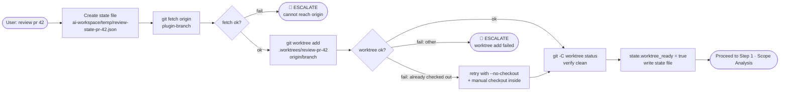

# Step 0 — Setup (Worktree Lifecycle)

> **Status:** ✅ Always runs  
> **Part of:** [review-lifecycle-summary.md](./review-lifecycle-summary.md)

---

## When to Use This Doc

Load when:
- `review-orchestrator` is starting — this step ALWAYS runs first
- Worktree creation, git fetch, or cleanup logic is needed
- Debugging a failed `git fetch` or `git worktree add`
- Checking the initial state file schema written at setup

> 📐 **Context budget:** ≤ 4 000 tokens.

Keywords: setup, worktree, git fetch, git worktree add, cleanup, isolation, worktree_ready, Always runs

---

## Overview

**Responsible:** `review-orchestrator` (no sub-agent)

**Primary goal:** Fetch the PR branch from remote, create an isolated git worktree scoped to that branch, write the initial state file. All subsequent agents read files **exclusively** from this worktree path.

**Exit condition:** `state.worktree_ready = true` → proceed to Step 1 · Scope Analysis. If any git command fails → ESCALATE immediately (no retry).

---

## Flow



---

## Commands

```bash
# 1. Fetch latest remote state
git fetch origin {pr_branch}

# 2. Create isolated worktree
git worktree add .worktrees/review-pr-{id} origin/{pr_branch}

# 3. Verify worktree is clean
git -C .worktrees/review-pr-{id} status

# Fallback: branch already checked out elsewhere
git worktree add --no-checkout .worktrees/review-pr-{id} origin/{pr_branch}
git -C .worktrees/review-pr-{id} checkout
```

---

## Multiple Parallel Reviews

Each review gets its own isolated worktree — user's main working tree is completely unaffected:

```
.worktrees/
├── review-pr-42/   ← reviewing PR #42
├── review-pr-43/   ← reviewing PR #43 simultaneously
└── review-pr-44/   ← queued
```

---

## Cleanup (GUARANTEED on exit)

```bash
git worktree remove --force .worktrees/review-pr-{id}
```

**This runs on every exit path** — success, failure, escalation, or cancel.

**Cleanup guard:**
```
on_exit:
  if state.worktree_ready == true AND state.worktree_removed == false:
    run: git worktree remove --force {state.worktree_path}
    set: state.worktree_removed = true
    set: state.status = "cleanup"
    write state file
```

> ⚠️ NEVER run `git worktree remove` before the review report has been written.  
> ⚠️ An orphaned worktree WILL block future `git worktree add` for the same branch — cleanup is non-negotiable.

---

## State Written at Setup

```jsonc
{
  "pr_id": "{id}",
  "pr_branch": "feature/member-xyz",
  "pr_author": "member-name",        // null if not provided
  "base_branch": "main",
  "worktree_path": ".worktrees/review-pr-{id}",
  "worktree_ready": true,            // set to true here
  "worktree_removed": false,
  "status": "running",
  "keywords": [],                    // parsed from invocation
  "pipeline": {
    "researcher":        null,
    "critic":            null,
    "code_reviewer":     null,
    "security_reviewer": null,
    "fe_reviewer":       null,
    "doublecheck":       null,
    "coordinator":       null
  },
  "verdict": null,
  "output_path": "ai-workspace/reviews/pr-{id}-review.md",
  "escalations": [],
  "created_at": "ISO-8601",
  "completed_at": null,
  // ── Performance Metrics ──────────────────────────────────────────────────
  "metrics": {
    "setup":       null,  // { duration_ms, git_fetch_ms, worktree_create_ms }
    "researcher":  null,  // { duration_ms, tokens_input, tokens_output, tokens_total, context_fill_rate, files_read }
    "critic":      null,  // same shape | "skipped"
    "reviewers":   null,  // { wall_clock_ms, "3a": {...}, "3b": {...}, "3c": {...}|"skipped" }
    "doublecheck": null,  // { duration_ms, tokens_input, tokens_output, tokens_total, context_fill_rate, findings_in, findings_out }
    "coordinator": null,  // { duration_ms, tokens_input, tokens_output, tokens_total, context_fill_rate }
    "totals":      null   // written by coordinator — see step-E-coordinator.md
  }
}
```

### Perf — Setup Block

Orchestrator records git timing immediately after each command:

```json
// written to state.metrics.setup after worktree is ready
{
  "started_at": "ISO-8601",
  "completed_at": "ISO-8601",
  "duration_ms": 730,
  "git_fetch_ms": 480,       // time for git fetch only
  "worktree_create_ms": 210  // time for git worktree add only
}
```

---

## Escalation Format

```
🚨 REVIEW ESCALATION — PR #{id}

Step: Setup — git fetch / git worktree add
Reason: {reason}

To retry:  "review pr {id}"
To cancel: "cancel review pr {id}"

Worktree: {removed | still present at .worktrees/review-pr-{id}}
          (manual: git worktree remove --force .worktrees/review-pr-{id})
```

---

## Failure Modes

| Failure | Cause | Action |
|---------|-------|--------|
| `git fetch` fails | No network / origin unreachable / branch doesn't exist on remote | ESCALATE — cannot proceed |
| `git worktree add` fails — branch already checked out | Another agent is using this branch | Retry with `--no-checkout` + checkout inside |
| `git worktree add` fails — other reason | Disk full, permission error | ESCALATE |
| Worktree status shows uncommitted changes | Should not happen for remote branch | Log warning, proceed |

