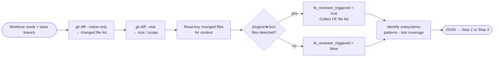

# Step 1 · Scope Analysis

> **Status:** ✅ Always runs  
> **Part of:** [review-lifecycle-summary.md](./review-lifecycle-summary.md)

---

## When to Use This Doc

Load when:
- Step 1 (Scope Analysis) is starting — always runs after setup
- `gem-researcher` is being invoked for PR scope analysis
- Orchestrator needs FE detection logic or routing rules after Step 1 completes

> 📐 **Context budget:** ≤ 4 000 tokens.

Keywords: scope analysis, gem-researcher, changed files, subsystems, FE detection, fe_reviewer_triggered, Always runs

---

## Overview

**Agent:** `gem-researcher`

**Primary goal:** Understand the full scope of the PR — what changed, what subsystems are touched, what patterns are used, whether tests exist. Produces a `scope_summary` that is passed as context to ALL subsequent steps.

**Exit condition:** JSON output returned to Orchestrator → Step 2 · Architecture Critique (if `deep`) or Step 3 · Parallel Review (standard). On failure → ESCALATE immediately.

---

## Internal Flow



---

## Task

```bash
# Get changed file list
git -C {worktree_path} diff origin/{base_branch}...HEAD --name-only

# Get scope summary (file count + lines)
git -C {worktree_path} diff origin/{base_branch}...HEAD --stat

# Read key changed files for context
# (orchestrator passes file list; researcher reads them from worktree)
```

The researcher determines:
- Which subsystems are touched (`authentication`, `api-router`, `frontend-plugin`, etc.)
- What coding patterns are used (`express-router`, `jest`, `backstage-plugin`)
- Whether tests exist, are absent, or are partial
- Whether `plugins/*/src/**/*.{ts,tsx}` files changed → auto-triggers `fe-backstage-reviewer` in Step 3c

---

## 🤖 Agent Composition

| Role | Agent | Note |
|------|-------|------|
| **Scope analyzer** | `gem-researcher` | ✅ Installed. Reads all changed files from worktree. Maps patterns and subsystems. |

---

## Invocation Prompt (Orchestrator → `gem-researcher`)

```
You are being invoked as Scope Analyzer for PR #{pr_id}.

## Your Task
Analyze the PR diff to understand its full scope:
- What files changed and in what subsystems?
- What coding patterns are present?
- Are tests present, absent, or partial?
- Are any files under plugins/*/src/ changed? (determines if fe-backstage-reviewer triggers)

## Input
Worktree path: {worktree_path}
Base branch: {base_branch}
Changed file list: {git diff --name-only output}
Git stat: {git diff --stat output}

## What to read
Read the most important changed files to understand context — not all files, focus on:
- Entry points / main logic files
- New/modified components or services
- Test files (if any)
Limit: read max 10 files. Prefer changed implementation files over unchanged boilerplate.

## Output Required
Return JSON:
{
  "changed_files": ["src/...", "..."],
  "subsystems": ["authentication", "api-router"],
  "patterns_detected": ["express-router", "jest", "backstage-plugin"],
  "test_coverage": "present|absent|partial",
  "fe_files": ["plugins/my-plugin/src/..."],       // [] if none
  "fe_reviewer_triggered": true|false,             // true if plugins/*/src/ files found
  "scope_summary": "Short plain-text summary (2–4 sentences) of what this PR does",
  "perf": {
    "started_at": "<ISO-8601 when you started>",
    "completed_at": "<ISO-8601 now>",
    "duration_ms": <elapsed ms>,
    "tokens_input": <estimated input tokens>,
    "tokens_output": <estimated output tokens>,
    "tokens_total": <sum>,
    "files_read": <count of files you actually read>
  }
}

## Constraints
- Read files from {worktree_path} only — never from repo root
- Do NOT suggest code changes
- scope_summary must be factual, not evaluative
```

---

## Output Contract (Step 1 → Orchestrator)

```json
{
  "changed_files": ["plugins/my-plugin/src/components/MyComp.tsx", "..."],
  "subsystems": ["frontend-plugin", "catalog"],
  "patterns_detected": ["backstage-plugin", "jest", "react-hooks"],
  "test_coverage": "partial",
  "fe_files": ["plugins/my-plugin/src/components/MyComp.tsx"],
  "fe_reviewer_triggered": true,
  "scope_summary": "This PR adds a new MyComp component to the my-plugin frontend plugin, implementing a catalog entity viewer with filtering support. Tests are partially present.",
  "perf": {
    "started_at": "ISO-8601",
    "completed_at": "ISO-8601",
    "duration_ms": 3240,
    "tokens_input": 6800,
    "tokens_output": 820,
    "tokens_total": 7620,
    "context_fill_rate": 0.034,
    "context_budget_exceeded": false,
    "files_read": 9
  }
}
```

> Orchestrator writes `perf` block to `state.metrics.researcher` immediately on receiving the output.

---

## Orchestrator Routing After Step 1

```
Orchestrator reads Step 1 output:

  if keywords contains "deep":
    → invoke Step 2 (Architecture Critique) with researcher output
    → after Step 2: invoke Step 3 (Parallel Review)

  else:
    → invoke Step 3 (Parallel Review) directly

  if fe_reviewer_triggered == true:
    → include fe-backstage-reviewer in Step 3 parallel set
    → pass fe_files list to fe-backstage-reviewer

  if fe_reviewer_triggered == false:
    → set state.pipeline.fe_reviewer = "skipped"
    → do NOT invoke fe-backstage-reviewer

  if keywords contains "fast" AND fe_reviewer_triggered == false:
    → parallel cap = 4 (only 2 reviewers anyway)
```

---

## Failure Policy

| Failure | Policy |
|---------|--------|
| `git diff` returns empty | ❌ **ESCALATE** — branch may not exist on remote or is already merged |
| Researcher fails to return JSON | ❌ **ESCALATE** — scope context is required by all downstream steps |
| Researcher times out | ❌ **ESCALATE** — same reason |

