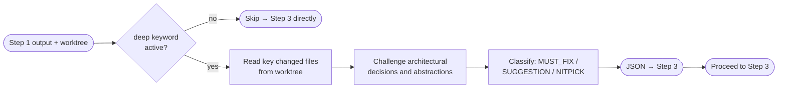

# Step 2 · Architecture Critique

> **Status:** 🟣 Conditional — `deep` keyword only  
> **Part of:** [review-lifecycle-summary.md](./review-lifecycle-summary.md)

---

## When to Use This Doc

Load when:
- Step 2 (Architecture Critique) is starting — ONLY if `deep` keyword is active
- `gem-critic` is being invoked for architectural challenge
- Checking when `deep` is appropriate vs not (use the decision table below)

> 📐 **Context budget:** ≤ 4 000 tokens.

Keywords: architecture critique, gem-critic, deep keyword, wrong abstraction, hidden coupling, Conditional

---

## Overview

**Agent:** `gem-critic`

**Trigger:** Only when the user appends `deep` to the invocation (e.g., `review pr 42 deep`).

**Primary goal:** Challenge the architectural decisions in the PR. Identify wrong abstractions, hidden coupling, over-engineering, layer violations, and patterns that will create technical debt. Does NOT suggest rewrites — only raises questions and flags risks.

**Exit condition:** JSON output returned to Orchestrator → proceed to Step 3 · Parallel Review. On failure → log to `escalations[]`, continue without architecture findings.

---

## Internal Flow



---

## When to Use `deep`

| Scenario | Recommendation |
|----------|----------------|
| Security-sensitive PR (auth, permissions, data access) | ✅ `deep` |
| Architecture-heavy change (new service, new pattern, breaking refactor) | ✅ `deep` |
| Large PR touching multiple subsystems | ✅ `deep` |
| Small bug fix or isolated UI change | ❌ Skip |
| Quick sanity check | ❌ Use `fast` instead |

---

## 🤖 Agent Composition

| Role | Agent | Note |
|------|-------|------|
| **Architecture critic** | `gem-critic` | ✅ Installed. Read-only — challenges only. Never rewrites. |

---

## Invocation Prompt (Orchestrator → `gem-critic`)

```
You are being invoked as Architecture Critic for PR #{pr_id}.

## Your Task
Challenge the architectural decisions made in this PR. Focus on:
- Wrong abstraction layer (logic in the wrong place — e.g., business logic in a React component)
- Hidden coupling (changes that create implicit dependencies between modules)
- Over-engineering (unnecessary abstractions, premature generalization)
- Under-engineering (logic that should be extracted but isn't)
- Patterns that conflict with existing architecture in this codebase

Do NOT suggest rewrites. Only raise questions and flag risks.

## Input
Worktree path: {worktree_path}
Scope summary: {Step 1 scope_summary}
Changed files: {Step 1 changed_files list}
Subsystems touched: {Step 1 subsystems}

## What to read
Read changed files from the worktree — focus on structural decisions:
- New files created (most likely to contain architectural choices)
- Files with significant logic changes
- Entry points (plugin.ts, router.ts, index.ts)

## Output Required
Return JSON:
{
  "architecture_findings": [
    {
      "severity": "MUST_FIX|SUGGESTION|NITPICK",
      "location": "plugins/my-plugin/src/plugin.ts:14",
      "abstraction": "What the problematic abstraction is",
      "question": "The challenging question — e.g. 'Why is this in the component instead of the API client?'",
      "risk": "What breaks if this is left as-is"
    }
  ],
  "overall_architecture_impression": "string",
  "perf": {
    "started_at": "<ISO-8601 when you started>",
    "completed_at": "<ISO-8601 now>",
    "duration_ms": <elapsed ms>,
    "tokens_input": <estimated input tokens>,
    "tokens_output": <estimated output tokens>,
    "tokens_total": <sum>,
    "files_read": <count of files you actually read>
  }
}

## Constraints
- Read files from {worktree_path} only
- If no architectural issues found, return empty findings array — do not fabricate issues
- Maximum 5 HIGH severity findings per review — be selective
```

---

## Output Contract (Step 2 → Orchestrator)

```json
{
  "architecture_findings": [
    {
      "severity": "MUST_FIX",
      "location": "plugins/my-plugin/src/components/MyComp.tsx:88",
      "abstraction": "API call inside render function",
      "question": "Why is the fetchData() call triggered inside useEffect during render rather than handled by the API client?",
      "risk": "Race conditions on fast navigation, no cancellation on unmount"
    }
  ],
  "overall_architecture_impression": "PR introduces a new plugin with clean structure, but has one concerning pattern around data fetching placement.",
  "perf": {
    "started_at": "ISO-8601",
    "completed_at": "ISO-8601",
    "duration_ms": 4150,
    "tokens_input": 9200,
    "tokens_output": 640,
    "tokens_total": 9840,
    "context_fill_rate": 0.046,
    "context_budget_exceeded": false,
    "files_read": 5
  }
}
```

> Orchestrator writes `perf` block to `state.metrics.critic` immediately on receiving the output. If step was skipped: `state.metrics.critic = "skipped"`.

---

## Orchestrator Handling

```
On Step 2 success:
  → store architecture_findings in memory context
  → pass to Step 4 (Signal Filter) along with Step 3 findings
  → set state.pipeline.critic = "done"

On Step 2 failure:
  → log to state.escalations[]: "Step 2 (Architecture Critique) failed: {reason}"
  → set state.pipeline.critic = "failed"
  → continue to Step 3 WITHOUT architecture context
  → note in report header: "⚠️ Architecture critique skipped (agent failed)"
```

---

## Failure Policy

| Failure | Policy |
|---------|--------|
| `gem-critic` fails | ⚠️ Log, continue — architecture findings are valuable but not blocking |
| `gem-critic` returns empty findings | ✅ Valid — no issues found, proceed normally |
| `gem-critic` times out | ⚠️ Same as failure — log and proceed |

