# Step 3 · Parallel Review

> **Status:** ✅ Always runs (3a + 3b always; 3c conditional)
> **Part of:** [review-lifecycle-guide.md](./review-lifecycle-guide.md)

---

## When to Use This Doc

Load when:
- Step 3 (Parallel Review) is starting — 3a + 3b always run, 3c conditional on FE detection
- Checking invocation prompts for `gem-reviewer`, `se-security-reviewer`, or `fe-backstage-reviewer`
- Determining active reviewer set based on keywords + `fe_reviewer_triggered`
- `security` keyword active → `se-security-reviewer` runs 2 OWASP passes

> 📐 **Context budget:** ≤ 8 000 tokens total. Pass FE diffs only to 3c — NOT full diff.

Keywords: parallel review, code review, security review, FE review, gem-reviewer, se-security-reviewer, fe-backstage-reviewer, Always runs

---

## Overview

**Agents:** `gem-reviewer` (3a) ∥ `se-security-reviewer` (3b) ∥ `fe-backstage-reviewer` (3c, conditional)

**Primary goal:** Comprehensive review of all changed code — correctness + security + frontend (when applicable) — all running in parallel for maximum efficiency.

**Exit condition:** All active agents complete (any failures logged, not blocking) → Step 4 · Signal Filter.

---

## Parallel Execution

```mermaid
flowchart LR
    IN([Step 1/2 output + worktree]) --> ROUTE

    ROUTE{Determine active\nreviewers}
    ROUTE --> C1
    ROUTE --> C2
    ROUTE -->|fe_reviewer_triggered == true| C3

    C1["3a · gem-reviewer\nGeneral code review"]
    C2["3b · se-security-reviewer\nSecurity review"]
    C3["3c · fe-backstage-reviewer\nBUI + React 18 review"]

    C1 --> WAIT
    C2 --> WAIT
    C3 --> WAIT

    WAIT([Wait for all active agents]) --> OUT([Step 4 — Signal Filter])
```



**Parallel caps:**
| Condition | Active agents | Cap |
|-----------|--------------|-----|
| Standard | 3a + 3b | 2 |
| + frontend | 3a + 3b + 3c | 3 |
| `fast` keyword | 3a + 3b (3c skipped unless critical FE patterns detected) | 4 |
| `deep` keyword | same as above + Step 2 ran before | same |

---

## Step 3a — General Code Review (`gem-reviewer`)

**Checks:** correctness, maintainability, naming consistency, code duplication, error handling, edge cases, test quality, coding standards compliance.

### Invocation Prompt

```
You are being invoked as Code Reviewer for PR #{pr_id}.

## Your Task
Review all changed files for code quality. Check:
- Correctness: does the logic do what it claims?
- Edge cases: what happens with null, empty, unexpected input?
- Error handling: are all error paths handled gracefully?
- Naming: are variables/functions/types named clearly and consistently?
- Duplication: is logic repeated that should be extracted?
- Test quality: are the tests meaningful, or just coverage noise?
- Standard compliance: AGENTS.md and .github/coding-standards.md

## Input
Worktree path: {worktree_path}
Changed files + diffs: {diff content}
Scope summary: {Step 1 scope_summary}
Subsystems: {Step 1 subsystems}

## Output Required
Return JSON:
{
  "findings": [
    {
      "severity": "MUST_FIX|SUGGESTION|NITPICK",
      "category": "correctness|maintainability|naming|duplication|error-handling|test-quality|standards",
      "location": "path/to/file.ts:42",
      "finding": "Description of the issue",
      "suggestion": "What to do instead"
    }
  ],
  "overall_impression": "string",
  "perf": {
    "started_at": "<ISO-8601 when you started>",
    "completed_at": "<ISO-8601 now>",
    "duration_ms": <elapsed ms>,
    "tokens_input": <estimated input tokens>,
    "tokens_output": <estimated output tokens>,
    "tokens_total": <sum>,
    "findings_count": <length of findings array>
  }
}

## Constraints
- Only report issues in code that was actually changed in this PR
- Every finding must have a specific file:line location
- If no issues found, return empty findings array
- Read files from {worktree_path} only
```

---

## Step 3b — Security Review (`se-security-reviewer`)

**Checks:** OWASP Top 10, injection, authentication/authorization gaps, secrets in code, input validation, data exposure, missing rate limiting, insecure defaults, dependency vulnerabilities.

When `security` keyword active → runs **two passes**: general + OWASP Top 10 checklist explicitly.

### Invocation Prompt

```
You are being invoked as Security Reviewer for PR #{pr_id}.

## Your Task
Security-focused review of all changed code. Apply OWASP Top 10 lens. Check:
- Injection: SQL, NoSQL, command, template injection
- Authentication: missing auth checks, broken session management
- Authorization: missing role checks, IDOR vulnerabilities
- Sensitive data: secrets hardcoded, PII exposed in logs, missing encryption
- Input validation: unsanitized user input, missing schema validation
- Security misconfigurations: insecure defaults, CORS, headers
- Dependency vulnerabilities: new packages with known CVEs
- Rate limiting: missing on endpoints that could be abused

## Input
Worktree path: {worktree_path}
Changed files + diffs: {diff content}
Scope summary: {Step 1 scope_summary}
{if security keyword: "Run TWO passes: first general security, then full OWASP Top 10 checklist"}

## Output Required
Return JSON:
{
  "findings": [
    {
      "severity": "MUST_FIX|SUGGESTION|NITPICK",
      "category": "injection|auth|authz|data-exposure|validation|config|dependency|rate-limiting",
      "location": "path/to/file.ts:42",
      "owasp_category": "A01:2021|...|null",
      "finding": "Description of the vulnerability",
      "suggestion": "Specific remediation"
    }
  ],
  "overall_impression": "string",
  "owasp_pass_done": true|false,
  "perf": {
    "started_at": "<ISO-8601 when you started>",
    "completed_at": "<ISO-8601 now>",
    "duration_ms": <elapsed ms>,
    "tokens_input": <estimated input tokens>,
    "tokens_output": <estimated output tokens>,
    "tokens_total": <sum>,
    "findings_count": <length of findings array>,
    "owasp_passes": 1|2
  }
}

## Constraints
- Only report issues in changed code — not pre-existing issues in unchanged code
- Every MUST_FIX must have a concrete exploit path, not just a theoretical risk
- Read files from {worktree_path} only
```

---

## Step 3c — Frontend Plugin Review (`fe-backstage-reviewer`) — Conditional

**Triggers automatically** when `gem-researcher` (Step 1 · Scope Analysis) detects changed files matching `plugins/*/src/**/*.{ts,tsx}`.

**Does NOT trigger when:**
- No changed files under `plugins/*/src/`
- `fast` keyword active AND no Critical/High-risk FE patterns detected by researcher

### Checks

| Category | What is verified |
|----------|-----------------|
| **BUI compliance** | BUI-first, no `makeStyles`, no `@material-ui/icons`, CSS Modules |
| **MuiV7ThemeProvider** | MUI v7 components (Button, Chip, Card, Alert, Divider, IconButton) wrapped — always MUST_FIX when missing |
| **React 18 patterns** | Hooks rules, no class components, async patterns, cleanup on unmount |
| **TypeScript quality** | Strict types, no implicit `any`, proper generics |
| **Testing standards** | `TestApiProvider`, `MemoryRouter`, co-located tests |
| **Plugin structure** | `plugin.ts`, `index.ts`, route refs, no default barrel imports |
| **Import hygiene** | No `import React`, direct imports not barrel, Remix Icons |

### Invocation Prompt

```
You are being invoked as Frontend Plugin Reviewer for PR #{pr_id}.

## Your Task
Review changed frontend plugin files for Backstage-specific compliance and React 18 best practices.

## Input
Worktree path: {worktree_path}
Changed FE files: {fe_files list from Step 1}
Changed FE diffs: {diff content for FE files only}
BUI catalog: docs/ai/domain-knowledge/bui-components.md (if available)
Coding standards: AGENTS.md + .github/coding-standards.md + .github/frontend-plugin-guide.md

## What to check (file by file)
BUI compliance:
- No makeStyles — use CSS Modules
- No @material-ui/icons — use @remixicon/react
- BUI-first: prefer @backstage/ui components (Box, Text, Flex, Button, Card, Tag)
- MUI v7 components (Button, Chip, Card, Alert, Divider, IconButton) → must be wrapped in <MuiV7ThemeProvider>
- Backstage components (InfoCard, LinkButton, Link, Progress) → no wrapper needed

React 18 patterns:
- No import React at top of file (uses react-jsx transform)
- No class components
- Cleanup functions in useEffect when side effects exist
- Proper hook dependencies in useEffect/useCallback/useMemo
- No direct DOM manipulation

TypeScript:
- No implicit any
- Props interface defined for all components
- Proper generics — no type casting with as unless justified

Testing:
- Tests co-located with component (Component.test.tsx next to Component.tsx)
- TestApiProvider wrapping API-dependent tests
- MemoryRouter for route-dependent tests
- No JSDoc in code files — document in README.md

Plugin structure:
- plugin.ts exports createPlugin + createRoutableExtension
- index.ts re-exports correctly
- routes.ts uses createRouteRef

## Output Required
Return JSON:
{
  "findings": [
    {
      "severity": "MUST_FIX|SUGGESTION|NITPICK",
      "category": "bui|muiv7|react18|typescript|testing|structure|imports",
      "location": "plugins/my-plugin/src/components/MyComp.tsx:42",
      "finding": "Description of the violation",
      "suggestion": "Specific actionable fix",
      "rule": "The rule being violated (e.g. 'BUI-first: use @backstage/ui Box not MUI Box')"
    }
  ],
  "overall_impression": "string",
  "files_reviewed": ["plugins/..."],
  "skipped_files": [],
  "bui_compliant": true|false,
  "perf": {
    "started_at": "<ISO-8601 when you started>",
    "completed_at": "<ISO-8601 now>",
    "duration_ms": <elapsed ms>,
    "tokens_input": <estimated input tokens>,
    "tokens_output": <estimated output tokens>,
    "tokens_total": <sum>,
    "findings_count": <length of findings array>,
    "files_reviewed_count": <length of files_reviewed>
  }
}

## Constraints
- Only review files under plugins/*/src/ — ignore backend, config, test infra
- Every finding needs file:line — no vague findings
- Read files from {worktree_path} only
```

---

## Output Contract (Step 3 → Orchestrator)

All three agents return findings in the same format. Orchestrator collects and passes all to Step 4:

```json
{
  "3a_findings": [ /* gem-reviewer findings */ ],
  "3b_findings": [ /* se-security-reviewer findings */ ],
  "3c_findings": [ /* fe-backstage-reviewer findings — null if skipped */ ],
  "3a_impression": "string",
  "3b_impression": "string",
  "3c_impression": "string | null",
  "perf": {
    "wall_clock_ms": 8900,
    "3a": {
      "started_at": "ISO-8601",
      "completed_at": "ISO-8601",
      "duration_ms": 7200,
      "tokens_input": 10400,
      "tokens_output": 2100,
      "tokens_total": 12500,
      "context_fill_rate": 0.052,
      "context_budget_exceeded": false,
      "findings_count": 8
    },
    "3b": {
      "started_at": "ISO-8601",
      "completed_at": "ISO-8601",
      "duration_ms": 6800,
      "tokens_input": 8200,
      "tokens_output": 1600,
      "tokens_total": 9800,
      "context_fill_rate": 0.041,
      "context_budget_exceeded": false,
      "findings_count": 4,
      "owasp_passes": 1
    },
    "3c": {
      "started_at": "ISO-8601",
      "completed_at": "ISO-8601",
      "duration_ms": 5500,
      "tokens_input": 5900,
      "tokens_output": 1300,
      "tokens_total": 7200,
      "context_fill_rate": 0.030,
      "context_budget_exceeded": false,
      "findings_count": 6,
      "files_reviewed_count": 3
    }
  }
}
```

> `perf.wall_clock_ms` = time from the moment Step 3 started (all agents dispatched) to the moment the last agent finished — always ≤ max(3a, 3b, 3c) duration, not the sum.
> Orchestrator writes `perf` block to `state.metrics.reviewers`. If an agent was skipped: its key is `"skipped"` instead of an object.

---

## Failure Policy

| Agent | Policy |
|-------|--------|
| `gem-reviewer` fails | ⚠️ Log to `escalations[]`, continue with C2/C3 findings |
| `se-security-reviewer` fails | ⚠️ Log to `escalations[]`, continue with C1/C3 findings |
| `fe-backstage-reviewer` fails | ⚠️ Log to `escalations[]`, continue with C1/C2 findings |
| All 3 fail | ❌ **ESCALATE** — no findings to synthesize |

