# Step 4 · Signal Filter

> **Status:** ✅ Always runs  
> **Part of:** [review-lifecycle-guide.md](./review-lifecycle-guide.md)

---

## When to Use This Doc

Load when:
- Step 4 (Signal Filter) is starting — always runs after Step 3
- `doublecheck` is filtering raw findings for hallucinations, pre-existing issues, and duplicates
- Step 3 partially failed — checking if null input handling applies
- Checking deduplication rules for findings from multiple reviewers

> 📐 **Context budget:** ≤ 4 000 tokens. Pass actual diff + raw findings, NOT full file contents.

Keywords: signal filter, doublecheck, hallucination removal, false positives, deduplication, pre-existing issues, severity adjustment, Always runs

---

## Overview

**Agent:** `doublecheck`

**Primary goal:** Cross-check every finding from Steps B and C against the actual PR diff. Remove hallucinated findings, out-of-scope issues (unchanged code), duplicate findings across reviewers, and low-confidence speculation. Confirm severity classifications are justified.

**Exit condition:** Filtered findings returned to Orchestrator → Step 5 (Verdict & Report). On failure → skip filter, forward raw findings to Step 5 with warning in report header.

---

## Why This Step Exists

Without `doublecheck`, review reports suffer from:
- ❌ **Hallucinated findings** — issues reported in code that was never changed
- ❌ **Pre-existing issues** — problems that existed before this PR and are not the author's responsibility
- ❌ **Duplicate findings** — `gem-reviewer` and `se-security-reviewer` flagging the same line for different reasons
- ❌ **Severity inflation** — SUGGESTION promoted to MUST_FIX without justification
- ❌ **Speculation** — "this could potentially be a problem" with no evidence

---

## Internal Flow

```mermaid
flowchart LR
    IN([Step 2/3 findings + diff]) --> D1
    D1[For each finding:\nverify location against diff] --> D2
    D2[Remove:\n• unchanged code findings\n• duplicate findings\n• unsupported speculation] --> D3
    D3[Confirm severity:\nare MUST_FIX findings truly blocking?] --> D4
    D4[Produce filtered_findings list\n+ removal log] --> OUT([Step 5 — Verdict & Report])
```



---

## 🤖 Agent Composition

| Role | Agent | Note |
|------|-------|------|
| **Anti-hallucination filter** | `doublecheck` | ✅ Installed. Read-only — never rewrites findings, only removes or confirms. |

---

## Invocation Prompt (Orchestrator → `doublecheck`)

```
You are being invoked as Signal Filter for PR #{pr_id}.

## Your Task
Cross-check every finding from the code and security reviewers against the actual PR diff.

Remove a finding if ANY of these is true:
1. The reported file:line was NOT changed in this PR (pre-existing issue)
2. The finding is speculation with no concrete evidence ("could potentially...")
3. The exact same issue was already reported by another reviewer (merge duplicates)
4. The severity classification is clearly wrong (e.g., naming issue marked as MUST_FIX)

Confirm MUST_FIX findings: each one must have a clear, demonstrable impact.
Downgrade to SUGGESTION if the risk is theoretical only.

## Input
PR diff: {git diff content — actual lines changed}
gem-critic findings: {Step 2 architecture_findings — null if step skipped}
gem-reviewer findings: {Step 3 3a_findings}
se-security-reviewer findings: {Step 3 3b_findings}
fe-backstage-reviewer findings: {Step 3 3c_findings — null if skipped}

## Output Required
Return JSON:
{
  "filtered_findings": [
    {
      "source": "gem-reviewer|se-security-reviewer|fe-backstage-reviewer|gem-critic",
      "severity": "MUST_FIX|SUGGESTION|NITPICK",
      "category": "...",
      "location": "path/to/file.ts:42",
      "finding": "...",
      "suggestion": "..."
    }
  ],
  "removed_count": 3,
  "removed_reasons": [
    "finding at router.ts:88 was about unchanged code — line not in diff",
    "duplicate: both gem-reviewer and se-security-reviewer flagged MyComp.tsx:21 for missing error handling — merged"
  ],
  "severity_adjustments": [
    "MyComp.tsx:31: downgraded MUST_FIX → SUGGESTION — risk is theoretical, no concrete exploit path shown"
  ],
  "perf": {
    "started_at": "<ISO-8601 when you started>",
    "completed_at": "<ISO-8601 now>",
    "duration_ms": <elapsed ms>,
    "tokens_input": <estimated input tokens>,
    "tokens_output": <estimated output tokens>,
    "tokens_total": <sum>,
    "context_efficiency": <tokens_output / tokens_input>,
    "context_budget_exceeded": false,
    "findings_in": <total raw findings received>,
    "findings_out": <length of filtered_findings array>
  }
}

## Constraints

- DO NOT add new findings — this step is a filter, NEVER a reviewer
- DO NOT rewrite the text of surviving findings — only remove or tag
- MUST keep borderline findings — err on the side of including
- MUST verify line numbers against the actual diff content provided
```

---

## Output Contract (Step 4 → Orchestrator)

```json
{
  "filtered_findings": [
    {
      "source": "se-security-reviewer",
      "severity": "MUST_FIX",
      "category": "auth",
      "location": "plugins/my-plugin/src/router.ts:34",
      "finding": "Missing authorization check before returning sensitive entity data",
      "suggestion": "Add identity.getRequestIdentity() check before the query"
    }
  ],
  "removed_count": 3,
  "removed_reasons": ["..."],
  "severity_adjustments": ["..."],
  "perf": {
    "started_at": "ISO-8601",
    "completed_at": "ISO-8601",
    "duration_ms": 2100,
    "tokens_input": 4800,
    "tokens_output": 800,
    "tokens_total": 5600,
    "context_fill_rate": 0.024,
    "context_efficiency": 0.17,
    "context_budget_exceeded": false,
    "findings_in": 18,
    "findings_out": 15
  }
}
```

> Orchestrator writes `perf` block to `state.metrics.doublecheck` immediately on receiving the output.

---

## Failure Policy

| Failure | Policy |
|---------|--------|
| `doublecheck` fails | ⚠️ Skip filter entirely. Forward Step 3 raw findings directly to Step 5. Note in report header: "⚠️ Signal filter skipped — findings unverified" |
| `doublecheck` times out | Same as failure |
| `doublecheck` returns no findings | ✅ Valid — all issues were pre-existing or hallucinated. Proceed with empty list → likely `APPROVED` verdict |

---

## Deduplication Rules

When the same issue appears in multiple reviewer outputs:

| Scenario | Action |
|----------|--------|
| Same file + same line + same issue | Keep **highest severity** version, discard rest. Note in `removed_reasons`. |
| Same file + same line + different categories | Keep both — they're different perspectives |
| Same issue, different files | Keep both — separate occurrences |
| Architecture finding + code finding on same issue | Keep both — different lenses |

