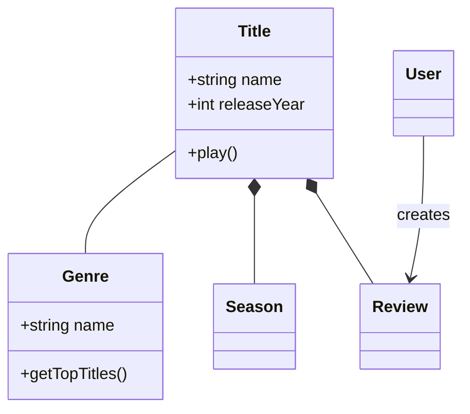
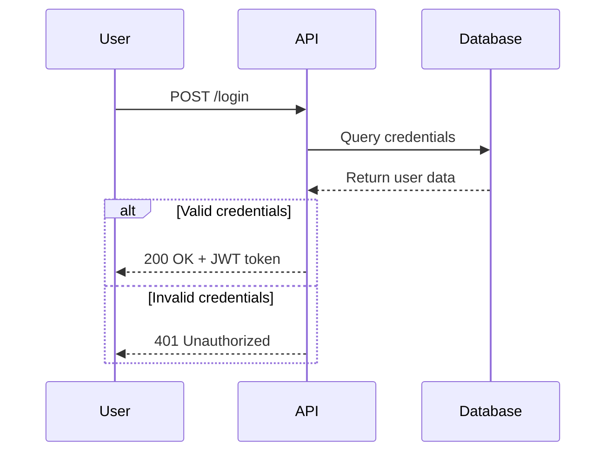
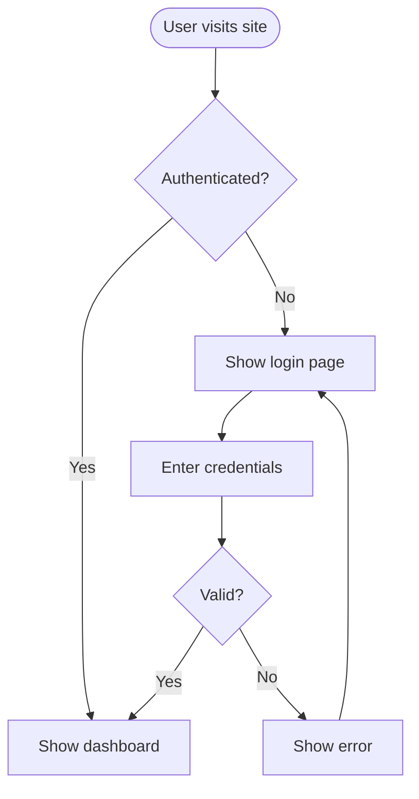
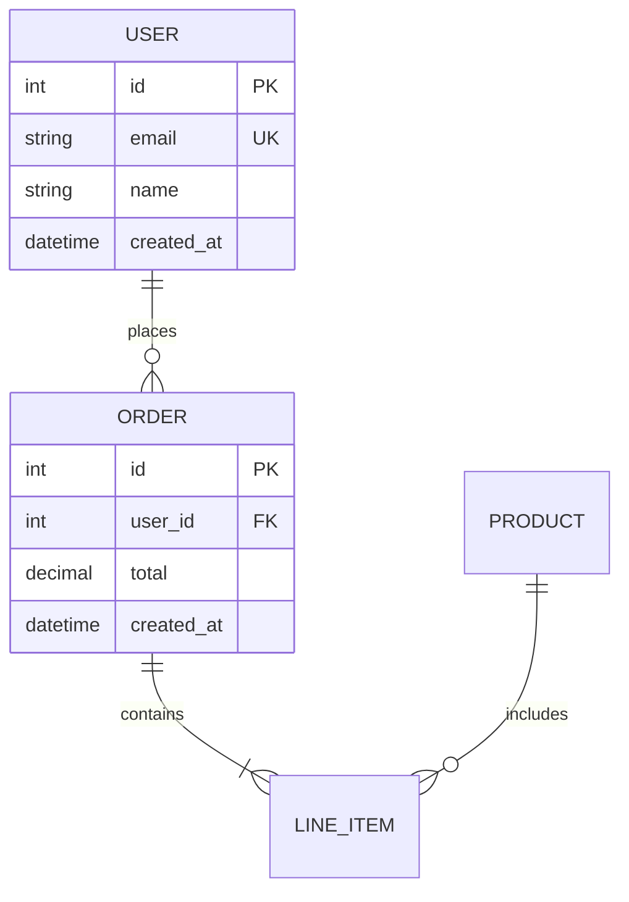
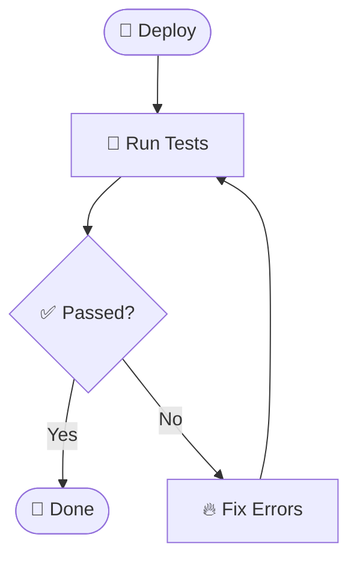
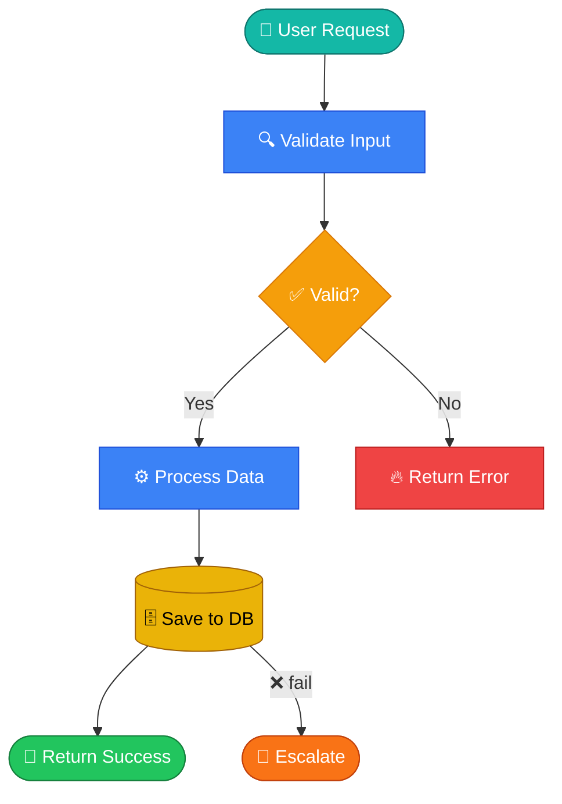
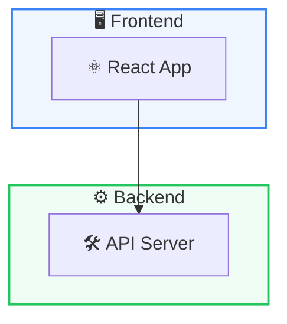
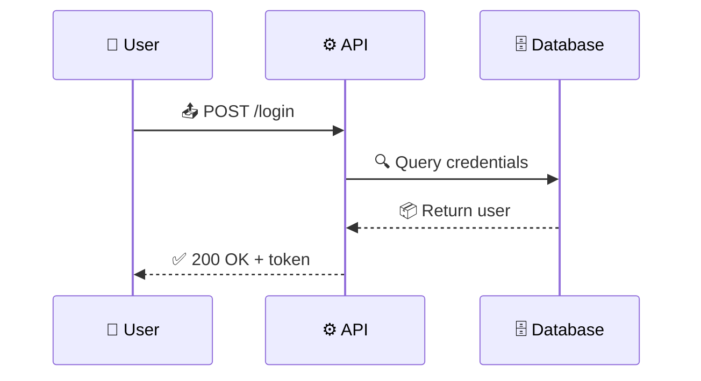
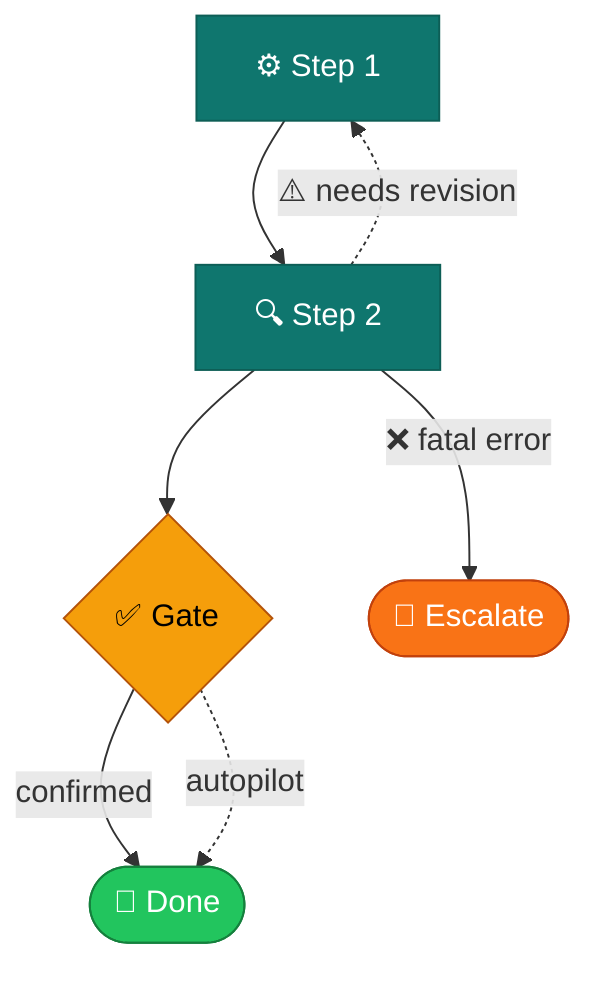
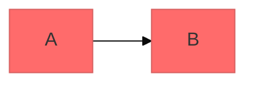

# Mermaid Diagramming

Create professional software diagrams using Mermaid's text-based syntax. Mermaid renders diagrams from simple text definitions, making diagrams version-controllable, easy to update, and maintainable alongside code.

## Core Syntax Structure

All Mermaid diagrams follow this pattern:

```mermaid
diagramType
  definition content
```

**Key principles:**
- First line declares diagram type (e.g., `classDiagram`, `sequenceDiagram`, `flowchart`)
- Use `%%` for comments
- Line breaks and indentation improve readability but aren't required
- Unknown words break diagrams; parameters fail silently

## Diagram Type Selection Guide

**Choose the right diagram type:**

1. **Class Diagrams** - Domain modeling, OOP design, entity relationships
   - Domain-driven design documentation
   - Object-oriented class structures
   - Entity relationships and dependencies

2. **Sequence Diagrams** - Temporal interactions, message flows
   - API request/response flows
   - User authentication flows
   - System component interactions
   - Method call sequences

3. **Flowcharts** - Processes, algorithms, decision trees
   - User journeys and workflows
   - Business processes
   - Algorithm logic
   - Deployment pipelines

4. **Entity Relationship Diagrams (ERD)** - Database schemas
   - Table relationships
   - Data modeling
   - Schema design

5. **C4 Diagrams** - Software architecture at multiple levels
   - System Context (systems and users)
   - Container (applications, databases, services)
   - Component (internal structure)
   - Code (class/interface level)

6. **State Diagrams** - State machines, lifecycle states
7. **Git Graphs** - Version control branching strategies
8. **Gantt Charts** - Project timelines, scheduling
9. **Pie/Bar Charts** - Data visualization

## Quick Start Examples

### Class Diagram (Domain Model)


### Sequence Diagram (API Flow)


### Flowchart (User Journey)


### ERD (Database Schema)


## Detailed References

For in-depth guidance on specific diagram types, see:

- **[references/class-diagrams.md](references/class-diagrams.md)** - Domain modeling, relationships (association, composition, aggregation, inheritance), multiplicity, methods/properties
- **[references/sequence-diagrams.md](references/sequence-diagrams.md)** - Actors, participants, messages (sync/async), activations, loops, alt/opt/par blocks, notes
- **[references/flowcharts.md](references/flowcharts.md)** - Node shapes, connections, decision logic, subgraphs, styling
- **[references/erd-diagrams.md](references/erd-diagrams.md)** - Entities, relationships, cardinality, keys, attributes
- **[references/c4-diagrams.md](references/c4-diagrams.md)** - System context, container, component diagrams, boundaries
- **[references/architecture-diagrams.md](references/architecture-diagrams.md)** - Cloud services, infrastructure, CI/CD deployments
- **[references/advanced-features.md](references/advanced-features.md)** - Themes, styling, configuration, layout options

## 🎨 Visual Style Convention (Mandatory — Apply to Every Diagram)

> This is the **house style** for all diagrams in this project. All agents generating Mermaid diagrams MUST follow these rules. No plain/unstyled diagrams.

### Rule 1 — Emoji in Node Labels

Add emoji to node labels wherever it makes intent immediately clear. Emoji are visual anchors — they let readers scan a diagram in seconds.



**Emoji cheat sheet by node type:**

| Context | Emoji to use |
|---------|-------------|
| Start / entry point | 🚀 👤 📥 🎯 |
| Success / done / approved | ✅ 🎉 🟢 |
| Error / failure / block | ❌ 🔥 🚨 🛑 |
| Warning / caution | ⚠️ 🟡 |
| Decision / gate | ❓ 🔀 |
| Data / database | 🗄️ 💾 📦 |
| User / person | 👤 🧑‍💻 |
| Email / notification | 📧 🔔 |
| Code / build | 🔨 ⚙️ 🛠️ |
| File / document | 📄 📋 📝 |
| Search / analysis | 🔍 🔬 |
| Security | 🔐 🛡️ |
| Cleanup / delete | 🧹 🗑️ |
| Sync / update | 🔄 ♻️ |
| Time / schedule | ⏰ 📅 |
| Network / API | 🌐 📡 |
| Agent / bot | 🤖 |

### Rule 2 — Always Use `classDef` for Color Grouping

Every flowchart must define color classes for semantically distinct node types. Use `:::className` on every node — never leave nodes unstyled.

**Standard color palette (copy-paste ready):**

```mermaid
flowchart TD
    classDef primary   fill:#3b82f6,stroke:#1d4ed8,color:#fff
    classDef success   fill:#22c55e,stroke:#15803d,color:#fff
    classDef warning   fill:#f59e0b,stroke:#d97706,color:#fff
    classDef danger    fill:#ef4444,stroke:#b91c1c,color:#fff
    classDef purple    fill:#8b5cf6,stroke:#6d28d9,color:#fff
    classDef gray      fill:#6b7280,stroke:#374151,color:#fff
    classDef orange    fill:#f97316,stroke:#c2410c,color:#fff
    classDef pink      fill:#ec4899,stroke:#be185d,color:#fff
    classDef teal      fill:#14b8a6,stroke:#0f766e,color:#fff
    classDef yellow    fill:#eab308,stroke:#a16207,color:#000
```

**Semantic mapping:**

| Class | Color | Use for |
|-------|-------|---------|
| `primary` | 🔵 Blue | Normal steps, main flow |
| `success` | 🟢 Green | Success, done, approved, cleanup |
| `warning` | 🟡 Amber | Conditional, optional, gate checks |
| `danger` | 🔴 Red | Error, failure, must-fix |
| `purple` | 🟣 Purple | Conditional/optional steps |
| `orange` | 🟠 Orange | Escalation, alerts |
| `teal` | 🩵 Teal | External systems, users |
| `yellow` | 💛 Yellow | Data stores, state |

### Rule 3 — Complete Styled Example

This is the **target quality level** for every diagram generated in this project:



### Rule 4 — Subgraph Styling

Always style subgraph backgrounds with light fills to create visual zones:



### Rule 5 — Sequence Diagrams With Icons

For sequence diagrams, prefix participant aliases with emoji:



### Rule 6 — Edge Types for Failure and Retry Paths

Use **different arrow types and labels** to visually distinguish flow types. Readers should instantly understand whether an edge is a normal forward step, a warning retry, or a hard stop.

| Edge type | Syntax | When to use |
|-----------|--------|-------------|
| **Happy path** | `A --> B` | Normal forward flow |
| **Hard fail / ESCALATE** (pipeline stops) | `A -->|❌ reason| ESC` | Agent failure that cannot be recovered — escalation node required |
| **Soft fail / retry** (flow continues differently) | `A -. ⚠️ reason .-> B` | Backward transitions, retry loops, recoverable deviations |
| **Optional / skippable path** | `A -.-> B` | Autopilot paths, conditional skips |

**Example — pipeline with all three types:**



**Key rules:**
- `❌` label = pipeline STOPS, escalation node required downstream
- `⚠️` dotted = flow redirects but continues — no hard stop
- Dotted without label = optional/skippable (autopilot, conditional)
- Backward edges (against main flow direction) SHOULD use dotted to reduce visual noise

---

## Best Practices

1. **Visual first** — apply emoji + colors by default; plain diagrams are rejected
2. **Start Simple** — Begin with core entities/components, add details and styling incrementally
3. **Use Meaningful Names** — Clear labels + emoji make diagrams self-documenting at a glance
4. **Comment Extensively** — Use `%%` comments to explain complex relationships
5. **Keep Focused** — One diagram per concept; split large diagrams into multiple focused views
6. **Version Control** — Store `.mmd` files alongside code for easy updates
7. **Add Context** — Include titles and notes to explain diagram purpose
8. **Iterate** — Refine diagrams as understanding evolves

## Configuration and Theming

Configure diagrams using frontmatter:



**Available themes:** default, forest, dark, neutral, base

**Layout options:**
- `layout: dagre` (default) - Classic balanced layout
- `layout: elk` - Advanced layout for complex diagrams (requires integration)

**Look options:**
- `look: classic` - Traditional Mermaid style
- `look: handDrawn` - Sketch-like appearance

## Exporting and Rendering

**Native support in:**
- GitHub/GitLab - Automatically renders in Markdown
- VS Code - With Markdown Mermaid extension
- Notion, Obsidian, Confluence - Built-in support

**Export options:**
- [Mermaid Live Editor](https://mermaid.live) - Online editor with PNG/SVG export
- Mermaid CLI - `npm install -g @mermaid-js/mermaid-cli` then `mmdc -i input.mmd -o output.png`
- Docker - `docker run --rm -v $(pwd):/data minlag/mermaid-cli -i /data/input.mmd -o /data/output.png`

## Common Pitfalls

- **Breaking characters** - Avoid `{}` in comments, use proper escape sequences for special characters
- **Syntax errors** - Misspellings break diagrams; validate syntax in Mermaid Live
- **Overcomplexity** - Split complex diagrams into multiple focused views
- **Missing relationships** - Document all important connections between entities

## When to Create Diagrams

**Always diagram when:**
- Starting new projects or features
- Documenting complex systems
- Explaining architecture decisions
- Designing database schemas
- Planning refactoring efforts
- Onboarding new team members

**Use diagrams to:**
- Align stakeholders on technical decisions
- Document domain models collaboratively
- Visualize data flows and system interactions
- Plan before coding
- Create living documentation that evolves with code
